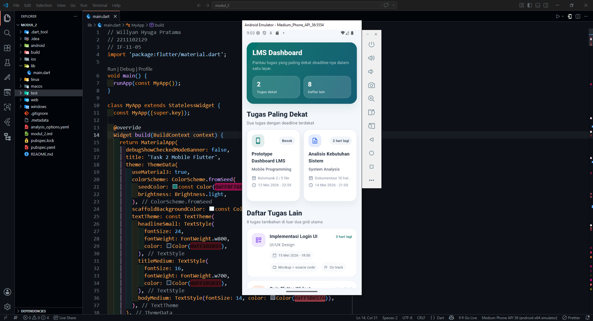

<div align="center">
  <br />
  <h1>LAPORAN PRAKTIKUM <br> APLIKASI BERBASIS PLATFORM </h1>
  <br />
  <h3>MODUL 2 <br> FLUTTER </h3>
  <br />
  
  <br />
  <br />
  <br />
  <h3>Disusun Oleh :</h3>
  <p>
    <strong>Willyan Hyuga Pratama</strong>
    <br>
    <strong>2211102129</strong>
    <br>
    <strong>S1 IF-11-REG05</strong>
  </p>
  <br />
  <h3>Dosen Pengampu :</h3>
  <p>
    <strong>Dedi Agung Prabowo, S.Kom., M.Kom</strong>
  </p>
  <br />
  <br />
  <h4>Asisten Praktikum :</h4>
  <strong>Apri Pandu Wicaksono </strong>
  <br>
  <strong>Hamka Zaenul Ardi</strong>
  <br />
  <h3>LABORATORIUM HIGH PERFORMANCE <br>FAKULTAS INFORMATIKA <br>UNIVERSITAS TELKOM PURWOKERTO <br>2026 </h3>
</div>

<hr>

## Dasar Teori

## Flutter

Flutter merupakan framework open-source yang dikembangkan oleh Google untuk membangun aplikasi mobile, web, dan desktop menggunakan satu basis kode. Flutter menggunakan bahasa pemrograman Dart serta menerapkan konsep widget sebagai dasar dalam pembuatan antarmuka pengguna. Dengan Flutter, pengembang dapat membuat aplikasi yang responsif, interaktif, dan memiliki performa yang baik.

## ListView

ListView adalah widget pada Flutter yang digunakan untuk menampilkan sekumpulan data dalam bentuk daftar secara vertikal maupun horizontal. Widget ini biasanya digunakan untuk menampilkan data yang berurutan seperti daftar kontak, pesan, berita, atau menu aplikasi. ListView memiliki fitur scrolling otomatis sehingga pengguna tetap dapat melihat data dalam jumlah banyak dengan nyaman.

Flutter menyediakan beberapa jenis ListView seperti ListView.builder dan ListView.separated yang dapat digunakan untuk menampilkan data secara dinamis dan lebih efisien. Penggunaan ListView membantu pengembang dalam mengatur tampilan data agar lebih rapi, terstruktur, dan mudah dipahami oleh

## GridView

GridView merupakan widget Flutter yang digunakan untuk menampilkan data dalam bentuk grid atau susunan baris dan kolom. Widget ini cocok digunakan untuk tampilan yang bersifat visual seperti galeri foto, katalog produk, maupun dashboard menu aplikasi. Dengan GridView, beberapa item dapat ditampilkan dalam satu baris sehingga penggunaan ruang pada layar menjadi lebih optimal.

GridView mendukung scrolling otomatis dan memiliki beberapa jenis seperti GridView.count serta GridView.builder yang dapat disesuaikan dengan kebutuhan aplikasi. Dengan adanya ListView dan GridView, Flutter memberikan kemudahan bagi pengembang dalam menciptakan tampilan aplikasi yang lebih menarik, responsif, dan nyaman digunakan pengguna.

## Task 2 Mobile Flutter

Kalian diminta untuk membuat tampilan mirip lms web kampus dimana terdapat 2 grid kanan kiri yang berisikan tugas mata kuliah yang paling mendekati dengan deadline, dan di bawah nya menampilkan 8 list view yang berisikan list tugas (diluar yang dari 2 grid tadi) berisikan nama tugas, mata kuliah apa, deadline, dan data tambahan lain nya.

Ketentuan:
- Menggunakan GridView untuk tampilan grid kanan dan kiri
- Menggunakan ListView (boleh dengan builder boleh dengan separated, tapi ga boleh yang biasa)

### Source Code

```dart
// Willyan Hyuga Pratama
// 2211102129
// IF-11-05
import 'package:flutter/material.dart';

void main() {
  runApp(const MyApp());
}

class MyApp extends StatelessWidget {
  const MyApp({super.key});

  @override
  Widget build(BuildContext context) {
    return MaterialApp(
      debugShowCheckedModeBanner: false,
      title: 'Task 2 Mobile Flutter',
      theme: ThemeData(
        useMaterial3: true,
        colorScheme: ColorScheme.fromSeed(
          seedColor: const Color(0xFF0F766E),
          brightness: Brightness.light,
        ),
        scaffoldBackgroundColor: const Color(0xFFF4F7FB),
        textTheme: const TextTheme(
          headlineSmall: TextStyle(
            fontSize: 24,
            fontWeight: FontWeight.w800,
            color: Color(0xFF102033),
          ),
          titleMedium: TextStyle(
            fontSize: 16,
            fontWeight: FontWeight.w700,
            color: Color(0xFF102033),
          ),
          bodyMedium: TextStyle(fontSize: 14, color: Color(0xFF5B6574)),
        ),
      ),
      home: const MyHomePage(),
    );
  }
}

```
**Kode Lengkap:** [lib/main.dart](lib/main.dart)

### Penjelasan Kode
Aplikasi ini menampilkan dashboard ala LMS kampus dengan 2 kartu GridView untuk tugas yang paling dekat deadline, lalu 8 tugas lainnya ditampilkan memakai ListView.separated. Struktur ini dibuat supaya tampilan rapi, responsif, dan sesuai ketentuan tugas Flutter.

### Output


