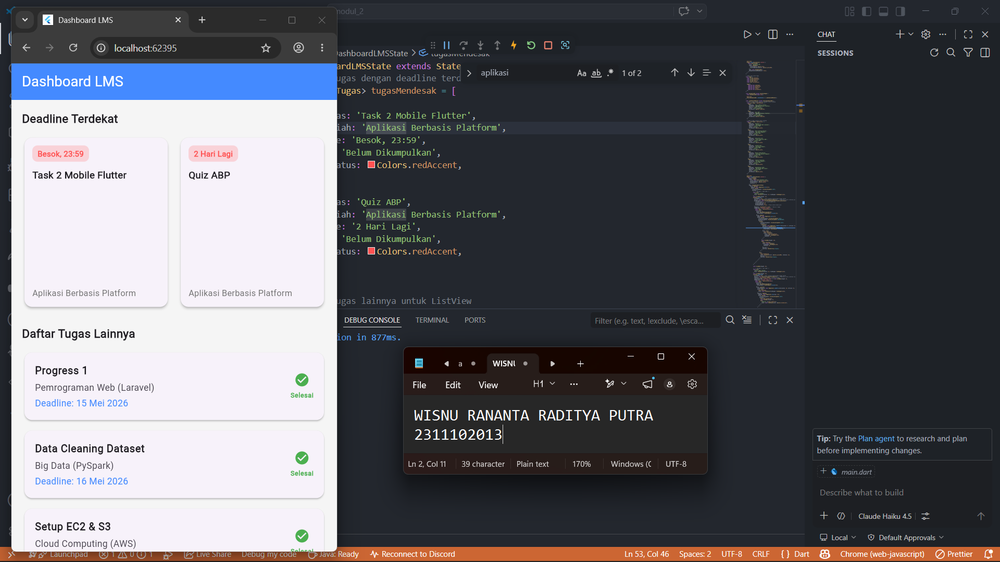

<div align="center">
  <br />
  <h1>LAPORAN PRAKTIKUM <br> APLIKASI BERBASIS PLATFORM </h1>
  <br />
  <h3>MODUL 2 <br> Flutter </h3>
  <br />
  
  <br />
  <br />
  <br />
  <h3>Disusun Oleh :</h3>
  <p>
    <strong>Wisnu Rananta Raditya Putra</strong>
    <br>
    <strong>2311102013</strong>
    <br>
    <strong>S1 IF-11-REG05</strong>
  </p>
  <br />
  <h3>Dosen Pengampu :</h3>
  <p>
    <strong>Dedi Agung Prabowo, S.Kom., M.Kom</strong>
  </p>
  <br />
  <br />
  <h4>Asisten Praktikum :</h4>
  <strong>Apri Pandu Wicaksono </strong>
  <br>
  <strong>Hamka Zaenul Ardi</strong>
  <br />
  <h3>LABORATORIUM HIGH PERFORMANCE <br>FAKULTAS INFORMATIKA <br>UNIVERSITAS TELKOM PURWOKERTO <br>2026 </h3>
</div>

<hr>


# Dasar Teori

## Konsep Dasar

<p align="justify">
Flutter merupakan framework open-source yang dikembangkan oleh Google untuk membangun aplikasi mobile, web, dan desktop menggunakan satu basis kode yang sama. Flutter menggunakan bahasa pemrograman Dart dan menerapkan konsep widget sebagai dasar pembentukan antarmuka aplikasi. Dalam Flutter, seluruh komponen tampilan seperti teks, tombol, gambar, maupun halaman aplikasi dibuat menggunakan widget sehingga proses pengembangan menjadi lebih fleksibel dan terstruktur. Flutter juga memiliki fitur hot reload yang memungkinkan perubahan kode dapat langsung terlihat tanpa perlu menjalankan ulang aplikasi. Selain itu, Flutter menggunakan sistem layout berbasis widget tree, yaitu susunan widget parent dan child yang membentuk struktur tampilan aplikasi. Beberapa widget layout yang umum digunakan antara lain Container, Row, Column, dan Stack untuk mengatur posisi, ukuran, dan susunan komponen pada layar agar tampilan aplikasi menjadi lebih rapi dan responsif.
</p>

## List View

<p align="justify">
ListView merupakan widget pada Flutter yang digunakan untuk menampilkan kumpulan data dalam bentuk daftar secara vertikal maupun horizontal. Widget ini sering digunakan pada aplikasi chatting, daftar kontak, maupun tampilan berita karena mampu menampilkan item secara berurutan. Flutter menyediakan ListView.builder untuk menangani data dalam jumlah banyak secara lebih efisien karena item hanya dibuat ketika diperlukan. Selain itu, ListView juga mendukung penggunaan widget seperti ListTile sehingga tampilan daftar menjadi lebih terstruktur dan menarik untuk digunakan dalam pengembangan aplikasi modern.
</p>

## Grid View    

<p align="justify">
GridView adalah widget yang digunakan untuk menampilkan data dalam bentuk kisi-kisi atau grid dengan beberapa kolom dalam satu baris. Widget ini biasanya digunakan pada tampilan galeri foto, katalog produk, maupun menu aplikasi karena mampu menampilkan banyak item secara lebih rapi dan menarik. Flutter menyediakan beberapa jenis GridView seperti GridView.count dan GridView.builder yang dapat disesuaikan dengan kebutuhan data statis maupun dinamis. Penggunaan GridView membantu pengembang dalam membuat tampilan aplikasi yang lebih interaktif dan efisien terutama untuk data berbasis gambar atau ikon.
</p>

# Task 2 - Mobile Flutter
## Source Code main.dart
```dart
<!-- 2311102013
Wisnu Rananta Raditya Putra
S1IF-11-05 -->
import 'package:flutter/material.dart';

void main() {
  runApp(const LMSApp());
}

class LMSApp extends StatelessWidget {
  const LMSApp({super.key});

  @override
  Widget build(BuildContext context) {
    return MaterialApp(
      title: 'Dashboard LMS',
      theme: ThemeData(
        primarySwatch: Colors.blue,
        scaffoldBackgroundColor: Colors.grey[100],
      ),
      home: const DashboardLMS(),
      debugShowCheckedModeBanner: false,
    );
  }
}

// Model data untuk Tugas
class Tugas {
  final String namaTugas;
  final String mataKuliah;
  final String deadline;
  final String status;
  final Color warnaStatus;

  Tugas({
    required this.namaTugas,
    required this.mataKuliah,
    required this.deadline,
    required this.status,
    required this.warnaStatus,
  });
}

class DashboardLMS extends StatefulWidget {
  const DashboardLMS({super.key});

  @override
  State<DashboardLMS> createState() => _DashboardLMSState();
}

class _DashboardLMSState extends State<DashboardLMS> {
  // Data 2 Tugas dengan deadline terdekat untuk GridView
  final List<Tugas> tugasMendesak = [
    Tugas(
      namaTugas: 'Task 2 Mobile Flutter',
      mataKuliah: 'Aplikasi Berbasis Platform',
      deadline: 'Besok, 23:59',
      status: 'Belum Dikumpulkan',
      warnaStatus: Colors.redAccent,
    ),
    Tugas(
      namaTugas: 'Quiz ABP',
      mataKuliah: 'Aplikasi Berbasis Platform',
      deadline: '2 Hari Lagi',
      status: 'Belum Dikumpulkan',
      warnaStatus: Colors.redAccent,
    ),
  ];

  // Data 8 Tugas lainnya untuk ListView
  final List<Tugas> tugasLainnya = [
    Tugas(
      namaTugas: 'Progress 1',
      mataKuliah: 'Pemrograman Web (Laravel)',
      deadline: '15 Mei 2026',
      status: 'Selesai',
      warnaStatus: Colors.green,
    ),
    Tugas(
      namaTugas: 'Data Cleaning Dataset',
      mataKuliah: 'Big Data (PySpark)',
      deadline: '16 Mei 2026',
      status: 'Selesai',
      warnaStatus: Colors.green,
    ),
    Tugas(
      namaTugas: 'Setup EC2 & S3',
      mataKuliah: 'Cloud Computing (AWS)',
      deadline: '18 Mei 2026',
      status: 'Selesai',
      warnaStatus: Colors.green,
    ),
    Tugas(
      namaTugas: 'Latihan Soal',
      mataKuliah: 'Kecerdasan Buatan',
      deadline: '20 Mei 2026',
      status: 'Selesai',
      warnaStatus: Colors.green,
    ),
    Tugas(
      namaTugas: 'Desain UI/UX Mockup',
      mataKuliah: 'Interaksi Manusia Komputer',
      deadline: '22 Mei 2026',
      status: 'Selesai',
      warnaStatus: Colors.green,
    ),
    Tugas(
      namaTugas: 'Laporan Praktikum',
      mataKuliah: 'Jaringan Komputer',
      deadline: '27 Mei 2026',
      status: 'Selesai',
      warnaStatus: Colors.green,
    ),
    Tugas(
      namaTugas: 'Implementasi AJAX',
      mataKuliah: 'Pemrograman Web Lanjut',
      deadline: '30 Mei 2026',
      status: 'Selesai',
      warnaStatus: Colors.green,
    ),
  ];

  @override
  Widget build(BuildContext context) {
    return Scaffold(
      appBar: AppBar(
        title: const Text('Dashboard LMS'),
        backgroundColor: Colors.blueAccent,
        foregroundColor: Colors.white,
        elevation: 0,
      ),
      body: SingleChildScrollView(
        child: Padding(
          padding: const EdgeInsets.all(16.0),
          child: Column(
            crossAxisAlignment: CrossAxisAlignment.start,
            children: [
              // --- SECTION 1: GRID VIEW ---
              const Text(
                'Deadline Terdekat',
                style: TextStyle(fontSize: 18, fontWeight: FontWeight.bold),
              ),
              const SizedBox(height: 12),
              GridView.builder(
                shrinkWrap: true, // Agar GridView menyesuaikan tinggi konten
                physics: const NeverScrollableScrollPhysics(), // Mematikan scroll internal grid agar scroll mengikuti SingleChildScrollView
                gridDelegate: const SliverGridDelegateWithFixedCrossAxisCount(
                  crossAxisCount: 2, // 2 grid kanan kiri
                  crossAxisSpacing: 12,
                  mainAxisSpacing: 12,
                  childAspectRatio: 0.85, // Rasio ukuran kotak grid
                ),
                itemCount: tugasMendesak.length, // Berisi 2 tugas
                itemBuilder: (context, index) {
                  final tugas = tugasMendesak[index];
                  return Card(
                    elevation: 3,
                    shape: RoundedRectangleBorder(
                      borderRadius: BorderRadius.circular(12),
                    ),
                    child: Padding(
                      padding: const EdgeInsets.all(12.0),
                      child: Column(
                        crossAxisAlignment: CrossAxisAlignment.start,
                        mainAxisAlignment: MainAxisAlignment.spaceBetween,
                        children: [
                          Column(
                            crossAxisAlignment: CrossAxisAlignment.start,
                            children: [
                              Container(
                                padding: const EdgeInsets.symmetric(horizontal: 8, vertical: 4),
                                decoration: BoxDecoration(
                                  color: tugas.warnaStatus.withOpacity(0.2),
                                  borderRadius: BorderRadius.circular(8),
                                ),
                                child: Text(
                                  tugas.deadline,
                                  style: TextStyle(
                                    color: tugas.warnaStatus,
                                    fontWeight: FontWeight.bold,
                                    fontSize: 12,
                                  ),
                                ),
                              ),
                              const SizedBox(height: 10),
                              Text(
                                tugas.namaTugas,
                                style: const TextStyle(
                                  fontWeight: FontWeight.bold,
                                  fontSize: 15,
                                ),
                                maxLines: 2,
                                overflow: TextOverflow.ellipsis,
                              ),
                            ],
                          ),
                          Text(
                            tugas.mataKuliah,
                            style: TextStyle(color: Colors.grey[600], fontSize: 13),
                            maxLines: 2,
                            overflow: TextOverflow.ellipsis,
                          ),
                        ],
                      ),
                    ),
                  );
                },
              ),
              
              const SizedBox(height: 24),

              // --- SECTION 2: LIST VIEW ---
              const Text(
                'Daftar Tugas Lainnya',
                style: TextStyle(fontSize: 18, fontWeight: FontWeight.bold),
              ),
              const SizedBox(height: 12),
              ListView.separated(
                shrinkWrap: true, // Agar ListView menyesuaikan tinggi konten
                physics: const NeverScrollableScrollPhysics(), // Mematikan scroll internal list
                itemCount: tugasLainnya.length, // Berisi 8 tugas
                separatorBuilder: (context, index) => const SizedBox(height: 8),
                itemBuilder: (context, index) {
                  final tugas = tugasLainnya[index];
                  return Card(
                    elevation: 2,
                    shape: RoundedRectangleBorder(
                      borderRadius: BorderRadius.circular(12),
                    ),
                    child: ListTile(
                      contentPadding: const EdgeInsets.symmetric(horizontal: 16, vertical: 8),
                      title: Text(
                        tugas.namaTugas,
                        style: const TextStyle(fontWeight: FontWeight.bold),
                      ),
                      subtitle: Padding(
                        padding: const EdgeInsets.only(top: 4.0),
                        child: Column(
                          crossAxisAlignment: CrossAxisAlignment.start,
                          children: [
                            Text(tugas.mataKuliah),
                            const SizedBox(height: 4),
                            Text(
                              'Deadline: ${tugas.deadline}',
                              style: const TextStyle(color: Colors.blueAccent),
                            ),
                          ],
                        ),
                      ),
                      trailing: Column(
                        mainAxisAlignment: MainAxisAlignment.center,
                        children: [
                          Icon(
                            tugas.status == 'Selesai' 
                                ? Icons.check_circle 
                                : Icons.pending_actions,
                            color: tugas.warnaStatus,
                          ),
                          const SizedBox(height: 4),
                          Text(
                            tugas.status,
                            style: TextStyle(
                              fontSize: 10,
                              color: tugas.warnaStatus,
                              fontWeight: FontWeight.bold,
                            ),
                          ),
                        ],
                      ),
                    ),
                  );
                },
              ),
            ],
          ),
        ),
      ),
    );
  }
}
```


# Screenshots Output


# Penjelasan
<p align="justify">
Kode di atas merupakan aplikasi dashboard LMS sederhana menggunakan Flutter dengan bahasa pemrograman Dart. Program dimulai dari fungsi <code>main()</code> yang menjalankan widget <code>LMSApp</code> melalui <code>runApp()</code>. Pada <code>MaterialApp</code>, ditentukan judul aplikasi, tema warna, halaman utama, serta pengaturan agar label debug tidak tampil. Program juga memiliki class Tugas yang digunakan sebagai model data untuk menyimpan informasi tugas seperti nama tugas, mata kuliah, deadline, status, dan warna status. Selanjutnya, <code>DashboardLMS</code> menggunakan <code>StatefulWidget</code> karena data pada halaman dapat berubah dan menampilkan dua jenis data tugas, yaitu tugas mendesak dan tugas lainnya.
</p>

<p align="justify">
Tampilan aplikasi menggunakan <code>Scaffold</code> yang terdiri dari <code>AppBar</code> dan <code>body</code>. Pada bagian body digunakan <code>SingleChildScrollView</code> dan <code>Column</code> agar seluruh konten dapat di-scroll secara vertikal. Section pertama menampilkan tugas dengan deadline terdekat menggunakan <code>GridView.builder</code> dalam bentuk grid dua kolom, sedangkan section kedua menampilkan daftar tugas lainnya menggunakan <code>ListView.separated</code>. Setiap data tugas ditampilkan menggunakan widget <code>Card</code> dan <code>ListTile</code> agar tampilan lebih rapi dan modern. Selain itu, ikon dan warna status digunakan untuk membedakan tugas yang sudah selesai dan yang belum dikumpulkan.
</p>