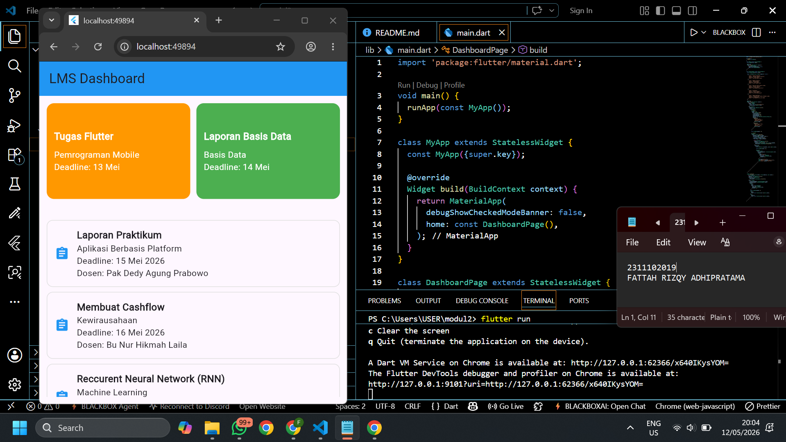

<div align="center">
  <br />
  <h1>LAPORAN PRAKTIKUM <br> APLIKASI BERBASIS PLATFORM </h1>
  <br />
  <h3>MODUL 2 <br> FLUTTER </h3>
  <br />
  
  <br />
  <br />
  <br />
  <h3>Disusun Oleh :</h3>
  <p>
    <strong>Fattah Rizqy Adhipratama</strong>
    <br>
    <strong>2311102019</strong>
    <br>
    <strong>S1 IF-11-REG05</strong>
  </p>
  <br />
  <h3>Dosen Pengampu :</h3>
  <p>
    <strong>Dedi Agung Prabowo, S.Kom., M.Kom</strong>
  </p>
  <br />
  <br />
  <h4>Asisten Praktikum :</h4>
  <strong>Apri Pandu Wicaksono </strong>
  <br>
  <strong>Hamka Zaenul Ardi</strong>
  <br />
  <h3>LABORATORIUM HIGH PERFORMANCE <br>FAKULTAS INFORMATIKA <br>UNIVERSITAS TELKOM PURWOKERTO <br>2026 </h3>
</div>

<hr>


# Dasar Teori

<p align="justify">
Flutter merupakan framework open-source yang dikembangkan oleh Google untuk membangun aplikasi mobile, web, dan desktop dengan satu basis kode. Dalam Flutter, seluruh tampilan aplikasi dibangun menggunakan widget. Widget adalah komponen dasar yang digunakan untuk membuat antarmuka pengguna, seperti teks, tombol, gambar, maupun struktur halaman. Flutter menyediakan dua jenis widget utama, yaitu StatelessWidget yang bersifat statis dan tidak berubah, serta StatefulWidget yang dapat berubah sesuai interaksi pengguna atau perubahan data. Dengan konsep widget, pengembangan antarmuka menjadi lebih fleksibel, terstruktur, dan mudah dipelihara.
</p>

<p align="justify">
Dalam proses pengaturan tampilan, Flutter menggunakan sistem layouting untuk menentukan posisi dan ukuran widget pada layar. Beberapa widget layout yang sering digunakan antara lain Row, Column, Container, dan Stack. Selain itu, Flutter juga menyediakan widget ListView dan GridView untuk menampilkan data dalam jumlah banyak secara efisien. ListView digunakan untuk menampilkan data dalam bentuk daftar secara vertikal maupun horizontal, sedangkan GridView digunakan untuk menampilkan data dalam bentuk kisi-kisi atau grid. Kedua widget tersebut sangat membantu dalam pembuatan aplikasi yang membutuhkan tampilan data dinamis, responsif, dan mudah diakses oleh pengguna.
</p>

# Tugas 2 - Mobile Flutter

<p align="justify">
Kalian diminta untuk membuat tampilan mirip lms web kampus dimana terdapat 2 grid kanan kiri yang berisikan tugas mata kuliah yang paling mendekati dengan deadline, dan di bawah nya menampilkan 8 list view yang berisikan list tugas (diluar yang dari 2 grid tadi) berisikan nama tugas, mata kuliah apa, deadline, dan data tambahan lain nya.

Ketentuan:
- Menggunakan GridView untuk tampilan grid kanan dan kiri
- Menggunakan ListView (boleh dengan builder boleh dengan separated, tapi ga boleh yang biasa)
</p>

## 1. Source Code main.dart
```
import 'package:flutter/material.dart';

void main() {
  runApp(const MyApp());
}

class MyApp extends StatelessWidget {
  const MyApp({super.key});

  @override
  Widget build(BuildContext context) {
    return MaterialApp(
      debugShowCheckedModeBanner: false,
      home: const DashboardPage(),
    );
  }
}

class DashboardPage extends StatelessWidget {
  const DashboardPage({super.key});

  final List<Map<String, String>> tugasList = const [
    {
      "judul": "Laporan Praktikum",
      "matkul": "Aplikasi Berbasis Platform",
      "deadline": "15 Mei 2026",
      "dosen": "Pak Dedy Agung Prabowo"
    },
    {
      "judul": "Membuat Cashflow",
      "matkul": "Kewirausahaan",
      "deadline": "16 Mei 2026",
      "dosen": "Bu Nur Hikmah Laila"
    },
    {
      "judul": "Reccurent Neural Network (RNN)",
      "matkul": "Machine Learning",
      "deadline": "17 Mei 2026",
      "dosen": "Pak Muhammad Zidny Naf an"
    },
    {
      "judul": "UI Design",
      "matkul": "Desain Interaksi",
      "deadline": "18 Mei 2026",
      "dosen": "Bu Tenia Wahyuningrum"
    },
    {
      "judul": "Video Presentasi",
      "matkul": "VERIFIKASI DAN VALIDASI PERANGKAT LUNAK",
      "deadline": "19 Mei 2026",
      "dosen": "Pak MUHAMMAD LULU LATIF USMAN"
    },
  ];

  @override
  Widget build(BuildContext context) {
    return Scaffold(
      appBar: AppBar(
        title: const Text("LMS Dashboard"),
        backgroundColor: Colors.blue,
      ),
      body: Padding(
        padding: const EdgeInsets.all(12),
        child: Column(
          children: [
            // GRIDVIEW
            SizedBox(
              height: 180,
              child: GridView.count(
                crossAxisCount: 2,
                crossAxisSpacing: 10,
                mainAxisSpacing: 10,
                childAspectRatio: 1.5,
                physics: const NeverScrollableScrollPhysics(),
                children: [
                  tugasGrid(
                    "Tugas Flutter",
                    "Pemrograman Mobile",
                    "Deadline: 13 Mei",
                    Colors.orange,
                  ),
                  tugasGrid(
                    "Laporan Basis Data",
                    "Basis Data",
                    "Deadline: 14 Mei",
                    Colors.green,
                  ),
                ],
              ),
            ),

            const SizedBox(height: 10),

            // LISTVIEW
            Expanded(
              child: ListView.separated(
                itemCount: tugasList.length,
                separatorBuilder: (context, index) =>
                    const SizedBox(height: 8),
                itemBuilder: (context, index) {
                  final tugas = tugasList[index];

                  return Container(
                    padding: const EdgeInsets.all(12),
                    decoration: BoxDecoration(
                      border: Border.all(color: Colors.grey.shade300),
                      borderRadius: BorderRadius.circular(10),
                    ),
                    child: Row(
                      children: [
                        const Icon(Icons.assignment, color: Colors.blue),

                        const SizedBox(width: 12),

                        Expanded(
                          child: Column(
                            crossAxisAlignment: CrossAxisAlignment.start,
                            children: [
                              Text(
                                tugas["judul"]!,
                                style: const TextStyle(
                                  fontWeight: FontWeight.bold,
                                  fontSize: 16,
                                ),
                              ),
                              Text(tugas["matkul"]!),
                              Text("Deadline: ${tugas["deadline"]}"),
                              Text("Dosen: ${tugas["dosen"]}"),
                            ],
                          ),
                        ),
                      ],
                    ),
                  );
                },
              ),
            ),
          ],
        ),
      ),
    );
  }

  Widget tugasGrid(
      String judul, String matkul, String deadline, Color warna) {
    return Container(
      padding: const EdgeInsets.all(12),
      decoration: BoxDecoration(
        color: warna,
        borderRadius: BorderRadius.circular(12),
      ),
      child: Column(
        crossAxisAlignment: CrossAxisAlignment.start,
        mainAxisAlignment: MainAxisAlignment.center,
        children: [
          Text(
            judul,
            style: const TextStyle(
              color: Colors.white,
              fontWeight: FontWeight.bold,
              fontSize: 16,
            ),
          ),
          const SizedBox(height: 8),
          Text(
            matkul,
            style: const TextStyle(color: Colors.white),
          ),
          Text(
            deadline,
            style: const TextStyle(color: Colors.white),
          ),
        ],
      ),
    );
  }
}
```

# Penjelasan
<p align="justify">
Program Flutter tersebut digunakan untuk membuat tampilan sederhana LMS kampus yang menampilkan daftar tugas kuliah. Pada bagian awal, aplikasi dijalankan menggunakan MaterialApp dengan halaman utama DashboardPage. Data tugas disimpan dalam bentuk list yang berisi judul tugas, mata kuliah, deadline, dan dosen. Tampilan utama menggunakan Scaffold yang memiliki AppBar dan body. Di dalam body digunakan Column untuk menyusun komponen secara vertikal, kemudian GridView.count digunakan untuk menampilkan dua tugas dengan deadline terdekat dalam bentuk grid kanan dan kiri, sedangkan ListView.separated digunakan untuk menampilkan delapan daftar tugas lainnya secara vertikal dengan tampilan yang lebih rapi karena memiliki jarak antar item. Setiap item tugas dibuat menggunakan Container, Row, dan Column agar informasi seperti nama tugas, mata kuliah, deadline, dan dosen dapat ditampilkan dengan jelas.
</p>

# Output
