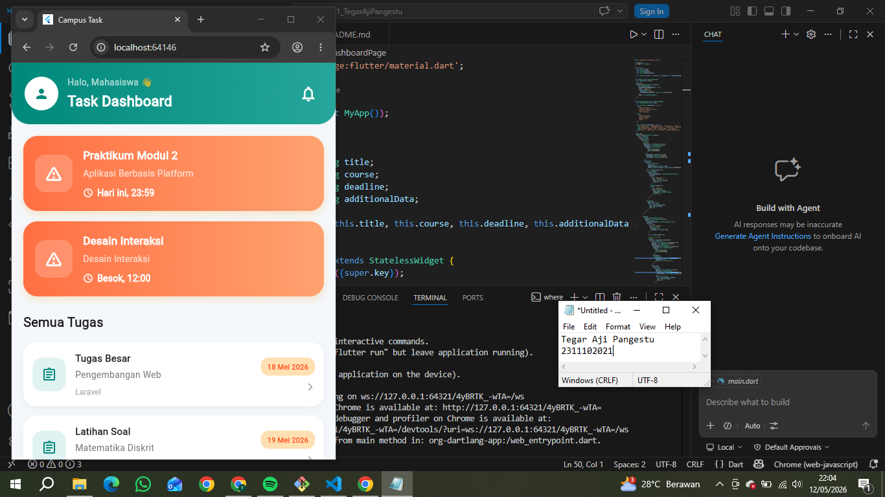

<div align="center">
  <br />
  <h1>LAPORAN PRAKTIKUM <br> APLIKASI BERBASIS PLATFORM </h1>
  <br />
  <h3>MODUL 2 <br> Flutter </h3>
  <br />
  
  <br />
  <br />
  <br />
  <h3>Disusun Oleh :</h3>
  <p>
    <strong>Tegar Aji pangestu</strong>
    <br>
    <strong>2311102021</strong>
    <br>
    <strong>S1 IF-11-REG05</strong>
  </p>
  <br />
  <h3>Dosen Pengampu :</h3>
  <p>
    <strong>Dedi Agung Prabowo, S.Kom., M.Kom</strong>
  </p>
  <br />
  <br />
  <h4>Asisten Praktikum :</h4>
  <strong>Apri Pandu Wicaksono </strong>
  <br>
  <strong>Hamka Zaenul Ardi</strong>
  <br />
  <h3>LABORATORIUM HIGH PERFORMANCE <br>FAKULTAS INFORMATIKA <br>UNIVERSITAS TELKOM PURWOKERTO <br>2026 </h3>
</div>

<hr>


# Dasar Teori

## Konsep Dasar

<p align="justify">
Flutter adalah framework open-source yang dikembangkan oleh Google untuk membangun aplikasi mobile, web, desktop, dan embedded dari satu basis kode (single codebase). Flutter menggunakan bahasa pemrograman Dart serta menyediakan berbagai widget modern yang memudahkan pengembang dalam membuat antarmuka pengguna (UI) yang cepat, responsif, dan menarik. Dengan fitur hot reload, proses pengembangan aplikasi menjadi lebih efisien karena perubahan kode dapat langsung terlihat tanpa perlu menjalankan ulang aplikasi.
</p>

## List View

<p align="justify">
Dalam Flutter, ListView adalah widget yang digunakan untuk menampilkan kumpulan data secara vertikal maupun horizontal dalam bentuk daftar yang dapat digulir (scroll). Widget ini sering digunakan untuk membuat tampilan seperti daftar kontak, chat, berita, maupun menu aplikasi karena mampu menampilkan banyak item dengan efisien. Flutter menyediakan beberapa jenis ListView seperti ListView, ListView.builder, dan ListView.separated yang memudahkan pengembang dalam mengatur tampilan serta performa data yang ditampilkan.
</p>

## Grid View    

<p align="justify">
Dalam Flutter, GridView adalah widget yang digunakan untuk menampilkan data dalam bentuk kisi atau grid yang terdiri dari beberapa baris dan kolom. Widget ini sangat cocok digunakan untuk membuat tampilan galeri, menu aplikasi, katalog produk, maupun dashboard karena mampu menyusun item secara rapi dan responsif. Flutter menyediakan beberapa jenis GridView seperti GridView.count, GridView.builder, dan GridView.extent yang dapat dipilih sesuai kebutuhan pengembangan aplikasi.
</p>

# Task 2 - Flutter
## Source Code 
```dart
<!-- 2311102021
Tegar Aji Pangestu
S1IF-11-05 -->
import 'package:flutter/material.dart';

void main() {
  runApp(const MyApp());
}

class Task {
  final String title;
  final String course;
  final String deadline;
  final String additionalData;

  const Task(this.title, this.course, this.deadline, this.additionalData);
}

class MyApp extends StatelessWidget {
  const MyApp({super.key});

  @override
  Widget build(BuildContext context) {
    return MaterialApp(
      debugShowCheckedModeBanner: false,
      title: 'Campus Task',
      theme: ThemeData(
        fontFamily: 'Poppins',
        scaffoldBackgroundColor: const Color(0xFFF4F7FB),
      ),
      home: const DashboardPage(),
    );
  }
}

class DashboardPage extends StatelessWidget {
  const DashboardPage({super.key});

  final List<Task> urgentTasks = const [
    Task(
      'Praktikum Modul 2',
      'Aplikasi Berbasis Platform',
      'Hari ini, 23:59',
      'Belum disubmit',
    ),
    Task(
      'Desain Interaksi',
      'Desain Interaksi',
      'Besok, 12:00',
      'Draft',
    ),
  ];

  final List<Task> otherTasks = const [
    Task('Tugas Besar', 'Pengembangan Web', '18 Mei 2026', 'Laravel'),
    Task('Latihan Soal', 'Matematika Diskrit', '19 Mei 2026', 'Bab Graf'),
    Task('Prototype Design', 'IMK', '20 Mei 2026', 'Link Figma'),
    Task('Quiz 1', 'Basis Data', '14 Mei 2026', 'Materi Normalisasi'),
  ];

  @override
  Widget build(BuildContext context) {
    return Scaffold(
      body: SafeArea(
        child: Column(
          children: [
            // HEADER
            Container(
              padding: const EdgeInsets.all(20),
              decoration: const BoxDecoration(
                gradient: LinearGradient(
                  colors: [
                    Color(0xFF00897B),
                    Color(0xFF26A69A),
                  ],
                ),
                borderRadius: BorderRadius.only(
                  bottomLeft: Radius.circular(28),
                  bottomRight: Radius.circular(28),
                ),
              ),
              child: Row(
                children: [
                  const CircleAvatar(
                    radius: 26,
                    backgroundColor: Colors.white,
                    child: Icon(Icons.person, color: Color(0xFF00897B)),
                  ),
                  const SizedBox(width: 14),
                  const Expanded(
                    child: Column(
                      crossAxisAlignment: CrossAxisAlignment.start,
                      children: [
                        Text(
                          'Halo, Mahasiswa 👋',
                          style: TextStyle(
                            color: Colors.white70,
                            fontSize: 14,
                          ),
                        ),
                        SizedBox(height: 4),
                        Text(
                          'Task Dashboard',
                          style: TextStyle(
                            color: Colors.white,
                            fontWeight: FontWeight.bold,
                            fontSize: 22,
                          ),
                        ),
                      ],
                    ),
                  ),
                  IconButton(
                    onPressed: () {},
                    icon: const Icon(
                      Icons.notifications_none,
                      color: Colors.white,
                      size: 28,
                    ),
                  ),
                ],
              ),
            ),

            Expanded(
              child: SingleChildScrollView(
                padding: const EdgeInsets.all(18),
                child: Column(
                  crossAxisAlignment: CrossAxisAlignment.start,
                  children: [
                    const Text(
                      'Deadline Terdekat',
                      style: TextStyle(
                        fontSize: 20,
                        fontWeight: FontWeight.bold,
                      ),
                    ),

                    const SizedBox(height: 18),

                    // URGENT TASK CARD
                    Column(
                      children: urgentTasks.map((task) {
                        return Container(
                          margin: const EdgeInsets.only(bottom: 16),
                          padding: const EdgeInsets.all(18),
                          decoration: BoxDecoration(
                            borderRadius: BorderRadius.circular(22),
                            gradient: const LinearGradient(
                              colors: [
                                Color(0xFFFF7043),
                                Color(0xFFFFA270),
                              ],
                            ),
                            boxShadow: [
                              BoxShadow(
                                color: Colors.orange.withOpacity(0.2),
                                blurRadius: 10,
                                offset: const Offset(0, 5),
                              ),
                            ],
                          ),
                          child: Row(
                            children: [
                              Container(
                                padding: const EdgeInsets.all(14),
                                decoration: BoxDecoration(
                                  color: Colors.white.withOpacity(0.2),
                                  borderRadius: BorderRadius.circular(16),
                                ),
                                child: const Icon(
                                  Icons.warning_amber_rounded,
                                  color: Colors.white,
                                  size: 30,
                                ),
                              ),

                              const SizedBox(width: 16),

                              Expanded(
                                child: Column(
                                  crossAxisAlignment:
                                      CrossAxisAlignment.start,
                                  children: [
                                    Text(
                                      task.title,
                                      style: const TextStyle(
                                        color: Colors.white,
                                        fontWeight: FontWeight.bold,
                                        fontSize: 17,
                                      ),
                                    ),
                                    const SizedBox(height: 6),
                                    Text(
                                      task.course,
                                      style: const TextStyle(
                                        color: Colors.white70,
                                      ),
                                    ),
                                    const SizedBox(height: 10),
                                    Row(
                                      children: [
                                        const Icon(
                                          Icons.schedule,
                                          color: Colors.white,
                                          size: 16,
                                        ),
                                        const SizedBox(width: 6),
                                        Text(
                                          task.deadline,
                                          style: const TextStyle(
                                            color: Colors.white,
                                            fontWeight: FontWeight.w600,
                                          ),
                                        ),
                                      ],
                                    )
                                  ],
                                ),
                              )
                            ],
                          ),
                        );
                      }).toList(),
                    ),

                    const SizedBox(height: 10),

                    const Text(
                      'Semua Tugas',
                      style: TextStyle(
                        fontSize: 20,
                        fontWeight: FontWeight.bold,
                      ),
                    ),

                    const SizedBox(height: 16),

                    // TASK LIST
                    ListView.builder(
                      shrinkWrap: true,
                      physics: const NeverScrollableScrollPhysics(),
                      itemCount: otherTasks.length,
                      itemBuilder: (context, index) {
                        final task = otherTasks[index];

                        return Container(
                          margin: const EdgeInsets.only(bottom: 14),
                          padding: const EdgeInsets.all(14),
                          decoration: BoxDecoration(
                            color: Colors.white,
                            borderRadius: BorderRadius.circular(20),
                            boxShadow: [
                              BoxShadow(
                                color: Colors.black.withOpacity(0.04),
                                blurRadius: 8,
                                offset: const Offset(0, 4),
                              )
                            ],
                          ),
                          child: Row(
                            children: [
                              Container(
                                padding: const EdgeInsets.all(14),
                                decoration: BoxDecoration(
                                  color: const Color(0xFFE0F2F1),
                                  borderRadius: BorderRadius.circular(16),
                                ),
                                child: const Icon(
                                  Icons.assignment_outlined,
                                  color: Color(0xFF00897B),
                                ),
                              ),

                              const SizedBox(width: 14),

                              Expanded(
                                child: Column(
                                  crossAxisAlignment:
                                      CrossAxisAlignment.start,
                                  children: [
                                    Text(
                                      task.title,
                                      style: const TextStyle(
                                        fontWeight: FontWeight.bold,
                                        fontSize: 15,
                                      ),
                                    ),
                                    const SizedBox(height: 5),
                                    Text(
                                      task.course,
                                      style: TextStyle(
                                        color: Colors.grey.shade600,
                                      ),
                                    ),
                                    const SizedBox(height: 8),
                                    Text(
                                      task.additionalData,
                                      style: TextStyle(
                                        color: Colors.grey.shade500,
                                        fontSize: 12,
                                      ),
                                    ),
                                  ],
                                ),
                              ),

                              Column(
                                crossAxisAlignment: CrossAxisAlignment.end,
                                children: [
                                  Container(
                                    padding: const EdgeInsets.symmetric(
                                      horizontal: 10,
                                      vertical: 6,
                                    ),
                                    decoration: BoxDecoration(
                                      color: Colors.orange.shade100,
                                      borderRadius: BorderRadius.circular(12),
                                    ),
                                    child: Text(
                                      task.deadline,
                                      style: const TextStyle(
                                        fontSize: 11,
                                        fontWeight: FontWeight.bold,
                                        color: Colors.deepOrange,
                                      ),
                                    ),
                                  ),
                                  const SizedBox(height: 10),
                                  const Icon(
                                    Icons.arrow_forward_ios,
                                    size: 14,
                                    color: Colors.grey,
                                  )
                                ],
                              )
                            ],
                          ),
                        );
                      },
                    )
                  ],
                ),
              ),
            )
          ],
        ),
      ),
    );
  }
}
```


# Screenshots Output


# Penjelasan
<p align="justify">
Program di atas merupakan aplikasi dashboard Flutter bertema Learning Management System (LMS) yang dibuat menggunakan widget Material Design untuk menghasilkan tampilan modern dan responsif. Aplikasi dimulai dari fungsi main() yang menjalankan LMSApp, kemudian menampilkan halaman utama LMSDashboardPage yang berisi AppBar, Drawer, statistik pembelajaran, daftar course, jadwal kelas, serta navigasi bawah. Data course disimpan dalam list dan ditampilkan menggunakan ListView.builder, sedangkan komponen seperti DashboardStatCard dan CourseCard dibuat dalam class terpisah agar kode lebih rapi dan mudah digunakan kembali. Program ini juga memanfaatkan widget seperti Container, Row, Column, NavigationBar, dan LinearProgressIndicator untuk membangun antarmuka LMS yang interaktif dan menarik.
</p>
