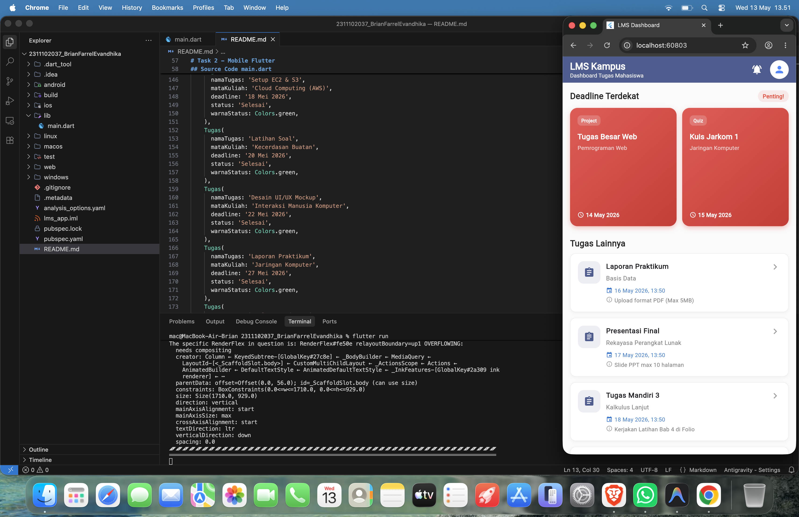

<div align="center">
  <br />
  <h1>LAPORAN PRAKTIKUM <br> APLIKASI BERBASIS PLATFORM </h1>
  <br />
  <h3>MODUL 2 <br> Flutter </h3>
  <br />
  
  <br />
  <br />
  <br />
  <h3>Disusun Oleh :</h3>
  <p>
    <strong>Brian Farrel Evandhika</strong>
    <br>
    <strong>2311102037</strong>
    <br>
    <strong>S1 IF-11-REG05</strong>
  </p>
  <br />
  <h3>Dosen Pengampu :</h3>
  <p>
    <strong>Dedi Agung Prabowo, S.Kom., M.Kom</strong>
  </p>
  <br />
  <br />
  <h4>Asisten Praktikum :</h4>
  <strong>Apri Pandu Wicaksono </strong>
  <br>
  <strong>Hamka Zaenul Ardi</strong>
  <br />
  <h3>LABORATORIUM HIGH PERFORMANCE <br>FAKULTAS INFORMATIKA <br>UNIVERSITAS TELKOM PURWOKERTO <br>2026 </h3>
</div>

<hr>


# Dasar Teori

## Konsep Dasar

<p align="justify">
Diciptakan oleh Google, Flutter adalah kerangka kerja perangkat lunak (framework) open-source yang memungkinkan pembuatan aplikasi multi-platform (mobile, web, dan desktop) hanya dengan satu basis kode (codebase). Dengan menggunakan bahasa pemrograman Dart, Flutter mengandalkan sistem widget sebagai fondasi utama dalam merancang antarmuka pengguna (UI). Setiap elemen visual—mulai dari tombol, teks, hingga struktur tata letak halaman—adalah widget. Hal ini membuat pengembangan aplikasi lebih terstruktur. Keunggulan lain dari Flutter adalah adanya fitur Hot Reload, di mana pengembang dapat langsung melihat efek dari modifikasi kode tanpa harus mengompilasi ulang aplikasinya secara penuh. Untuk mendesain tampilan, Flutter memakai hierarki widget tree yang terdiri dari induk (parent) dan anak (child). Komponen-komponen penyusun tata letak seperti Column, Row, Stack, dan Container sangat sering dimanfaatkan untuk menciptakan antarmuka yang dinamis, teratur, dan responsif di berbagai ukuran layar.
</p>

## List View

<p align="justify">
Dalam pengembangan aplikasi Flutter, ListView adalah komponen (widget) yang berfungsi menyajikan elemen-elemen data secara berurutan, baik dalam orientasi vertikal maupun horizontal. ListView sangat ideal diaplikasikan pada halaman yang membutuhkan daftar panjang seperti kontak, riwayat obrolan, atau feed berita. Apabila berhadapan dengan data berskala besar, disarankan menggunakan ListView.builder karena metode ini menerapkan teknik lazy-loading, yakni hanya me-render elemen (item) yang sedang terlihat di layar sehingga jauh lebih hemat memori. Sebagai tambahan, ListView sering dipadukan dengan ListTile guna menyusun elemen daftar agar memiliki format yang seragam, estetik, dan rapi pada aplikasi-aplikasi masa kini.
</p>

## Grid View    

<p align="justify">
GridView merupakan widget di ekosistem Flutter yang ditujukan untuk menyusun kumpulan elemen dalam format pola grid atau kisi, di mana setiap baris bisa diisi oleh beberapa item sekaligus. Penggunaan widget ini sering ditemukan pada menu utama, etalase katalog produk, maupun galeri media karena memberikan struktur penyajian yang rapi sekaligus menawan. Tersedia berbagai varian seperti GridView.count untuk jumlah grid yang statis, dan GridView.builder untuk mengelola koleksi data dinamis berjumlah besar secara efisien. Dengan memanfaatkan GridView, pembuatan antarmuka aplikasi menjadi jauh lebih terstruktur dan efisien, khususnya untuk menyuguhkan konten yang didominasi oleh aset visual seperti ikon maupun gambar.
</p>

# Task 2 - Mobile Flutter
## Source Code main.dart
```dart
import 'package:flutter/material.dart';
import 'package:intl/intl.dart';

void main() {
  runApp(const LMSApp());
}

class LMSApp extends StatelessWidget {
  const LMSApp({super.key});

  @override
  Widget build(BuildContext context) {
    return MaterialApp(
      title: 'LMS Dashboard',
      debugShowCheckedModeBanner: false,
      theme: ThemeData(
        colorScheme: ColorScheme.fromSeed(
          seedColor: const Color(0xFF1E3A8A),
          brightness: Brightness.light,
        ),
        useMaterial3: true,
        fontFamily: 'Inter',
      ),
      home: const LMSDashboard(),
    );
  }
}

// Model Class untuk Tugas
class Task {
  final String taskName;
  final String courseName;
  final DateTime deadline;
  final String additionalData;
  final String taskType;

  Task({
    required this.taskName,
    required this.courseName,
    required this.deadline,
    required this.additionalData,
    required this.taskType,
  });
}

class LMSDashboard extends StatefulWidget {
  const LMSDashboard({super.key});

  @override
  State<LMSDashboard> createState() => _LMSDashboardState();
}

class _LMSDashboardState extends State<LMSDashboard> {
  // Dummy Data
  final List<Task> _allTasks = [
    Task(taskName: 'Tugas Besar Web', courseName: 'Pemrograman Web', deadline: DateTime.now().add(const Duration(days: 1)), additionalData: 'Kelompok 3 Orang', taskType: 'Project'),
    Task(taskName: 'Kuis Jarkom 1', courseName: 'Jaringan Komputer', deadline: DateTime.now().add(const Duration(days: 2)), additionalData: 'Pilihan Ganda via E-Learning', taskType: 'Quiz'),
    Task(taskName: 'Laporan Praktikum', courseName: 'Basis Data', deadline: DateTime.now().add(const Duration(days: 3)), additionalData: 'Upload format PDF (Max 5MB)', taskType: 'Report'),
    Task(taskName: 'Presentasi Final', courseName: 'Rekayasa Perangkat Lunak', deadline: DateTime.now().add(const Duration(days: 4)), additionalData: 'Slide PPT max 10 halaman', taskType: 'Presentation'),
    Task(taskName: 'Tugas Mandiri 3', courseName: 'Kalkulus Lanjut', deadline: DateTime.now().add(const Duration(days: 5)), additionalData: 'Kerjakan Latihan Bab 4 di Folio', taskType: 'Homework'),
    Task(taskName: 'Review Jurnal', courseName: 'Sistem Operasi', deadline: DateTime.now().add(const Duration(days: 6)), additionalData: 'Review Jurnal Internasional Q1/Q2', taskType: 'Paper'),
    Task(taskName: 'Proyek Akhir', courseName: 'Kecerdasan Buatan', deadline: DateTime.now().add(const Duration(days: 7)), additionalData: 'Implementasi Machine Learning', taskType: 'Project'),
    Task(taskName: 'Tugas Paper', courseName: 'Etika Profesi', deadline: DateTime.now().add(const Duration(days: 8)), additionalData: 'Minimal 1500 kata, font Times New Roman', taskType: 'Paper'),
    Task(taskName: 'Desain UI Modul 1', courseName: 'Pemrograman Mobile', deadline: DateTime.now().add(const Duration(days: 9)), additionalData: 'Sertakan Link Figma', taskType: 'Project'),
    Task(taskName: 'Evaluasi Dosen', courseName: 'Kewarganegaraan', deadline: DateTime.now().add(const Duration(days: 10)), additionalData: 'Isi kuesioner di portal mahasiswa', taskType: 'Survey'),
  ];

  @override
  void initState() {
    super.initState();
    // Mengurutkan tugas berdasarkan deadline terdekat
    _allTasks.sort((a, b) => a.deadline.compareTo(b.deadline));
  }

  @override
  Widget build(BuildContext context) {
    // 2 Tugas dengan deadline paling dekat
    final List<Task> urgentTasks = _allTasks.take(2).toList();
    // 8 Tugas lainnya
    final List<Task> otherTasks = _allTasks.skip(2).take(8).toList();

    return Scaffold(
      backgroundColor: Colors.grey[50],
      appBar: AppBar(
        title: const Column(
          crossAxisAlignment: CrossAxisAlignment.start,
          children: [
            Text(
              'LMS Kampus',
              style: TextStyle(fontWeight: FontWeight.bold, fontSize: 20),
            ),
            Text(
              'Dashboard Tugas Mahasiswa',
              style: TextStyle(fontSize: 12, fontWeight: FontWeight.normal),
            ),
          ],
        ),
        backgroundColor: Theme.of(context).colorScheme.primary,
        foregroundColor: Colors.white,
        elevation: 0,
        actions: [
          IconButton(
            icon: const Icon(Icons.notifications_active),
            onPressed: () {},
          ),
          const SizedBox(width: 8),
          const CircleAvatar(
            backgroundColor: Colors.white,
            child: Icon(Icons.person, color: Colors.blueAccent),
          ),
          const SizedBox(width: 16),
        ],
      ),
      body: Stack(
        children: [
          // Watermark
          Positioned.fill(
            child: IgnorePointer(
              child: Center(
                child: Opacity(
                  opacity: 0.15,
                  child: Transform.rotate(
                    angle: -0.5,
                    child: const Text(
                      '2311102037_BrianFarrelEvandhika\n2311102037_BrianFarrelEvandhika\n2311102037_BrianFarrelEvandhika',
                      textAlign: TextAlign.center,
                      style: TextStyle(
                        fontSize: 24,
                        fontWeight: FontWeight.bold,
                        color: Colors.black,
                      ),
                    ),
                  ),
                ),
              ),
            ),
          ),
          SingleChildScrollView(
            child: Column(
              crossAxisAlignment: CrossAxisAlignment.start,
              children: [
                // === BAGIAN ATAS: GridView Kanan Kiri (Deadline Terdekat) ===
          Padding(
            padding: const EdgeInsets.all(16.0),
            child: Column(
              crossAxisAlignment: CrossAxisAlignment.start,
              children: [
                Row(
                  mainAxisAlignment: MainAxisAlignment.spaceBetween,
                  children: [
                    const Text(
                      'Deadline Terdekat',
                      style: TextStyle(
                        fontSize: 18,
                        fontWeight: FontWeight.bold,
                        color: Colors.black87,
                      ),
                    ),
                    Container(
                      padding: const EdgeInsets.symmetric(horizontal: 10, vertical: 4),
                      decoration: BoxDecoration(
                        color: Colors.red.withOpacity(0.1),
                        borderRadius: BorderRadius.circular(12),
                      ),
                      child: const Text(
                        'Penting!',
                        style: TextStyle(
                          color: Colors.red,
                          fontSize: 12,
                          fontWeight: FontWeight.bold,
                        ),
                      ),
                    ),
                  ],
                ),
                const SizedBox(height: 12),
                GridView.builder(
                  shrinkWrap: true,
                  physics: const NeverScrollableScrollPhysics(),
                  gridDelegate: SliverGridDelegateWithFixedCrossAxisCount(
                    crossAxisCount: 2,
                    crossAxisSpacing: 12,
                    mainAxisSpacing: 12,
                    // Menggunakan MediaQuery agar tinggi grid selalu kecil (~150px) dan langsung berefek saat disave
                    childAspectRatio: MediaQuery.of(context).size.width / 300, 
                  ),
                  itemCount: urgentTasks.length,
                  itemBuilder: (context, index) {
                    final task = urgentTasks[index];
                    return Container(
                      decoration: BoxDecoration(
                        gradient: LinearGradient(
                          colors: [Colors.red.shade400, Colors.red.shade700],
                          begin: Alignment.topLeft,
                          end: Alignment.bottomRight,
                        ),
                        borderRadius: BorderRadius.circular(16),
                        boxShadow: [
                          BoxShadow(
                            color: Colors.red.withOpacity(0.3),
                            blurRadius: 8,
                            offset: const Offset(0, 4),
                          )
                        ],
                      ),
                      child: Padding(
                        padding: const EdgeInsets.all(16.0),
                        child: Column(
                          crossAxisAlignment: CrossAxisAlignment.start,
                          mainAxisAlignment: MainAxisAlignment.spaceBetween,
                          children: [
                            Column(
                              crossAxisAlignment: CrossAxisAlignment.start,
                              children: [
                                Container(
                                  padding: const EdgeInsets.symmetric(horizontal: 8, vertical: 4),
                                  decoration: BoxDecoration(
                                    color: Colors.white.withOpacity(0.2),
                                    borderRadius: BorderRadius.circular(8),
                                  ),
                                  child: Text(
                                    task.taskType,
                                    style: const TextStyle(
                                      color: Colors.white,
                                      fontSize: 10,
                                      fontWeight: FontWeight.w600,
                                    ),
                                  ),
                                ),
                                const SizedBox(height: 12),
                                Text(
                                  task.taskName,
                                  style: const TextStyle(
                                    fontWeight: FontWeight.bold,
                                    fontSize: 16,
                                    color: Colors.white,
                                  ),
                                  maxLines: 2,
                                  overflow: TextOverflow.ellipsis,
                                ),
                                const SizedBox(height: 4),
                                Text(
                                  task.courseName,
                                  style: TextStyle(
                                    color: Colors.white.withOpacity(0.8),
                                    fontSize: 12,
                                  ),
                                  maxLines: 2,
                                  overflow: TextOverflow.ellipsis,
                                ),
                              ],
                            ),
                            Row(
                              children: [
                                const Icon(Icons.access_time_rounded, size: 14, color: Colors.white),
                                const SizedBox(width: 4),
                                Text(
                                  DateFormat('dd MMM yyyy').format(task.deadline),
                                  style: const TextStyle(
                                    color: Colors.white,
                                    fontSize: 12,
                                    fontWeight: FontWeight.w600,
                                  ),
                                ),
                              ],
                            )
                          ],
                        ),
                      ),
                    );
                  },
                ),
              ],
            ),
          ),
          
          const Padding(
            padding: EdgeInsets.symmetric(horizontal: 16.0, vertical: 8.0),
            child: Text(
              'Tugas Lainnya',
              style: TextStyle(
                fontSize: 18,
                fontWeight: FontWeight.bold,
                color: Colors.black87,
              ),
            ),
          ),
          
          // === BAGIAN BAWAH: ListView.separated (Tugas Lainnya) ===
          ListView.separated(
            shrinkWrap: true,
            physics: const NeverScrollableScrollPhysics(),
            padding: const EdgeInsets.fromLTRB(16, 0, 16, 20),
            itemCount: otherTasks.length,
            separatorBuilder: (context, index) => const SizedBox(height: 12),
              itemBuilder: (context, index) {
                final task = otherTasks[index];
                return Container(
                  decoration: BoxDecoration(
                    color: Colors.white,
                    borderRadius: BorderRadius.circular(12),
                    boxShadow: [
                      BoxShadow(
                        color: Colors.grey.withOpacity(0.1),
                        blurRadius: 4,
                        offset: const Offset(0, 2),
                      )
                    ],
                    border: Border.all(color: Colors.grey.shade200),
                  ),
                  child: ListTile(
                    contentPadding: const EdgeInsets.symmetric(horizontal: 16, vertical: 8),
                    leading: Container(
                      width: 48,
                      height: 48,
                      decoration: BoxDecoration(
                        color: Theme.of(context).colorScheme.primary.withOpacity(0.1),
                        borderRadius: BorderRadius.circular(12),
                      ),
                      child: Icon(
                        Icons.assignment_rounded,
                        color: Theme.of(context).colorScheme.primary,
                      ),
                    ),
                    title: Text(
                      task.taskName,
                      style: const TextStyle(
                        fontWeight: FontWeight.bold,
                        fontSize: 15,
                      ),
                    ),
                    subtitle: Column(
                      crossAxisAlignment: CrossAxisAlignment.start,
                      children: [
                        const SizedBox(height: 4),
                        Text(
                          task.courseName,
                          style: TextStyle(
                            color: Colors.grey.shade600,
                            fontSize: 13,
                          ),
                        ),
                        const SizedBox(height: 8),
                        Row(
                          children: [
                            Icon(Icons.event, size: 14, color: Colors.blue.shade700),
                            const SizedBox(width: 4),
                            Text(
                              DateFormat('dd MMM yyyy, HH:mm').format(task.deadline),
                              style: TextStyle(
                                color: Colors.blue.shade700,
                                fontSize: 12,
                                fontWeight: FontWeight.w500,
                              ),
                            ),
                          ],
                        ),
                        const SizedBox(height: 4),
                        Row(
                          crossAxisAlignment: CrossAxisAlignment.start,
                          children: [
                            Icon(Icons.info_outline, size: 14, color: Colors.grey.shade500),
                            const SizedBox(width: 4),
                            Expanded(
                              child: Text(
                                task.additionalData,
                                style: TextStyle(
                                  color: Colors.grey.shade600,
                                  fontSize: 12,
                                ),
                                maxLines: 1,
                                overflow: TextOverflow.ellipsis,
                              ),
                            ),
                          ],
                        ),
                      ],
                    ),
                    isThreeLine: true,
                    trailing: const Icon(Icons.chevron_right, color: Colors.grey),
                    onTap: () {
                      // Aksi ketika list ditekan
                    },
                  ),
                );
              },
            ),
          ],
        ),
      ),
      ],
    ),
    );
  }
}

```


# Screenshots Output


# Penjelasan
<p align="justify">
Program yang telah dibuat adalah purwarupa sistem antarmuka Dashboard LMS berbasis Flutter dan Dart. Eksekusi awal aplikasi berjalan lewat metode <code>main()</code> yang akan memicu proses <code>runApp()</code> pada kelas <code>LMSApp</code>. Konfigurasi dasar sistem didefinisikan dalam <code>MaterialApp</code>, yang di dalamnya mencakup penentuan rute beranda (home), tema warna, nama aplikasi, hingga menghilangkan pita (banner) debug mode. Untuk kebutuhan strukturisasi data, dideklarasikan kelas model bernama Tugas, yang menampung atribut-atribut seperti mata kuliah, nama tugas, keterangan batas waktu (deadline), hingga status pengerjaan beserta warna informasinya. Sementara itu, komponen antarmuka utamanya dikelola oleh kelas <code>DashboardLMS</code> berjenis <code>StatefulWidget</code>, agar tampilan bisa bereaksi atau diperbarui secara dinamis. Tampilan dashboard ini membagi visualisasi data menjadi dua kategori utama, yakni daftar tugas mendesak serta keseluruhan tugas-tugas pendukung.
</p>

<p align="justify">
Secara kerangka utama antarmuka, aplikasi dibangun di atas widget <code>Scaffold</code> yang menaungi struktur header <code>AppBar</code> dan area konten <code>body</code>. Supaya seluruh isi halaman dapat digeser (scroll) tanpa batasan tinggi layar, <code>body</code> dibungkus oleh kombinasi <code>SingleChildScrollView</code> serta <code>Column</code>. Di dalam kontennya, terdapat area pertama yang menonjolkan daftar penugasan prioritas melalui bantuan <code>GridView.builder</code> yang dibuat sejajar ke dalam 2 kolom. Setelah itu, pada area bagian bawah disajikan kumpulan seluruh tugas lain dengan memanfaatkan komponen <code>ListView.separated</code>. Guna memberikan nuansa yang elegan dan mudah dibaca, tiap entri tugas dikemas secara estetis melalui gabungan widget <code>Card</code> dan <code>ListTile</code>. Indikator status penyelesaian diperjelas dengan variasi ikon dan kode warna yang merepresentasikan tugas selesai (hijau) atau yang masih berjalan (merah/belum dikumpulkan).
</p>