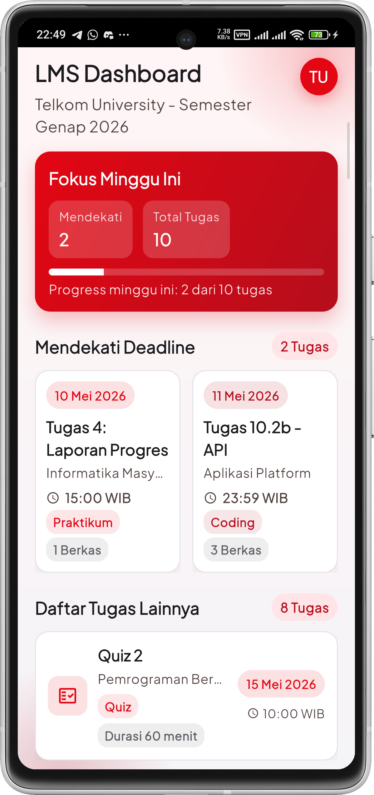
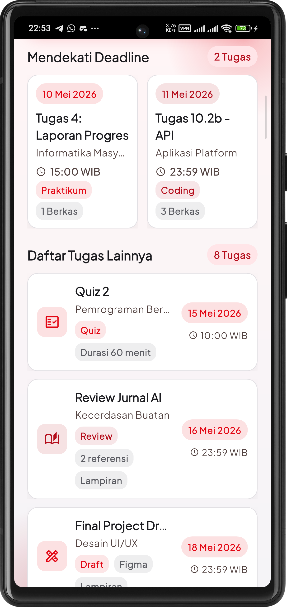

<div align="center">
  <br />
  <h1>LAPORAN PRAKTIKUM <br> APLIKASI BERBASIS PLATFORM </h1>
  <br />
  <h3>MODUL 2 <br> FLUTTER </h3>
  <br />
  
  <br />
  <br />
  <br />
  <h3>Disusun Oleh :</h3>
  <p>
    <strong>Muhammad Aulia Muzzaki Nugraha</strong>
    <br>
    <strong>2311102051</strong>
    <br>
    <strong>S1 IF-11-REG05</strong>
  </p>
  <br />
  <h3>Dosen Pengampu :</h3>
  <p>
    <strong>Dedi Agung Prabowo, S.Kom., M.Kom</strong>
  </p>
  <br />
  <br />
  <h4>Asisten Praktikum :</h4>
  <strong>Apri Pandu Wicaksono </strong>
  <br>
  <strong>Hamka Zaenul Ardi</strong>
  <br />
  <h3>LABORATORIUM HIGH PERFORMANCE <br>FAKULTAS INFORMATIKA <br>UNIVERSITAS TELKOM PURWOKERTO <br>2026 </h3>
</div>

<hr>

## Dasar Teori

Flutter adalah framework UI berbasis Dart yang membangun antarmuka melalui pohon widget. Seluruh elemen visual seperti teks, ikon, gambar, dan layout direpresentasikan sebagai widget sehingga tampilan mudah dirangkai dan diperbarui. Keunggulan utama Flutter adalah satu basis kode dapat dipakai untuk Android, iOS, web, dan desktop, sehingga proses pengembangan menjadi lebih efisien. Proyek ini menggunakan Material 3 agar gaya tampilan modern dan konsisten dengan pedoman desain terbaru.

Flutter memiliki dua tipe widget utama: `StatelessWidget` dan `StatefulWidget`. `StatelessWidget` cocok untuk tampilan yang tidak berubah, sedangkan `StatefulWidget` digunakan saat ada animasi, input, atau state dinamis. Pada tugas ini, halaman utama dashboard memakai `StatefulWidget` karena efek transisi masuk dikontrol oleh `AnimationController` dengan `FadeTransition` dan `SlideTransition`. Tata letak mengandalkan `Stack`, `Column`, `Row`, `GridView`, dan `ListView` untuk menyusun konten secara rapi dan responsif.

Data tugas disusun menggunakan class model `DeadlineTask` dan `TaskItem` agar setiap item memiliki struktur yang jelas. Warna aplikasi diatur lewat palette khusus, lalu diterapkan ke tema dan komponen agar seluruh elemen tampak seragam. Latar gradien dan glow digunakan untuk memberi nuansa visual, sementara chip dan kartu membantu menampilkan metadata tugas secara ringkas.

## Task 2 Mobile Flutter
### Source code

```dart
const List<DeadlineTask> deadlineTasks = [
  DeadlineTask(
    date: '10 Mei 2026',
    title: 'Tugas 4: Laporan Progres',
    course: 'Informatika Masyarakat',
    time: '15:00 WIB',
    tag: 'Praktikum',
    extra: '1 Berkas',
    tagColor: TelkomPalette.red,
  ),
  DeadlineTask(
    date: '11 Mei 2026',
    title: 'Tugas 10.2b - API',
    course: 'Aplikasi Platform',
    time: '23:59 WIB',
    tag: 'Coding',
    extra: '3 Berkas',
    tagColor: TelkomPalette.deepRed,
  ),
];

const List<TaskItem> otherTasks = [
  TaskItem(
    title: 'Quiz 2',
    course: 'Pemrograman Bergerak',
    date: '15 Mei 2026',
    time: '10:00 WIB',
    type: 'Quiz',
    detail: 'Durasi 60 menit',
    icon: Icons.fact_check_outlined,
    accent: TelkomPalette.red,
  ),
  TaskItem(
    title: 'Review Jurnal AI',
    course: 'Kecerdasan Buatan',
    date: '16 Mei 2026',
    time: '23:59 WIB',
    type: 'Review',
    detail: '2 referensi',
    icon: Icons.auto_stories_outlined,
    accent: TelkomPalette.deepRed,
    hasAttachment: true,
  ),
  TaskItem(
    title: 'Final Project Draft',
    course: 'Desain UI/UX',
    date: '18 Mei 2026',
    time: '23:59 WIB',
    type: 'Draft',
    detail: 'Figma',
    icon: Icons.design_services_outlined,
    accent: TelkomPalette.red,
    hasAttachment: true,
  ),
  TaskItem(
    title: 'Tugas Praktikum 3',
    course: 'Pemrograman Bergerak',
    date: '20 Mei 2026',
    time: '08:00 WIB',
    type: 'Praktikum',
    detail: 'Lab A',
    icon: Icons.laptop_mac_outlined,
    accent: TelkomPalette.deepRed,
  ),
  TaskItem(
    title: 'Latihan Soal UTS',
    course: 'Matematika Diskrit',
    date: '22 Mei 2026',
    time: '17:00 WIB',
    type: 'Latihan',
    detail: '25 soal',
    icon: Icons.task_outlined,
    accent: TelkomPalette.red,
  ),
  TaskItem(
    title: 'Tugas Kelompok 1',
    course: 'Arsitektur Perangkat Lunak',
    date: '23 Mei 2026',
    time: '21:00 WIB',
    type: 'Kelompok',
    detail: 'Presentasi',
    icon: Icons.groups_outlined,
    accent: TelkomPalette.deepRed,
    isGroup: true,
  ),
  TaskItem(
    title: 'Analisis Kasus',
    course: 'Sistem Informasi',
    date: '24 Mei 2026',
    time: '19:00 WIB',
    type: 'Analisis',
    detail: 'Studi kasus',
    icon: Icons.analytics_outlined,
    accent: TelkomPalette.red,
  ),
  TaskItem(
    title: 'Refleksi Mingguan',
    course: 'Etika Profesi',
    date: '25 Mei 2026',
    time: '20:00 WIB',
    type: 'Refleksi',
    detail: '400 kata',
    icon: Icons.edit_note_outlined,
    accent: TelkomPalette.deepRed,
  ),
];
```

### Screenshot Output



### Penjelasan Code

Eksekusi dimulai dari `main()` yang memanggil `LmsApp`. Pada kelas ini disusun tema Material 3 dengan skema warna berbasis `TelkomPalette`, serta tipografi diubah menggunakan `GoogleFonts.plusJakartaSansTextTheme` agar tampilan lebih modern dan konsisten. Aplikasi juga menonaktifkan banner debug dan menggunakan latar transparan supaya dekorasi background terlihat.

Halaman `DashboardPage` bersifat dinamis karena menampilkan animasi masuk menggunakan `AnimationController`, `FadeTransition`, dan `SlideTransition`. Layout utama disusun dengan `Stack` agar background dan konten bisa ditumpuk. Konten mencakup header, kartu ringkasan, grid deadline, serta daftar tugas lain yang dibangun dari data `DeadlineTask` dan `TaskItem`. Widget pendukung seperti `DateChip`, `MetaChip`, dan `TaskListTile` membuat informasi lebih ringkas. Saat kartu ditekan, aplikasi menampilkan `SnackBar` sebagai feedback interaksi.