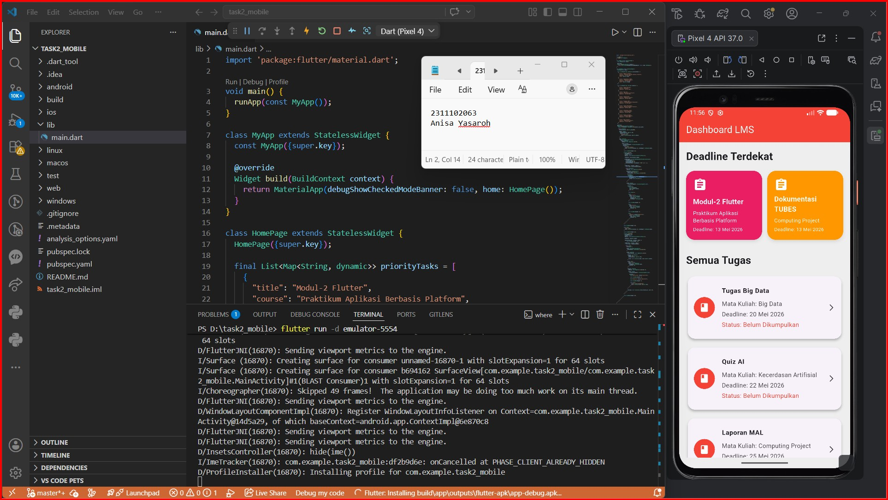
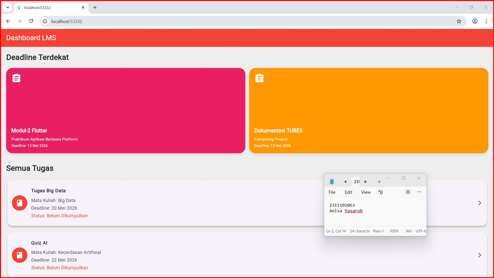

<div align="center">
  <br />
  <h1>LAPORAN PRAKTIKUM <br> APLIKASI BERBASIS PLATFORM </h1>
  <br />
  <h3>MODUL 2 <br> FLUTTER </h3>
  <br />
  
  <br />
  <br />
  <br />
  <h3>Disusun Oleh :</h3>
  <p>
    <strong>Anisa Yasaroh</strong>
    <br>
    <strong>2311102063</strong>
    <br>
    <strong>S1 IF-11-REG05</strong>
  </p>
  <br />
  <h3>Dosen Pengampu :</h3>
  <p>
    <strong>Dedi Agung Prabowo, S.Kom., M.Kom</strong>
  </p>
  <br />
  <br />
  <h4>Asisten Praktikum :</h4>
  <strong>Apri Pandu Wicaksono </strong>
  <br>
  <strong>Hamka Zaenul Ardi</strong>
  <br />
  <h3>LABORATORIUM HIGH PERFORMANCE <br>FAKULTAS INFORMATIKA <br>UNIVERSITAS TELKOM PURWOKERTO <br>2026 </h3>
</div>

<hr>

## Dasar Teori

Flutter merupakan framework open-source yang dikembangkan oleh Google untuk membangun aplikasi mobile secara cross-platform, yaitu satu kode program dapat dijalankan pada berbagai sistem operasi seperti Android dan iOS. Flutter menggunakan bahasa pemrograman Dart dan menerapkan konsep widget sebagai dasar penyusunan antarmuka aplikasi. Semua komponen tampilan pada Flutter, seperti teks, tombol, gambar, dan layout disusun menggunakan widget sehingga tampilan aplikasi dapat dibuat lebih fleksibel dan interaktif.

Dalam Flutter terdapat dua jenis widget utama, yaitu `StatelessWidget` dan `StatefulWidget`. `StatelessWidget` digunakan untuk tampilan yang bersifat tetap dan tidak mengalami perubahan data, sedangkan `StatefulWidget` digunakan ketika tampilan dapat berubah sesuai interaksi pengguna atau perubahan data aplikasi. Pada kode program praktikum ini digunakan `StatelessWidget` pada class `MyApp` dan `HomePage` karena tampilan dashboard tugas dibuat dalam bentuk statis. Selain itu, Flutter juga menyediakan widget layout seperti `Column`, `Row`, `Container`, `GridView`, dan `ListView` untuk mengatur posisi komponen pada layar aplikasi.

Pada praktikum ini aplikasi dibuat menggunakan widget `MaterialApp` sebagai struktur utama aplikasi dan `Scaffold` sebagai kerangka tampilan halaman. Widget `AppBar` digunakan untuk membuat bagian header aplikasi, sedangkan `GridView.builder` digunakan untuk menampilkan daftar tugas prioritas dalam bentuk grid dan `ListView.separated` digunakan untuk menampilkan daftar seluruh tugas secara vertikal. Data tugas disimpan dalam bentuk `List<Map>` sehingga informasi seperti judul tugas, mata kuliah, dan deadline dapat ditampilkan secara dinamis ke dalam antarmuka aplikasi. Dengan penggunaan Flutter dan Dart, aplikasi dapat dibuat dengan tampilan modern, responsif, dan lebih mudah dikembangkan.

## Task 2 Mobile Flutter
### Source code

```
import 'package:flutter/material.dart';

void main() {
  runApp(const MyApp());
}

class MyApp extends StatelessWidget {
  const MyApp({super.key});

  @override
  Widget build(BuildContext context) {
    return MaterialApp(debugShowCheckedModeBanner: false, home: HomePage());
  }
}

class HomePage extends StatelessWidget {
  HomePage({super.key});

  final List<Map<String, dynamic>> priorityTasks = [
    {
      "title": "Modul-2 Flutter",
      "course": "Praktikum Aplikasi Berbasis Platform",
      "deadline": "13 Mei 2026",
      "color": Colors.pink,
    },
    {
      "title": "Dokumentasi TUBES",
      "course": "Computing Project",
      "deadline": "13 Mei 2026",
      "color": Colors.orange,
    },
  ];

  final List<Map<String, String>> taskList = [
    {
      "title": "Tugas Big Data",
      "course": "Big Data",
      "deadline": "20 Mei 2026",
    },
    {
      "title": "Quiz AI",
      "course": "Kecerdasan Artifisial",
      "deadline": "22 Mei 2026",
    },
    {
      "title": "Laporan MAL",
      "course": "Computing Project",
      "deadline": "25 Mei 2026",
    },
    {
      "title": "Proposal IMK",
      "course": "Informatika Untuk Masyarakat",
      "deadline": "27 Mei 2026",
    },
    {
      "title": "Tugas Pemrograman",
      "course": "Aplikasi Berbasis Platform",
      "deadline": "29 Mei 2026",
    },
    {
      "title": "Presentasi Cloud",
      "course": "Cloud Computing",
      "deadline": "30 Mei 2026",
    },
    {
      "title": "Resume Jaringan",
      "course": "Jaringan Komputer",
      "deadline": "1 Juni 2026",
    },
    {
      "title": "Mini Project",
      "course": "Pembelajaran Mesin",
      "deadline": "3 Juni 2026",
    },
  ];

  @override
  Widget build(BuildContext context) {
    double screenWidth = MediaQuery.of(context).size.width;

    return Scaffold(
      backgroundColor: Colors.grey[200],

      appBar: AppBar(
        backgroundColor: Colors.red,
        title: const Text(
          "Dashboard LMS",
          style: TextStyle(color: Colors.white),
        ),
      ),

      body: SafeArea(
        child: SingleChildScrollView(
          child: Padding(
            padding: const EdgeInsets.all(16),

            child: Column(
              crossAxisAlignment: CrossAxisAlignment.start,
              children: [
                const Text(
                  "Deadline Terdekat",
                  style: TextStyle(fontSize: 24, fontWeight: FontWeight.bold),
                ),

                const SizedBox(height: 16),

                GridView.builder(
                  shrinkWrap: true,
                  primary: false,
                  physics: const NeverScrollableScrollPhysics(),

                  itemCount: priorityTasks.length,

                  gridDelegate: SliverGridDelegateWithFixedCrossAxisCount(
                    crossAxisCount: 2,
                    crossAxisSpacing: 12,
                    mainAxisSpacing: 12,
                    childAspectRatio: screenWidth > 700 ? 2.8 : 1.1,
                  ),

                  itemBuilder: (context, index) {
                    final task = priorityTasks[index];

                    return Container(
                      padding: const EdgeInsets.all(16),

                      decoration: BoxDecoration(
                        color: task["color"],
                        borderRadius: BorderRadius.circular(20),

                        boxShadow: [
                          BoxShadow(
                            color: Colors.black.withOpacity(0.1),
                            blurRadius: 6,
                            offset: const Offset(0, 4),
                          ),
                        ],
                      ),

                      child: Column(
                        crossAxisAlignment: CrossAxisAlignment.start,

                        children: [
                          const Icon(
                            Icons.assignment,
                            color: Colors.white,
                            size: 32,
                          ),

                          const Spacer(),

                          Text(
                            task["title"],
                            style: const TextStyle(
                              color: Colors.white,
                              fontSize: 16,
                              fontWeight: FontWeight.bold,
                            ),
                          ),

                          const SizedBox(height: 6),

                          Text(
                            task["course"],
                            style: const TextStyle(
                              color: Colors.white,
                              fontSize: 12,
                            ),
                          ),

                          const SizedBox(height: 4),

                          Text(
                            "Deadline: ${task["deadline"]}",
                            style: const TextStyle(
                              color: Colors.white,
                              fontSize: 11,
                            ),
                          ),
                        ],
                      ),
                    );
                  },
                ),

                const SizedBox(height: 30),

                const Text(
                  "Semua Tugas",
                  style: TextStyle(fontSize: 24, fontWeight: FontWeight.bold),
                ),

                const SizedBox(height: 16),

                ListView.separated(
                  shrinkWrap: true,
                  primary: false,
                  physics: const NeverScrollableScrollPhysics(),

                  itemCount: taskList.length,

                  separatorBuilder: (context, index) =>
                      const SizedBox(height: 12),

                  itemBuilder: (context, index) {
                    final task = taskList[index];

                    return Card(
                      elevation: 4,

                      shape: RoundedRectangleBorder(
                        borderRadius: BorderRadius.circular(16),
                      ),

                      child: ListTile(
                        contentPadding: const EdgeInsets.all(14),

                        leading: CircleAvatar(
                          radius: 24,
                          backgroundColor: Colors.red,

                          child: const Icon(Icons.book, color: Colors.white),
                        ),

                        title: Text(
                          task["title"]!,
                          style: const TextStyle(
                            fontWeight: FontWeight.bold,
                            fontSize: 15,
                          ),
                        ),

                        subtitle: Padding(
                          padding: const EdgeInsets.only(top: 8),

                          child: Column(
                            crossAxisAlignment: CrossAxisAlignment.start,

                            children: [
                              Text("Mata Kuliah: ${task["course"]}"),

                              const SizedBox(height: 4),

                              Text("Deadline: ${task["deadline"]}"),

                              const SizedBox(height: 4),

                              const Text(
                                "Status: Belum Dikumpulkan",
                                style: TextStyle(color: Colors.red),
                              ),
                            ],
                          ),
                        ),

                        trailing: const Icon(Icons.arrow_forward_ios, size: 18),
                      ),
                    );
                  },
                ),

                const SizedBox(height: 30),
              ],
            ),
          ),
        ),
      ),
    );
  }
}

```
### Screenshot Output



### Penjelasan Code

Kode di atas digunakan untuk membuat tampilan seperti lms berbasis mobile menggunakan framework Flutter dan bahasa pemrograman Dart. Program diawali dengan `main()` yang menjalankan widget `MyApp` menggunakan fungsi `runApp()`. Class `MyApp` merupakan turunan dari `StatelessWidget` yang berfungsi sebagai struktur utama aplikasi dengan menggunakan widget `MaterialApp`. Pada bagian ini juga digunakan properti `debugShowCheckedModeBanner: false` untuk menghilangkan label debug pada aplikasi serta `HomePage()` sebagai halaman utama yang akan ditampilkan pertama kali saat aplikasi dijalankan. Selain itu, pada class `HomePage` terdapat data tugas yang disimpan dalam bentuk `List<Map>` yaitu `priorityTasks` untuk daftar tugas prioritas dan `taskList` untuk seluruh daftar tugas sehingga data dapat ditampilkan secara dinamis pada halaman aplikasi.

Kode tersebut juga digunakan untuk membangun tampilan antarmuka aplikasi agar lebih interaktif dan responsif. Widget `Scaffold` digunakan sebagai kerangka utama halaman yang terdiri dari `AppBar` dan `body`. Bagian `body` menggunakan `SingleChildScrollView` agar halaman dapat digulir ke bawah ketika isi tampilan melebihi ukuran layar. Widget `GridView.builder` digunakan untuk menampilkan daftar deadline terdekat dalam bentuk grid dua kolom, sedangkan `ListView.separated` digunakan untuk menampilkan seluruh daftar tugas dalam bentuk list secara vertikal. Setiap item tugas ditampilkan menggunakan widget seperti `Container`, `Card`, `ListTile`, `Text`, dan `CircleAvatar` sehingga tampilan aplikasi menjadi lebih rapi dan mudah dipahami pengguna. Selain itu, penggunaan `MediaQuery` pada kode berfungsi untuk menyesuaikan ukuran tampilan berdasarkan ukuran layar perangkat agar aplikasi tetap nyaman digunakan pada mobile maupun web.