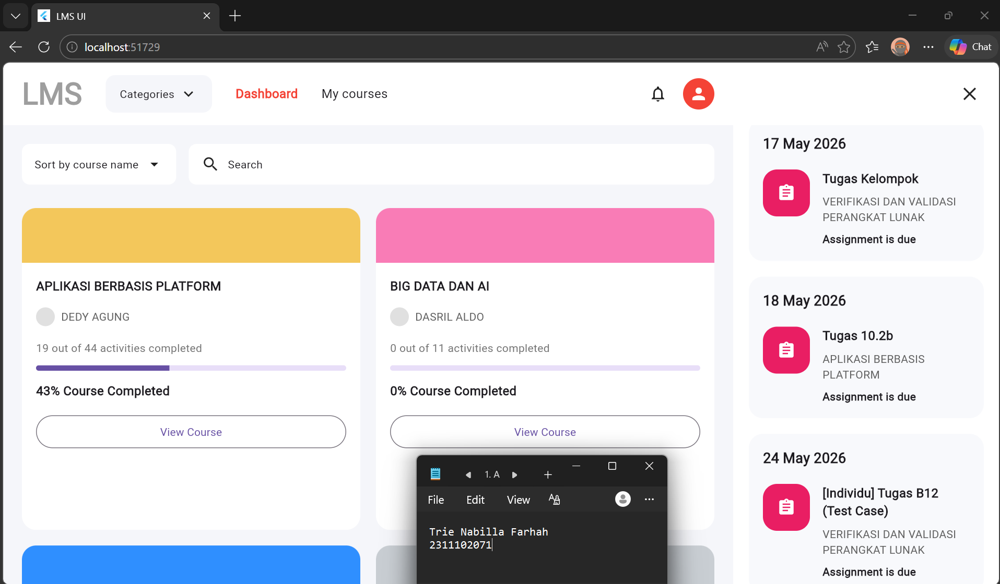
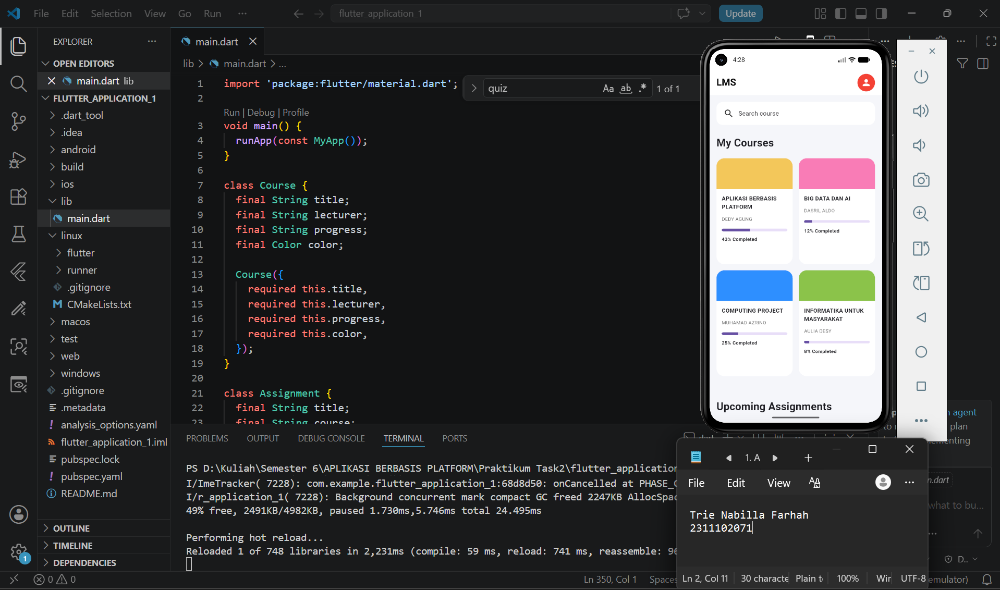

<div align="center">
  <br />
  <h1>LAPORAN PRAKTIKUM <br> APLIKASI BERBASIS PLATFORM </h1>
  <br />
  <h3>MODUL 2 <br> FLUTTER </h3>
  <br />
  
  <br />
  <br />
  <br />
  <h3>Disusun Oleh :</h3>
  <p>
    <strong>Trie Nabilla Farhah</strong>
    <br>
    <strong>2311102071</strong>
    <br>
    <strong>S1 IF-11-REG05</strong>
  </p>
  <br />
  <h3>Dosen Pengampu :</h3>
  <p>
    <strong>Dedi Agung Prabowo, S.Kom., M.Kom</strong>
  </p>
  <br />
  <br />
  <h4>Asisten Praktikum :</h4>
  <strong>Apri Pandu Wicaksono </strong>
  <br>
  <strong>Hamka Zaenul Ardi</strong>
  <br />
  <h3>LABORATORIUM HIGH PERFORMANCE <br>FAKULTAS INFORMATIKA <br>UNIVERSITAS TELKOM PURWOKERTO <br>2026 </h3>
</div>

<hr>

## Dasar Teori
Flutter merupakan framework open-source yang dikembangkan oleh Google untuk membangun aplikasi multiplatform seperti Android, iOS, web, dan desktop menggunakan satu basis kode (single codebase). Flutter menggunakan bahasa pemrograman Dart dan menyediakan berbagai widget yang digunakan untuk membangun antarmuka pengguna (UI) yang interaktif, responsif, dan modern. Selain itu, Flutter memiliki performa yang cukup baik karena menggunakan rendering engine sendiri sehingga tampilan aplikasi dapat berjalan dengan lancar pada berbagai perangkat.

Dalam pengembangannya, Flutter menggunakan konsep widget sebagai komponen utama penyusun tampilan aplikasi. Widget pada Flutter terdiri dari Stateless Widget dan Stateful Widget. Stateless Widget digunakan untuk tampilan yang bersifat tetap, sedangkan Stateful Widget digunakan untuk tampilan yang dapat berubah sesuai interaksi pengguna. Flutter juga mendukung Material Design yang memungkinkan pengembang membuat tampilan aplikasi yang konsisten dan modern dengan berbagai komponen bawaan seperti AppBar, Card, dan Button.

Pada praktikum ini, Flutter digunakan untuk membangun tampilan dashboard Learning Management System (LMS) berbasis mobile. Implementasi dilakukan menggunakan widget GridView untuk menampilkan daftar mata kuliah dalam bentuk grid dan ListView.separated untuk menampilkan daftar tugas secara vertikal. Selain itu, Flutter memiliki fitur Hot Reload yang memudahkan proses pengembangan aplikasi karena perubahan kode dapat langsung ditampilkan tanpa perlu menjalankan ulang aplikasi dari awal.
## Task 2 Mobile Flutter
### Source code

```
import 'package:flutter/material.dart';

void main() {
  runApp(const MyApp());
}

class Course {
  final String title;
  final String lecturer;
  final String progress;
  final Color color;

  Course({
    required this.title,
    required this.lecturer,
    required this.progress,
    required this.color,
  });
}

class Assignment {
  final String title;
  final String course;
  final String date;

  Assignment({required this.title, required this.course, required this.date});
}

class MyApp extends StatelessWidget {
  const MyApp({super.key});

  @override
  Widget build(BuildContext context) {
    return MaterialApp(
      debugShowCheckedModeBanner: false,
      title: 'LMS Mobile',
      theme: ThemeData(scaffoldBackgroundColor: const Color(0xffF5F6FA)),
      home: const HomePage(),
    );
  }
}

class HomePage extends StatelessWidget {
  const HomePage({super.key});

  @override
  Widget build(BuildContext context) {
    final courses = [
      Course(
        title: 'APLIKASI BERBASIS PLATFORM',
        lecturer: 'DEDY AGUNG',
        progress: '43%',
        color: const Color(0xffF3C75B),
      ),
      Course(
        title: 'BIG DATA DAN AI',
        lecturer: 'DASRIL ALDO',
        progress: '12%',
        color: const Color(0xffF97CB6),
      ),
      Course(
        title: 'COMPUTING PROJECT',
        lecturer: 'MUHAMAD AZRINO',
        progress: '25%',
        color: const Color(0xff2F8FFF),
      ),
      Course(
        title: 'INFORMATIKA UNTUK MASYARAKAT',
        lecturer: 'AULIA DESY',
        progress: '8%',
        color: const Color(0xff8BC34A),
      ),
    ];

    final assignments = [
      Assignment(
        title: 'Tugas Kelompok',
        course: 'VERIFIKASI DAN VALIDASI',
        date: '17 May 2026',
      ),
      Assignment(
        title: 'Tugas 10.2b',
        course: 'APLIKASI BERBASIS PLATFORM',
        date: '18 May 2026',
      ),
      Assignment(
        title: 'Quiz Flutter',
        course: 'MOBILE PROGRAMMING',
        date: '19 May 2026',
      ),
      Assignment(
        title: 'Laporan Praktikum',
        course: 'MACHINE LEARNING',
        date: '20 May 2026',
      ),
      Assignment(
        title: 'Proposal Project',
        course: 'COMPUTING PROJECT',
        date: '21 May 2026',
      ),
      Assignment(
        title: 'UI Design',
        course: 'INTERAKSI MANUSIA',
        date: '22 May 2026',
      ),
      Assignment(
        title: 'Essay AI',
        course: 'ARTIFICIAL INTELLIGENCE',
        date: '23 May 2026',
      ),
      Assignment(
        title: 'Testing App',
        course: 'SOFTWARE TESTING',
        date: '24 May 2026',
      ),
    ];

    return Scaffold(
      appBar: AppBar(
        backgroundColor: Colors.white,
        elevation: 0,
        title: const Text(
          'LMS',
          style: TextStyle(color: Colors.black, fontWeight: FontWeight.bold),
        ),
        actions: const [
          Padding(
            padding: EdgeInsets.only(right: 16),
            child: CircleAvatar(
              backgroundColor: Colors.red,
              child: Icon(Icons.person, color: Colors.white),
            ),
          ),
        ],
      ),

      body: SingleChildScrollView(
        padding: const EdgeInsets.all(16),
        child: Column(
          crossAxisAlignment: CrossAxisAlignment.start,
          children: [
            // SEARCH
            Container(
              height: 52,
              padding: const EdgeInsets.symmetric(horizontal: 16),
              decoration: BoxDecoration(
                color: Colors.white,
                borderRadius: BorderRadius.circular(14),
              ),
              child: const Row(
                children: [
                  Icon(Icons.search),
                  SizedBox(width: 10),
                  Text('Search course'),
                ],
              ),
            ),

            const SizedBox(height: 24),

            const Text(
              'My Courses',
              style: TextStyle(fontSize: 24, fontWeight: FontWeight.bold),
            ),

            const SizedBox(height: 18),

            // GRIDVIEW
            GridView.builder(
              shrinkWrap: true,
              physics: const NeverScrollableScrollPhysics(),
              itemCount: courses.length,
              gridDelegate: const SliverGridDelegateWithFixedCrossAxisCount(
                crossAxisCount: 2,
                crossAxisSpacing: 14,
                mainAxisSpacing: 14,
                childAspectRatio: 0.72,
              ),
              itemBuilder: (context, index) {
                final course = courses[index];

                return Container(
                  decoration: BoxDecoration(
                    color: Colors.white,
                    borderRadius: BorderRadius.circular(18),
                  ),
                  child: Column(
                    crossAxisAlignment: CrossAxisAlignment.start,
                    children: [
                      // HEADER COLOR
                      Container(
                        height: 70,
                        decoration: BoxDecoration(
                          color: course.color,
                          borderRadius: const BorderRadius.only(
                            topLeft: Radius.circular(18),
                            topRight: Radius.circular(18),
                          ),
                        ),
                      ),

                      Padding(
                        padding: const EdgeInsets.all(12),
                        child: Column(
                          crossAxisAlignment: CrossAxisAlignment.start,
                          children: [
                            Text(
                              course.title,
                              maxLines: 2,
                              overflow: TextOverflow.ellipsis,
                              style: const TextStyle(
                                fontSize: 13,
                                fontWeight: FontWeight.bold,
                              ),
                            ),

                            const SizedBox(height: 10),

                            Text(
                              course.lecturer,
                              style: TextStyle(
                                fontSize: 11,
                                color: Colors.grey[700],
                              ),
                            ),

                            const SizedBox(height: 14),

                            ClipRRect(
                              borderRadius: BorderRadius.circular(20),
                              child: LinearProgressIndicator(
                                minHeight: 6,
                                value:
                                    double.parse(
                                      course.progress.replaceAll('%', ''),
                                    ) /
                                    100,
                              ),
                            ),

                            const SizedBox(height: 10),

                            Text(
                              '${course.progress} Completed',
                              style: const TextStyle(
                                fontSize: 11,
                                fontWeight: FontWeight.bold,
                              ),
                            ),
                          ],
                        ),
                      ),
                    ],
                  ),
                );
              },
            ),

            const SizedBox(height: 28),

            const Text(
              'Upcoming Assignments',
              style: TextStyle(fontSize: 24, fontWeight: FontWeight.bold),
            ),

            const SizedBox(height: 18),

            // LISTVIEW
            ListView.separated(
              shrinkWrap: true,
              physics: const NeverScrollableScrollPhysics(),
              itemCount: assignments.length,
              separatorBuilder: (context, index) => const SizedBox(height: 14),
              itemBuilder: (context, index) {
                final item = assignments[index];

                return Container(
                  padding: const EdgeInsets.all(14),
                  decoration: BoxDecoration(
                    color: Colors.white,
                    borderRadius: BorderRadius.circular(18),
                  ),
                  child: Row(
                    children: [
                      Container(
                        width: 52,
                        height: 52,
                        decoration: BoxDecoration(
                          color: Colors.pink,
                          borderRadius: BorderRadius.circular(14),
                        ),
                        child: const Icon(
                          Icons.assignment,
                          color: Colors.white,
                        ),
                      ),

                      const SizedBox(width: 14),

                      Expanded(
                        child: Column(
                          crossAxisAlignment: CrossAxisAlignment.start,
                          children: [
                            Text(
                              item.title,
                              maxLines: 2,
                              overflow: TextOverflow.ellipsis,
                              style: const TextStyle(
                                fontWeight: FontWeight.bold,
                                fontSize: 15,
                              ),
                            ),

                            const SizedBox(height: 6),

                            Text(
                              item.course,
                              maxLines: 1,
                              overflow: TextOverflow.ellipsis,
                              style: TextStyle(
                                color: Colors.grey[700],
                                fontSize: 12,
                              ),
                            ),

                            const SizedBox(height: 6),

                            Text(
                              item.date,
                              style: const TextStyle(
                                color: Colors.red,
                                fontWeight: FontWeight.w600,
                                fontSize: 12,
                              ),
                            ),
                          ],
                        ),
                      ),
                    ],
                  ),
                );
              },
            ),
          ],
        ),
      ),
    );
  }
}

```
### Screenshot Output



### Penjelasan Code

Program Flutter tersebut digunakan untuk membuat tampilan Learning Management System (LMS) versi mobile dengan memanfaatkan widget `GridView.builder` dan `ListView.separated`. Pada bagian awal program dibuat dua model data yaitu `Course` dan `Assignment` yang berfungsi untuk menyimpan informasi mata kuliah dan tugas. Selanjutnya, data mata kuliah dan tugas disimpan ke dalam list agar dapat ditampilkan secara dinamis pada halaman aplikasi. Struktur utama aplikasi menggunakan `MaterialApp` dan `Scaffold` sebagai kerangka dasar tampilan, kemudian ditambahkan `AppBar`, kolom utama (`Column`), serta `SingleChildScrollView` agar halaman dapat digulir ke bawah pada perangkat mobile.

Pada bagian tampilan, `GridView.builder` digunakan untuk menampilkan daftar mata kuliah dalam bentuk grid dua kolom yang berisi nama mata kuliah, dosen, progress pembelajaran, dan progress bar. Sementara itu, `ListView.separated` digunakan untuk menampilkan daftar tugas secara vertikal lengkap dengan nama tugas, nama mata kuliah, dan tanggal deadline. Penggunaan `Container`, `Padding`, `SizedBox`, dan `BorderRadius` membuat tampilan aplikasi menjadi lebih rapi dan modern menyerupai LMS pada umumnya. Selain itu, kombinasi warna, icon, dan card putih memberikan tampilan antarmuka yang lebih menarik dan nyaman digunakan pada perangkat mobile seperti Pixel 5.
