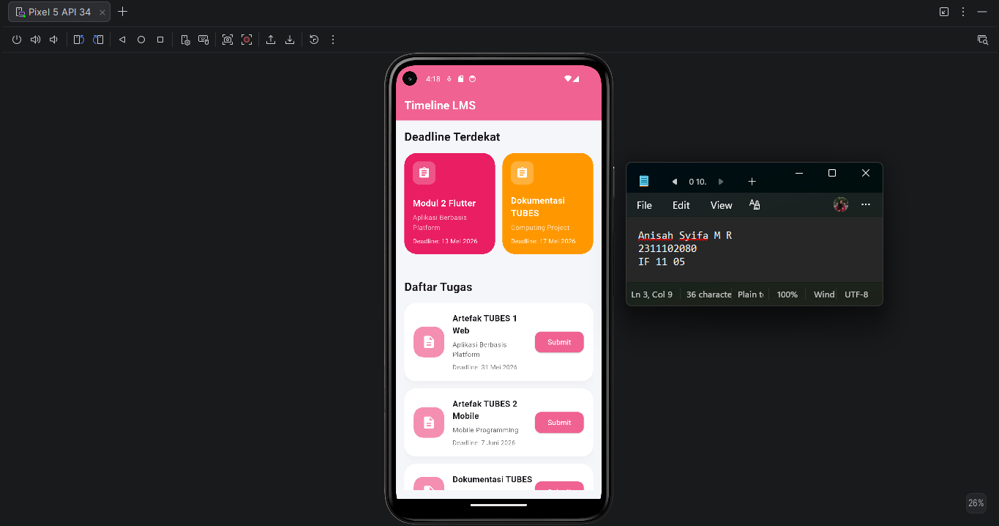
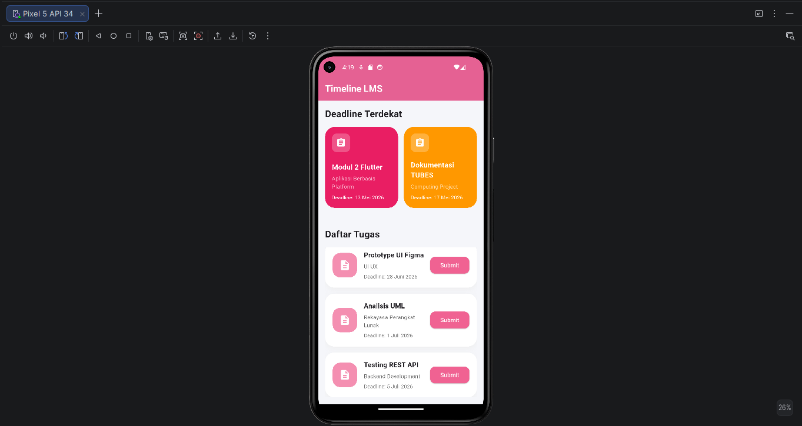
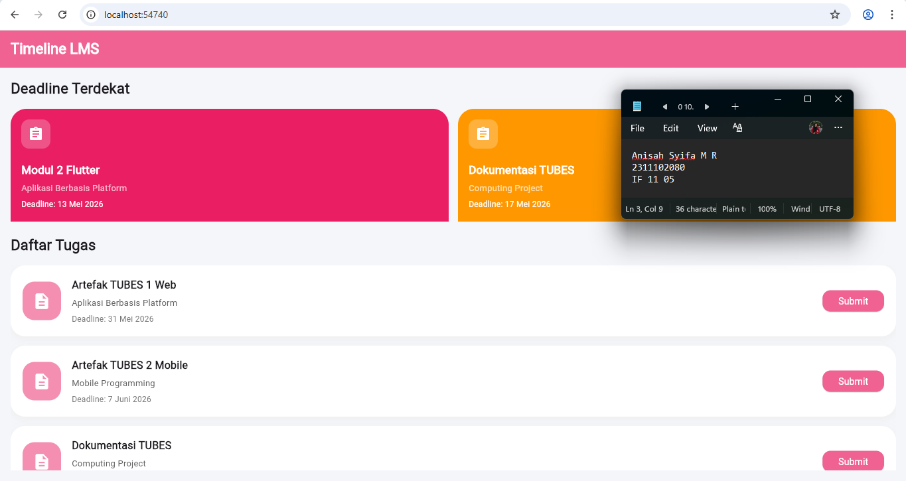

<div align="center">
  <br />
  <h1>LAPORAN PRAKTIKUM <br> APLIKASI BERBASIS PLATFORM </h1>
  <br />
  <h3>MODUL 2 <br> FLUTTER </h3>
  <br />
  
  <br />
  <br />
  <br />
  <h3>Disusun Oleh :</h3>
  <p>
    <strong>Anisah Syifa Mustika Riyanto</strong>
    <br>
    <strong>2311102080</strong>
    <br>
    <strong>S1 IF-11-REG05</strong>
  </p>
  <br />
  <h3>Dosen Pengampu :</h3>
  <p>
    <strong>Dedi Agung Prabowo, S.Kom., M.Kom</strong>
  </p>
  <br />
  <br />
  <h4>Asisten Praktikum :</h4>
  <strong>Apri Pandu Wicaksono </strong>
  <br>
  <strong>Hamka Zaenul Ardi</strong>
  <br />
  <h3>LABORATORIUM HIGH PERFORMANCE <br>FAKULTAS INFORMATIKA <br>UNIVERSITAS TELKOM PURWOKERTO <br>2026 </h3>
</div>

<hr>

## Dasar Teori

Flutter merupakan framework open-source yang dikembangkan oleh Google untuk membangun aplikasi multiplatform menggunakan satu basis kode. Flutter memungkinkan pengembang membuat aplikasi Android, iOS, web, desktop, hingga embedded system dengan performa yang cepat dan tampilan antarmuka yang menarik. Flutter menggunakan bahasa pemrograman Dart sebagai dasar pengembangan aplikasi.

Pada Flutter, tampilan antarmuka dibangun menggunakan widget. Widget merupakan komponen dasar yang digunakan untuk membentuk seluruh elemen pada aplikasi, seperti teks, tombol, gambar, layout, dan navigasi. Widget dalam Flutter terbagi menjadi dua jenis utama, yaitu StatelessWidget dan StatefulWidget. StatelessWidget digunakan untuk tampilan yang bersifat statis dan tidak berubah selama aplikasi berjalan, sedangkan StatefulWidget digunakan untuk tampilan yang dapat berubah berdasarkan interaksi pengguna atau perubahan data.

Flutter memiliki berbagai widget layout yang membantu pengaturan posisi komponen pada aplikasi, seperti Column, Row, Container, Stack, Expanded, dan Padding. Selain itu, Flutter juga menyediakan widget scrolling seperti ListView dan GridView yang sering digunakan untuk menampilkan daftar data secara vertikal maupun grid. Pada praktikum ini digunakan GridView.builder untuk menampilkan tugas prioritas dalam bentuk grid, serta ListView.separated untuk menampilkan daftar tugas lainnya secara dinamis.

Flutter mendukung konsep hot reload, yaitu fitur yang memungkinkan perubahan kode langsung terlihat pada aplikasi tanpa perlu menjalankan ulang program secara keseluruhan. Fitur ini sangat membantu dalam proses pengembangan antarmuka karena mempercepat proses testing dan debugging.

Dalam pengembangan aplikasi Flutter, struktur project terdiri dari beberapa folder penting, seperti folder `lib` yang berisi source code utama aplikasi, folder `android` untuk konfigurasi Android, folder `web` untuk aplikasi berbasis web, serta file `pubspec.yaml` yang digunakan untuk mengatur dependency dan asset project.

Pada praktikum ini, Flutter digunakan untuk membuat tampilan LMS sederhana yang menampilkan daftar tugas kuliah menggunakan GridView dan ListView. Tampilan aplikasi dirancang dengan konsep modern menggunakan warna dominan pink salem, card berbentuk rounded, serta layout responsive yang dapat dijalankan pada emulator Android maupun browser web.

## Task 2 Mobile Flutter

### Source code

```
import 'package:flutter/material.dart';

void main() {
  runApp(const MyApp());
}

class MyApp extends StatelessWidget {
  const MyApp({super.key});

  @override
  Widget build(BuildContext context) {
    return MaterialApp(
      debugShowCheckedModeBanner: false,
      home: const LMSPage(),
    );
  }
}

class LMSPage extends StatelessWidget {
  const LMSPage({super.key});

  @override
  Widget build(BuildContext context) {
    final List<Map<String, dynamic>> deadlineTasks = [
      {
        "title": "Modul 2 Flutter",
        "course": "Aplikasi Berbasis Platform",
        "deadline": "13 Mei 2026",
        "color": Colors.pink,
      },
      {
        "title": "Dokumentasi TUBES",
        "course": "Computing Project",
        "deadline": "17 Mei 2026",
        "color": Colors.orange,
      },
    ];

    final List<Map<String, dynamic>> tasks = [
      {
        "title": "Artefak TUBES 1 Web",
        "course": "Aplikasi Berbasis Platform",
        "deadline": "31 Mei 2026",
      },
      {
        "title": "Artefak TUBES 2 Mobile",
        "course": "Mobile Programming",
        "deadline": "7 Juni 2026",
      },
      {
        "title": "Dokumentasi TUBES",
        "course": "Computing Project",
        "deadline": "19 Juni 2026",
      },
      {
        "title": "Resume Jurnal AI",
        "course": "Artificial Intelligence",
        "deadline": "22 Juni 2026",
      },
      {
        "title": "Perancangan ERD",
        "course": "Basis Data",
        "deadline": "25 Juni 2026",
      },
      {
        "title": "Prototype UI Figma",
        "course": "UI UX",
        "deadline": "28 Juni 2026",
      },
      {
        "title": "Analisis UML",
        "course": "Rekayasa Perangkat Lunak",
        "deadline": "1 Juli 2026",
      },
      {
        "title": "Testing REST API",
        "course": "Backend Development",
        "deadline": "5 Juli 2026",
      },
    ];

    return Scaffold(
      backgroundColor: const Color(0xfff5f6fa),

      appBar: AppBar(
        backgroundColor: Colors.pink.shade300,
        elevation: 0,
        title: const Text(
          "Timeline LMS",
          style: TextStyle(
            color: Colors.white,
            fontWeight: FontWeight.bold,
          ),
        ),
      ),

      body: Padding(
        padding: const EdgeInsets.all(16),

        child: Column(
          crossAxisAlignment: CrossAxisAlignment.start,

          children: [

            const Text(
              "Deadline Terdekat",
              style: TextStyle(
                fontSize: 22,
                fontWeight: FontWeight.bold,
              ),
            ),

            const SizedBox(height: 15),

            /// GRIDVIEW
            SizedBox(
              height: 170,

              child: GridView.builder(
                itemCount: deadlineTasks.length,

                physics: const NeverScrollableScrollPhysics(),

                gridDelegate:
                const SliverGridDelegateWithFixedCrossAxisCount(
                  crossAxisCount: 2,
                  crossAxisSpacing: 14,
                  mainAxisSpacing: 14,
                  childAspectRatio: 1.5,
                ),

                itemBuilder: (context, index) {

                  final task = deadlineTasks[index];

                  return Container(
                    padding: const EdgeInsets.all(16),

                    decoration: BoxDecoration(
                      color: task["color"],
                      borderRadius: BorderRadius.circular(24),
                    ),

                    child: Column(
                      crossAxisAlignment:
                      CrossAxisAlignment.start,

                      mainAxisAlignment:
                      MainAxisAlignment.start,

                      children: [

                        Container(
                          padding: const EdgeInsets.all(10),

                          decoration: BoxDecoration(
                            color: Colors.white24,
                            borderRadius:
                            BorderRadius.circular(12),
                          ),

                          child: const Icon(
                            Icons.assignment,
                            color: Colors.white,
                          ),
                        ),

                        const SizedBox(height: 20),

                        Text(
                          task["title"],

                          style: const TextStyle(
                            color: Colors.white,
                            fontSize: 17,
                            fontWeight: FontWeight.bold,
                          ),
                        ),

                        const SizedBox(height: 6),

                        Text(
                          task["course"],

                          style: const TextStyle(
                            color: Colors.white70,
                            fontSize: 13,
                          ),
                        ),

                        const SizedBox(height: 6),

                        Text(
                          "Deadline: ${task["deadline"]}",

                          style: const TextStyle(
                            color: Colors.white,
                            fontSize: 12,
                          ),
                        ),
                      ],
                    ),
                  );
                },
              ),
            ),

            const SizedBox(height: 20),

            const Text(
              "Daftar Tugas",
              style: TextStyle(
                fontSize: 22,
                fontWeight: FontWeight.bold,
              ),
            ),

            const SizedBox(height: 15),

            /// LISTVIEW
            Expanded(
              child: ListView.separated(

                itemCount: tasks.length,

                separatorBuilder: (context, index) =>
                const SizedBox(height: 14),

                itemBuilder: (context, index) {

                  final task = tasks[index];

                  return Container(
                    padding: const EdgeInsets.all(18),

                    decoration: BoxDecoration(
                      color: Colors.white,

                      borderRadius:
                      BorderRadius.circular(22),

                      boxShadow: [
                        BoxShadow(
                          color: Colors.grey.shade200,
                          blurRadius: 10,
                          offset: const Offset(0, 4),
                        ),
                      ],
                    ),

                    child: Row(
                      children: [

                        Container(
                          width: 58,
                          height: 58,

                          decoration: BoxDecoration(
                            color: Colors.pink.shade200,
                            borderRadius:
                            BorderRadius.circular(18),
                          ),

                          child: const Icon(
                            Icons.description,
                            color: Colors.white,
                            size: 28,
                          ),
                        ),

                        const SizedBox(width: 16),

                        Expanded(
                          child: Column(
                            crossAxisAlignment:
                            CrossAxisAlignment.start,

                            children: [

                              Text(
                                task["title"],

                                style: const TextStyle(
                                  fontWeight:
                                  FontWeight.bold,
                                  fontSize: 16,
                                ),
                              ),

                              const SizedBox(height: 6),

                              Text(
                                task["course"],

                                style: TextStyle(
                                  color: Colors.grey.shade700,
                                  fontSize: 13,
                                ),
                              ),

                              const SizedBox(height: 6),

                              Text(
                                "Deadline: ${task["deadline"]}",

                                style: TextStyle(
                                  color: Colors.grey.shade600,
                                  fontSize: 12,
                                ),
                              ),
                            ],
                          ),
                        ),

                        ElevatedButton(
                          style: ElevatedButton.styleFrom(
                            backgroundColor:
                            Colors.pink.shade300,

                            shape: RoundedRectangleBorder(
                              borderRadius:
                              BorderRadius.circular(12),
                            ),
                          ),

                          onPressed: () {},

                          child: const Text(
                            "Submit",
                            style: TextStyle(
                              color: Colors.white,
                            ),
                          ),
                        ),
                      ],
                    ),
                  );
                },
              ),
            ),
          ],
        ),
      ),
    );
  }
}
```

### Screenshot Output





### Penjelasan Code

Program Flutter yang dibuat merupakan aplikasi sederhana berbasis Learning Management System (LMS) yang digunakan untuk menampilkan daftar tugas kuliah. Pada bagian awal program digunakan `import 'package:flutter/material.dart';` untuk mengimpor library Material Design Flutter yang menyediakan berbagai widget antarmuka. Program dimulai dari fungsi `main()` yang menjalankan widget utama menggunakan `runApp(const MyApp())`. Widget `MyApp` menggunakan `StatelessWidget` karena tampilan aplikasi bersifat statis dan tidak memerlukan perubahan state secara dinamis. Pada widget ini digunakan `MaterialApp` sebagai root aplikasi dan `home` diarahkan ke halaman utama bernama `LMSPage`.

Pada widget `LMSPage`, dibuat dua buah list data menggunakan `List<Map<String, dynamic>>` yaitu `deadlineTasks` dan `tasks`. Data `deadlineTasks` digunakan untuk menampilkan tugas prioritas dengan deadline terdekat pada bagian GridView, sedangkan data `tasks` digunakan untuk menampilkan daftar seluruh tugas pada bagian ListView. Setiap data berisi informasi seperti nama tugas, mata kuliah, deadline, dan warna card.

Tampilan utama aplikasi dibangun menggunakan widget `Scaffold` yang berfungsi sebagai struktur dasar halaman Flutter. Pada bagian `AppBar` digunakan warna dominan pink salem dengan judul “Timeline LMS”. Sementara itu, bagian body menggunakan `Padding` dan `Column` untuk menyusun komponen secara vertikal agar tampilan menjadi lebih rapi.

Pada bagian atas aplikasi digunakan `GridView.builder` untuk menampilkan dua card tugas prioritas secara grid kanan dan kiri. GridView dipilih karena dapat menampilkan data dalam bentuk grid secara dinamis. Setiap card berisi icon tugas, nama tugas, mata kuliah, dan deadline. Tampilan card dibuat lebih modern menggunakan `Container`, `BoxDecoration`, `BorderRadius.circular()`, serta pewarnaan yang berbeda pada setiap card.

Selanjutnya, pada bagian bawah digunakan `ListView.separated` untuk menampilkan delapan daftar tugas lainnya secara vertikal. Widget ini dipilih karena dapat menampilkan list secara dinamis sekaligus memberikan jarak antar item menggunakan separator. Setiap item list terdiri dari icon, nama tugas, nama mata kuliah, deadline, serta tombol submit menggunakan `ElevatedButton`. Untuk mempercantik tampilan digunakan efek bayangan (`BoxShadow`), sudut melengkung, dan kombinasi warna pink salem agar tampilan menyerupai LMS modern.

Secara keseluruhan, program Flutter ini berhasil menerapkan penggunaan widget dasar Flutter seperti `Scaffold`, `Container`, `Column`, `GridView.builder`, dan `ListView.separated` untuk membangun antarmuka aplikasi LMS sederhana yang responsive dan dapat dijalankan pada emulator Android maupun browser web.
