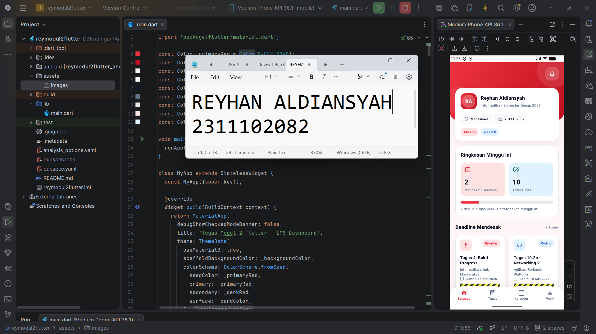

   
  <h1>LAPORAN PRAKTIKUM   APLIKASI BERBASIS PLATFORM</h1>
   
  <h3>MODUL 2   FLUTTER MOBILE UI</h3>
   
  
   
   
  <h3>Disusun Oleh:</h3>
  

    <strong>Reyhan Aldiansyah</strong>
     
    <strong>2311102082</strong>
     
    <strong>S1 IF-11-REG05</strong>
  

   
  <h3>Dosen Pengampu:</h3>
  

    <strong>Dedi Agung Prabowo, S.Kom., M.Kom</strong>
  

   
  <h4>Asisten Praktikum:</h4>
  <strong>Apri Pandu Wicaksono</strong>
   
  <strong>Hamka Zaenul Ardi</strong>
   
   
  <h3>LABORATORIUM HIGH PERFORMANCE   FAKULTAS INFORMATIKA   UNIVERSITAS TELKOM PURWOKERTO   2026</h3>

## Dasar Teori

Flutter merupakan framework dari Google yang digunakan untuk membangun aplikasi mobile dengan satu basis kode. Tampilan pada Flutter disusun dari widget seperti `Scaffold`, `Container`, `Row`, `Column`, `Text`, dan widget lain yang saling membentuk antarmuka aplikasi.

Pada praktikum ini, konsep yang digunakan adalah menampilkan data dari `List` ke dalam UI secara dinamis. Data tugas disimpan dalam bentuk list objek `TaskItem`, lalu ditampilkan menggunakan widget yang sesuai. Untuk tugas yang paling mendesak digunakan `GridView.builder`, sedangkan daftar tugas lainnya ditampilkan dengan `ListView.separated` agar susunannya rapi, dinamis, dan mudah dikembangkan.

## Penjelasan Aplikasi

Aplikasi yang dibuat adalah LMS Dashboard kampus berbasis Flutter dengan tampilan modern seperti dashboard mobile. Halaman utama berisi header merah, kartu profil mahasiswa, ringkasan minggu ini, dua tugas deadline terdekat, daftar semua tugas, dan bottom navigation.

Bagian `Deadline Mendesak` dibuat menggunakan `GridView.builder` dengan dua kolom kanan-kiri sesuai ketentuan tugas. Bagian `Semua Tugas` dibuat menggunakan `ListView.separated` untuk menampilkan 8 data tugas secara vertikal tanpa membuat daftar manual dengan `Column`. Struktur data tugas disimpan dalam list objek `TaskItem` sehingga kode lebih rapi dan mudah dibaca.

Secara keseluruhan, aplikasi ini menampilkan informasi akademik mahasiswa dan daftar tugas dengan tampilan yang lebih nyaman dilihat pada perangkat mobile.

## Output

Tampilan di atas merupakan hasil running LMS Dashboard Flutter yang menampilkan profil mahasiswa, ringkasan tugas mingguan, dua deadline mendesak dalam grid, dan seluruh tugas lainnya dalam list.

## Kesimpulan

Berdasarkan praktikum yang telah dilakukan, Flutter dapat digunakan untuk membuat antarmuka mobile yang modern, rapi, dan responsif. Penggunaan `GridView.builder` pada bagian deadline mendesak dan `ListView.separated` pada bagian semua tugas membuat data lebih terstruktur serta sesuai dengan kebutuhan tugas.

Selain itu, penyimpanan data dalam list objek `TaskItem` membuat kode lebih bersih dan lebih mudah dikembangkan untuk penambahan fitur di tahap berikutnya.
