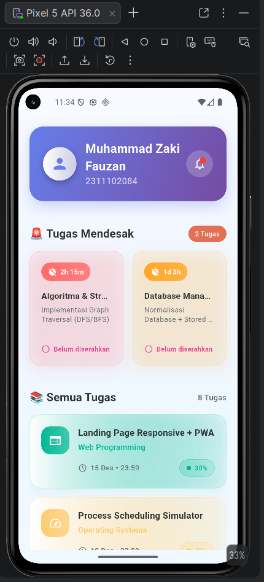
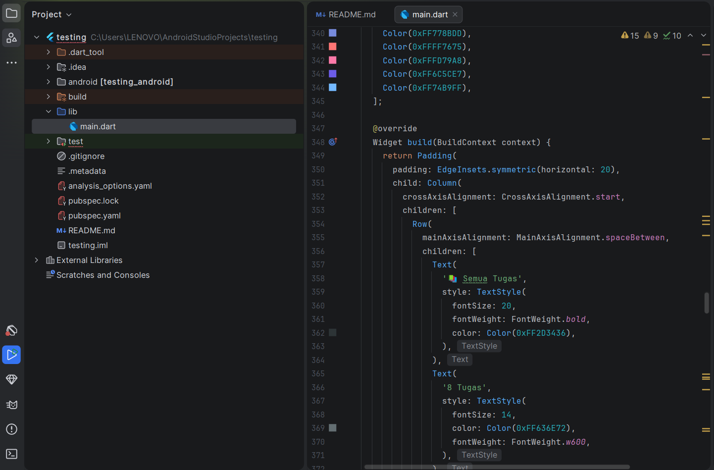

<div align="center">
  <br />
  <h1>LAPORAN PRAKTIKUM <br> APLIKASI BERBASIS PLATFORM </h1>
  <br />
  <h3>MODUL 2 <br> FLUTTER </h3>
  <br />
  
  <br />
  <br />
  <br />
  <h3>Disusun Oleh :</h3>
  <p>
    <strong>Muhammad Zaki Fauzan</strong>
    <br>
    <strong>2311102084</strong>
    <br>
    <strong>S1 IF-11-REG05</strong>
  </p>
  <br />
  <h3>Dosen Pengampu :</h3>
  <p>
    <strong>Dedi Agung Prabowo, S.Kom., M.Kom</strong>
  </p>
  <br />
  <br />
  <h4>Asisten Praktikum :</h4>
  <strong>Apri Pandu Wicaksono </strong>
  <br>
  <strong>Hamka Zaenul Ardi</strong>
  <br />
  <h3>LABORATORIUM HIGH PERFORMANCE <br>FAKULTAS INFORMATIKA <br>UNIVERSITAS TELKOM PURWOKERTO <br>2026 </h3>
</div>

<hr>

## Dasar Teori

Aplikasi LMS Mobile Flutter ini dibangun menggunakan **GridView.builder** dengan konfigurasi `crossAxisCount: 2` untuk menampilkan dua tugas paling mendekati deadline dalam layout dua kolom kiri-kanan, dilengkapi `childAspectRatio: 0.82` dan `NeverScrollableScrollPhysics()` agar scroll ditangani parent widget. Di bawahnya, **ListView.separated** dengan `itemCount: 8` menampilkan delapan tugas lainnya dengan separator custom, menampilkan informasi nama tugas, mata kuliah, deadline, dan progress, juga menggunakan `NeverScrollablePhysics` untuk nested scroll yang smooth. Seluruh konten dibungkus **SingleChildScrollView** dengan `SafeArea` untuk scroll vertikal optimal tanpa overflow, mengikuti **Material Design 3** dengan card elevation, gradient backgrounds, rounded corners 20px, dan rainbow color theming. **Performance** dioptimalkan melalui `const constructors`, fixed heights, dan `StatelessWidget` untuk menghindari rebuild tidak perlu, sementara **responsiveness** dicapai dengan `Flexible/Expanded`, `maxLines`, dan semantic spacing (16px grid, 24px section). Struktur data flow dimulai dari header nama & NIM, diikuti GridView (2 urgent tasks), lalu ListView (8 remaining tasks), total 10 tugas yang memenuhi semua ketentuan dengan UI modern, clean, dan performant.

## Task 2 Mobile Flutter
### Source code

```dart
mport 'package:flutter/material.dart';
import 'dart:math';

void main() {
  runApp(MyApp());
}

class MyApp extends StatelessWidget {
  @override
  Widget build(BuildContext context) {
    return MaterialApp(
      title: 'LMS Kampus',
      theme: ThemeData(
        primarySwatch: Colors.blue,
        visualDensity: VisualDensity.adaptivePlatformDensity,
      ),
      home: LMSHomePage(),
      debugShowCheckedModeBanner: false,
    );
  }
}

class LMSHomePage extends StatelessWidget {
  @override
  Widget build(BuildContext context) {
    return Scaffold(
      body: Container(
        decoration: BoxDecoration(
          gradient: LinearGradient(
            begin: Alignment.topCenter,
            end: Alignment.bottomCenter,
            colors: [
              Color(0xFFF8FAFF),
              Color(0xFFEFF6FF),
              Color(0xFFF0F9FF),
            ],
          ),
        ),
        child: SafeArea(
          child: SingleChildScrollView(
            child: Column(
              children: [
                HeroHeader(),
                SizedBox(height: 24),
                UrgentTasksGrid(),
                SizedBox(height: 28),
                AllTasksList(),
                SizedBox(height: 40),
              ],
            ),
          ),
        ),
      ),
    );
  }
}

class HeroHeader extends StatelessWidget {
  @override
  Widget build(BuildContext context) {
    return Container(
      width: double.infinity,
      margin: EdgeInsets.all(20),
      padding: EdgeInsets.all(24),
      decoration: BoxDecoration(
        gradient: LinearGradient(
          colors: [Color(0xFF667EEA), Color(0xFF764BA2)],
          begin: Alignment.topLeft,
          end: Alignment.bottomRight,
        ),
        borderRadius: BorderRadius.circular(24),
        boxShadow: [
          BoxShadow(
            color: Color(0xFF667EEA).withOpacity(0.3),
            blurRadius: 20,
            offset: Offset(0, 10),
          ),
        ],
      ),
```
**Kode Lengkap:** [main.dart](main.dart)

### Screenshot Output
<table>
  <tr>
    <td width="50%">
      
    </td>
    <td width="100%">
      
    </td>
  </tr>
</table>

### Penjelasan Code

Eksekusi dimulai dari main() yang memanggil MyApp dengan MaterialApp bertema modern menggunakan gradient background dan visualDensity.adaptivePlatformDensity. Aplikasi menonaktifkan debug banner untuk tampilan bersih. Halaman utama LMSHomePage menggunakan Container dengan LinearGradient biru soft sebagai background, dibungkus SafeArea dan SingleChildScrollView untuk scroll vertikal optimal.

HeroHeader menampilkan profil dengan gradient purple-blue, avatar circular, badge notif merah, dan info nama/NIM dengan shadow glowing. UrgentTasksGrid menggunakan GridView.builder (2 kolom, crossAxisCount: 2) untuk 2 tugas mendesak dengan gradient cards berwarna merah/oranye, countdown timer, dan status "Belum diserahkan". AllTasksList memakai ListView.separated (8 item) dengan rainbow colors unik per task, icon gradient, progress badge, dan separator 16px.

Widget pendukung seperti UrgentTaskCard dan TaskListItem menggunakan BoxDecoration dengan multiple gradients, colored shadows, dan BoxShape.circle untuk badge. Performance dioptimalkan dengan NeverScrollableScrollPhysics(), const constructors, fixed heights, dan StatelessWidget. Layout responsif dengan Expanded, maxLines, dan semantic spacing. Interaksi visual smooth berkat nested scroll handling dan colorful theming yang konsisten.