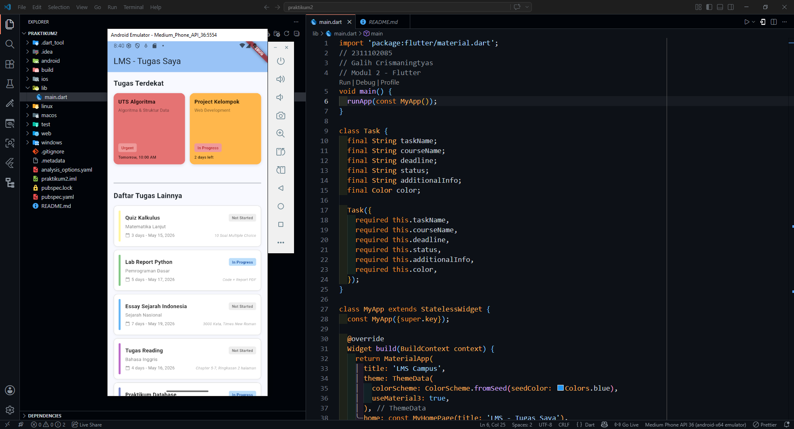

<div align="center">
  <br />
  <h1>LAPORAN PRAKTIKUM <br> APLIKASI BERBASIS PLATFORM </h1>
  <br />
  <h3>MODUL 2 <br> FLUTTER </h3>
  <br />
  
  <br />
  <br />
  <br />
  <h3>Disusun Oleh :</h3>
  <p>
    <strong>Galih Crismaningtyas</strong>
    <br>
    <strong>311102085</strong>
    <br>
    <strong>S1 IF-11-REG05</strong>
  </p>
  <br />
  <h3>Dosen Pengampu :</h3>
  <p>
    <strong>Dedi Agung Prabowo, S.Kom., M.Kom</strong>
  </p>
  <br />
  <br />
  <h4>Asisten Praktikum :</h4>
  <strong>Apri Pandu Wicaksono </strong>
  <br>
  <strong>Hamka Zaenul Ardi</strong>
  <br />
  <h3>LABORATORIUM HIGH PERFORMANCE <br>FAKULTAS INFORMATIKA <br>UNIVERSITAS TELKOM PURWOKERTO <br>2026 </h3>
</div>

<hr>

## Dasar Teori

Flutter adalah framework open-source yang dikembangkan oleh Google untuk membangun aplikasi mobile, web, dan desktop menggunakan satu basis kode (single codebase). Flutter menggunakan bahasa pemrograman Dart dan menerapkan konsep widget sebagai dasar pembuatan antarmuka pengguna. Dengan sistem tersebut, pengembang dapat membuat tampilan aplikasi yang responsif, interaktif, dan mudah dikembangkan.

Dalam Flutter, widget berfungsi sebagai komponen penyusun tampilan aplikasi. Salah satu widget yang sering digunakan adalah ListView, yaitu widget yang digunakan untuk menampilkan data dalam bentuk daftar secara vertikal maupun horizontal. ListView sangat cocok digunakan untuk menampilkan data yang tersusun secara berurutan, seperti daftar kontak, pesan, berita, maupun menu aplikasi.

ListView memiliki kemampuan scrolling otomatis sehingga pengguna dapat melihat data dalam jumlah banyak tanpa memenuhi seluruh layar. Flutter juga menyediakan beberapa jenis ListView seperti ListView.builder untuk data dinamis dan ListView.separated untuk menambahkan pemisah antar item. Penggunaan ListView membantu pengembang dalam mengelola tampilan data agar lebih rapi dan efisien.

Selain ListView, Flutter juga menyediakan widget GridView yang digunakan untuk menampilkan data dalam bentuk grid atau susunan baris dan kolom. GridView umumnya digunakan pada aplikasi yang memiliki tampilan visual seperti galeri foto, katalog produk, dashboard menu, dan daftar gambar. Dengan GridView, beberapa item dapat ditampilkan dalam satu baris sehingga penggunaan ruang layar menjadi lebih optimal.

ListView dan GridView memiliki fungsi yang berbeda sesuai kebutuhan tampilan aplikasi. ListView lebih cocok digunakan untuk data linear dan berbasis teks, sedangkan GridView lebih sesuai untuk tampilan visual yang memerlukan beberapa kolom. Dengan memanfaatkan kedua widget tersebut, pengembang dapat menciptakan antarmuka aplikasi yang lebih menarik, terstruktur, dan memberikan pengalaman pengguna yang lebih baik.

### Source Code

```dart
import 'package:flutter/material.dart';
// 2311102085
// Galih Crismaningtyas
// Modul 2 - Flutter
void main() {
  runApp(const MyApp());
}

class Task {
  final String taskName;
  final String courseName;
  final String deadline;
  final String status;
  final String additionalInfo;
  final Color color;

  Task({
    required this.taskName,
    required this.courseName,
    required this.deadline,
    required this.status,
    required this.additionalInfo,
    required this.color,
  });
}

class MyApp extends StatelessWidget {
  const MyApp({super.key});

  @override
  Widget build(BuildContext context) {
    return MaterialApp(
      title: 'LMS Campus',
      theme: ThemeData(
        colorScheme: ColorScheme.fromSeed(seedColor: Colors.blue),
        useMaterial3: true,
      ),
      home: const MyHomePage(title: 'LMS - Tugas Saya'),
    );
  }
}

class MyHomePage extends StatefulWidget {
  const MyHomePage({super.key, required this.title});

  final String title;

  @override
  State<MyHomePage> createState() => _MyHomePageState();
}

class _MyHomePageState extends State<MyHomePage> {
  // Data untuk 2 grid dengan deadline terdekat
  final List<Task> recentTasks = [
    Task(
      taskName: 'UTS Algoritma',
      courseName: 'Algoritma & Struktur Data',
      deadline: 'Tomorrow, 10:00 AM',
      status: 'Urgent',
      additionalInfo: '3 Soal Essay',
      color: Colors.red[300]!,
    ),
    Task(
      taskName: 'Project Kelompok',
      courseName: 'Web Development',
      deadline: '2 days left',
      status: 'In Progress',
      additionalInfo: '90% Complete',
      color: Colors.orange[300]!,
    ),
  ];

  // Data untuk ListView (8 tugas lainnya)
  final List<Task> otherTasks = [
    Task(
      taskName: 'Quiz Kalkulus',
      courseName: 'Matematika Lanjut',
      deadline: '3 days - May 15, 2026',
      status: 'Not Started',
      additionalInfo: '10 Soal Multiple Choice',
      color: Colors.yellow[200]!,
    ),
    Task(
      taskName: 'Lab Report Python',
      courseName: 'Pemrograman Dasar',
      deadline: '5 days - May 17, 2026',
      status: 'In Progress',
      additionalInfo: 'Code + Report PDF',
      color: Colors.green[300]!,
    ),
    Task(
      taskName: 'Essay Sejarah Indonesia',
      courseName: 'Sejarah Nasional',
      deadline: '7 days - May 19, 2026',
      status: 'Not Started',
      additionalInfo: '3000 Kata, Times New Roman',
      color: Colors.blue[300]!,
    ),
    Task(
      taskName: 'Tugas Reading',
      courseName: 'Bahasa Inggris',
      deadline: '4 days - May 16, 2026',
      status: 'Not Started',
      additionalInfo: 'Chapter 5-7, Ringkasan 2 halaman',
      color: Colors.purple[300]!,
    ),
    Task(
      taskName: 'Praktikum Database',
      courseName: 'Database Management',
      deadline: '6 days - May 18, 2026',
      status: 'In Progress',
      additionalInfo: 'Query & Database Design',
      color: Colors.indigo[300]!,
    ),
    Task(
      taskName: 'Diskusi Forum',
      courseName: 'Sistem Informasi',
      deadline: '3 days - May 15, 2026',
      status: 'Not Started',
      additionalInfo: 'Minimal 2 Postingan & 2 Reply',
      color: Colors.teal[300]!,
    ),
    Task(
      taskName: 'Tugas Grafis 2D',
      courseName: 'Grafika Komputer',
      deadline: '8 days - May 20, 2026',
      status: 'Not Started',
      additionalInfo: 'Menggunakan OpenGL atau Canvas',
      color: Colors.cyan[300]!,
    ),
    Task(
      taskName: 'Presentasi Projek Akhir',
      courseName: 'Capstone Project',
      deadline: '10 days - May 22, 2026',
      status: 'Not Started',
      additionalInfo: 'PPT + Video Demo (5 menit)',
      color: Colors.pink[300]!,
    ),
  ];

  @override
  Widget build(BuildContext context) {
    return Scaffold(
      appBar: AppBar(
        backgroundColor: Theme.of(context).colorScheme.inversePrimary,
        title: Text(widget.title),
        elevation: 2,
      ),
      body: SingleChildScrollView(
        child: Column(
          children: [
            // Section: Tugas dengan Deadline Terdekat (2 Grid)
            Padding(
              padding: const EdgeInsets.all(16),
              child: Column(
                crossAxisAlignment: CrossAxisAlignment.start,
                children: [
                  const Text(
                    'Tugas Terdekat',
                    style: TextStyle(fontSize: 18, fontWeight: FontWeight.bold),
                  ),
                  const SizedBox(height: 12),
                  // GridView untuk 2 tugas terdekat
                  GridView.count(
                    crossAxisCount: 2,
                    shrinkWrap: true,
                    physics: const NeverScrollableScrollPhysics(),
                    mainAxisSpacing: 12,
                    crossAxisSpacing: 12,
                    childAspectRatio: 1,
                    children: recentTasks.map((task) {
                      return _buildGridCard(task);
                    }).toList(),
                  ),
                ],
              ),
            ),
            const Divider(thickness: 2, indent: 16, endIndent: 16),
            // Section: Daftar Tugas Lainnya
            Padding(
              padding: const EdgeInsets.symmetric(horizontal: 16, vertical: 12),
              child: Column(
                crossAxisAlignment: CrossAxisAlignment.start,
                children: [
                  const Text(
                    'Daftar Tugas Lainnya',
                    style: TextStyle(fontSize: 18, fontWeight: FontWeight.bold),
                  ),
                  const SizedBox(height: 12),
                  // ListView.separated untuk 8 tugas lainnya
                  ListView.separated(
                    shrinkWrap: true,
                    physics: const NeverScrollableScrollPhysics(),
                    itemCount: otherTasks.length,
                    separatorBuilder: (context, index) =>
                        const SizedBox(height: 8),
                    itemBuilder: (context, index) {
                      return _buildListCard(otherTasks[index]);
                    },
                  ),
                ],
              ),
            ),
            const SizedBox(height: 20),
          ],
        ),
      ),
    );
  }
```
**Kode Lengkap:** [lib/main.dart](lib/main.dart)

### Penjelasan Kode
Aplikasi Flutter ini menampilkan tampilan mirip LMS kampus, dengan 2 kartu tugas paling dekat deadline di bagian atas menggunakan GridView, lalu 8 tugas lainnya di bawah menggunakan ListView.separated. Setiap item memuat nama tugas, mata kuliah, deadline, status, dan informasi tambahan agar daftar tugas lebih informatif dan mudah dibaca.

### Output

