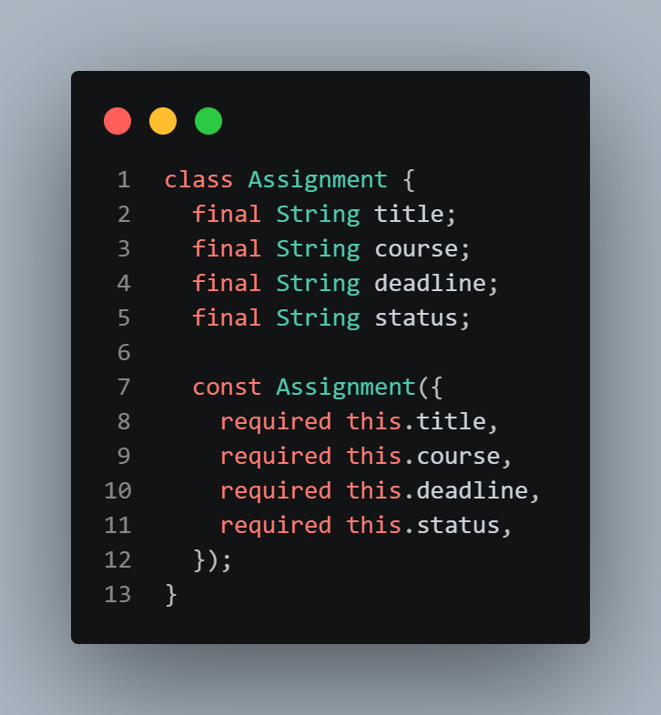
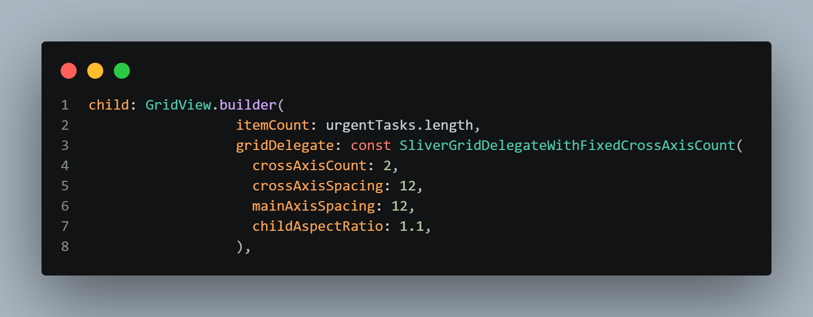
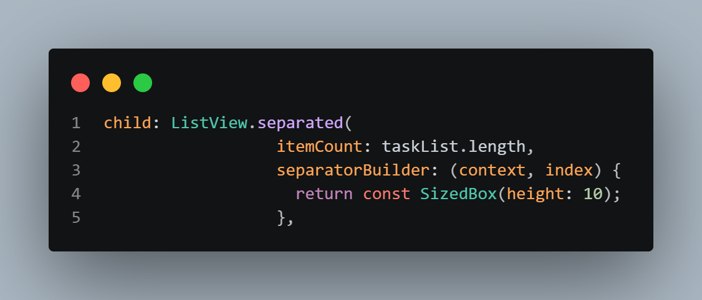
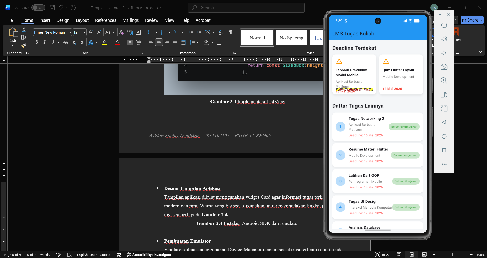

   
  <h1>LAPORAN PRAKTIKUM   APLIKASI BERBASIS PLATFORM </h1>
   
  <h3>MODUL 2   Mobile Flutter </h3>
   
  
   
   
   
  <h3>Disusun Oleh :</h3>
  

    <strong>Wildan Fachri Dzulfikar</strong>
     
    <strong>2311102107</strong>
     
    <strong>S1 IF-11-REG05</strong>
  

   
  <h3>Dosen Pengampu :</h3>
  

    <strong>Dedi Agung Prabowo, S.Kom., M.Kom</strong>
  

   
   
  <h4>Asisten Praktikum :</h4>
  <strong>Apri Pandu Wicaksono </strong>
   
  <strong>Hamka Zaenul Ardi</strong>
   
  <h3>LABORATORIUM HIGH PERFORMANCE  FAKULTAS INFORMATIKA  UNIVERSITAS TELKOM PURWOKERTO  2026 </h3>

# 1. Dasar Teori

## Bahasa Pemrograman Dart
Dart merupakan bahasa pemrograman yang dikembangkan oleh Google dan digunakan sebagai bahasa utama dalam framework Flutter. Dart dirancang agar mampu membangun aplikasi dengan performa tinggi baik untuk mobile, web, maupun desktop.

Bahasa Dart mendukung konsep Object Oriented Programming (OOP) seperti class, object, constructor, inheritance, dan function sehingga mempermudah pengembang dalam membangun aplikasi yang terstruktur.

Pada pengembangan aplikasi Flutter, Dart digunakan untuk membuat logika program, mengatur tampilan antarmuka, serta mengelola data pada aplikasi.

## Framework Flutter
Flutter adalah framework open-source yang dikembangkan oleh Google untuk membangun aplikasi lintas platform menggunakan satu basis kode program. Dengan Flutter, pengembang dapat membuat aplikasi Android, iOS, web, dan desktop secara bersamaan.

Flutter memiliki fitur hot reload yang memungkinkan perubahan kode dapat langsung terlihat tanpa harus menjalankan ulang aplikasi dari awal. Selain itu, Flutter menggunakan rendering engine sendiri sehingga performa aplikasi menjadi lebih cepat dan konsisten.

## Konsep Widget

Widget merupakan elemen utama dalam Flutter yang digunakan untuk membangun antarmuka aplikasi. Seluruh tampilan pada Flutter seperti teks, gambar, tombol, dan layout disusun menggunakan widget.

Flutter memiliki dua jenis widget utama yaitu StatelessWidget dan StatefulWidget. StatelessWidget digunakan ketika data tidak berubah, sedangkan StatefulWidget digunakan ketika tampilan dapat berubah secara dinamis selama aplikasi berjalan.

## User Interface pada Flutter

Flutter menyediakan berbagai widget untuk membangun tampilan antarmuka aplikasi secara modern dan responsif. Beberapa widget yang umum digunakan antara lain Scaffold sebagai kerangka halaman, AppBar sebagai header aplikasi, serta Row dan Column untuk mengatur posisi widget.

Penggunaan widget UI yang tepat dapat membantu menghasilkan aplikasi yang rapi dan mudah digunakan oleh pengguna.

## GridView dan Implementasinya

GridView merupakan widget Flutter yang digunakan untuk menampilkan data dalam bentuk grid atau susunan beberapa kolom. Widget ini cocok digunakan untuk menampilkan informasi berbentuk card seperti menu, galeri, maupun daftar tugas.

Pada praktikum ini, GridView digunakan untuk menampilkan dua tugas dengan deadline terdekat dalam bentuk grid kanan dan kiri menggunakan GridView.builder.

## ListView dan Implementasinya

ListView merupakan widget Flutter yang digunakan untuk menampilkan daftar data secara vertikal maupun horizontal. Flutter menyediakan beberapa jenis ListView seperti ListView.builder dan ListView.separated.

Pada praktikum ini digunakan ListView.separated untuk menampilkan daftar tugas lainnya karena mampu memberikan pemisah antar item sehingga tampilan menjadi lebih rapi.

## Material Design

Material Design merupakan sistem desain yang dikembangkan oleh Google untuk menciptakan tampilan aplikasi yang modern, konsisten, dan responsif.

Flutter menyediakan berbagai widget berbasis Material Design seperti MaterialApp, AppBar, Card, dan FloatingActionButton yang mempermudah pengembang dalam membuat aplikasi dengan tampilan menarik.

#  2. Pembahasan Tugas

## Persiapan Project Flutter

Pada tahap awal dilakukan pembuatan project Flutter baru menggunakan command Flutter pada terminal. Project dibuat untuk mengimplementasikan tampilan LMS sederhana menggunakan GridView dan ListView.

Project kemudian dibuka menggunakan Visual Studio Code dan dijalankan pada Emulator Android untuk memastikan aplikasi dapat berjalan dengan baik.

## Pembuatan Data Tugas

Data tugas dibuat menggunakan List<Map<String, dynamic>> yang berfungsi untuk menyimpan informasi tugas seperti nama tugas, mata kuliah, deadline, dan status tugas.

Data tersebut nantinya digunakan untuk ditampilkan pada GridView dan ListView seperti pada Gambar 2.1,

Gambar 2.1 List Data Tugas yang digunakan

## Implementasi GridView

GridView.builder digunakan untuk menampilkan dua tugas dengan deadline terdekat dalam bentuk grid. Grid disusun menjadi dua kolom agar tampilan menyerupai LMS web kampus.

Setiap grid menampilkan informasi nama tugas, mata kuliah, dan deadline seperti pada Gambar 2.2,

Gambar 2.2 Implementasi GridView

## Implementasi ListView

ListView.separated digunakan untuk menampilkan daftar tugas lainnya di bawah GridView. Widget ini dipilih karena mampu memberikan jarak antar item sehingga tampilan menjadi lebih rapi dan mudah dibaca seperti pada Gambar 2.3,

Gambar 2.3 Implementasi ListView

## Desain Tampilan Aplikasi

Tampilan aplikasi dibuat menggunakan widget Card agar informasi tugas terlihat lebih modern dan rapi. Warna yang berbeda digunakan untuk membedakan tingkat prioritas tugas seperti pada Gambar 2.4,

Gambar 2.4 Tampilan Aplikasi sudah berjalan

## Pengujian Aplikasi

Setelah seluruh kode selesai diimplementasikan, aplikasi berhasil dijalankan pada emulator Android. Tampilan GridView dan ListView berhasil muncul sesuai dengan ketentuan tugas yang diberikan.

## Hasil Akhir

Hasil akhir aplikasi berhasil menampilkan tampilan sederhana menyerupai LMS web kampus menggunakan GridView dan ListView. Dua tugas prioritas berhasil ditampilkan pada bagian grid, sedangkan delapan tugas lainnya berhasil ditampilkan menggunakan ListView.
