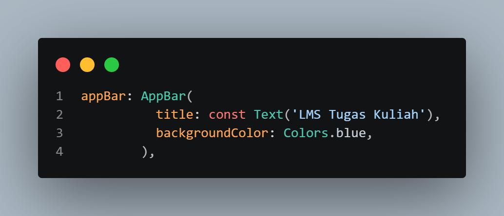

   
  <h1>LAPORAN PRAKTIKUM   APLIKASI BERBASIS PLATFORM </h1>
   
  <h3>MODUL 2   Mobile Flutter </h3>
   
  
   
   
   
  <h3>Disusun Oleh :</h3>
  

    <strong>Fajar Ario Abdillah</strong>
     
    <strong>2311102114</strong>
     
    <strong>S1 IF-11-REG05</strong>
  

   
  <h3>Dosen Pengampu :</h3>
  

    <strong>Dedi Agung Prabowo, S.Kom., M.Kom</strong>
  

   
   
  <h4>Asisten Praktikum :</h4>
  <strong>Apri Pandu Wicaksono </strong>
   
  <strong>Hamka Zaenul Ardi</strong>
   
  <h3>LABORATORIUM HIGH PERFORMANCE  FAKULTAS INFORMATIKA  UNIVERSITAS TELKOM PURWOKERTO  2026 </h3>

# 1. Dasar Teori

## Flutter
Flutter merupakan framework open-source yang dikembangkan oleh Google untuk membangun aplikasi mobile, web, dan desktop dari satu basis kode (single codebase). Flutter menggunakan bahasa pemrograman Dart dan memiliki keunggulan utama dalam pengembangan aplikasi lintas platform (cross-platform). 

Flutter bekerja dengan konsep widget, yaitu komponen dasar yang digunakan untuk membangun antarmuka pengguna (UI). Semua elemen dalam Flutter, seperti teks, tombol, layout, dan lainnya, merupakan widget. Dengan pendekatan ini, pengembang dapat dengan mudah menyusun tampilan aplikasi secara fleksibel dan terstruktur.

Selain itu, Flutter menggunakan rendering engine sendiri sehingga tidak bergantung pada komponen native platform, yang membuat performanya lebih cepat dan konsisten di berbagai perangkat. Flutter juga mendukung fitur hot reload, yang memungkinkan pengembang melihat perubahan kode secara langsung tanpa harus menjalankan ulang aplikasi dari awal.

## Widget pada Flutter
Widget merupakan komponen utama dalam Flutter yang digunakan untuk membangun tampilan antarmuka aplikasi. Semua elemen pada Flutter merupakan widget, mulai dari teks, tombol, gambar, hingga layout. Widget pada Flutter terbagi menjadi dua jenis utama, yaitu:

1. StatelessWidget

Widget yang tidak memiliki perubahan state atau data selama aplikasi berjalan.

2. StatefulWidget

Widget yang dapat mengalami perubahan state secara dinamis ketika aplikasi dijalankan.

## Layout pada Flutter

Layout pada Flutter digunakan untuk mengatur posisi dan susunan widget pada layar aplikasi. Flutter menyediakan berbagai widget layout seperti:

- Column
- Row
- Container
- Expanded
- Padding
- GridView
- ListView

Penggunaan layout yang tepat dapat membantu menghasilkan tampilan aplikasi yang rapi dan responsif.

## GridView

GridView merupakan widget Flutter yang digunakan untuk menampilkan data dalam bentuk grid atau kisi-kisi. Widget ini sangat cocok digunakan untuk menampilkan data dalam susunan baris dan kolom.

Pada praktikum ini, GridView digunakan untuk menampilkan dua tugas dengan deadline terdekat dalam bentuk grid kanan dan kiri.

Flutter menyediakan beberapa jenis GridView, seperti:

- GridView.count
- GridView.builder
- GirdView.extent

Pada tugas ini digunakan GridView.builder karena lebih efisien untuk membangun item secara dinamis.

## ListView

ListView merupakan widget Flutter yang digunakan untuk menampilkan daftar data secara vertikal maupun horizontal. ListView memiliki beberapa jenis, yaitu:

- ListView biasa
- ListView.builder
- LisView.separated

Pada praktikum ini digunakan ListView.separated untuk menampilkan daftar tugas lainnya beserta pemisah antar item agar tampilan lebih rapi.

Keunggulan ListView.builder dan ListView.separated adalah mampu membangun item secara dinamis sehingga lebih hemat memori.

## Material Design

Material Design merupakan sistem desain yang dikembangkan oleh Google untuk menciptakan tampilan aplikasi yang konsisten, modern, dan responsif. Flutter menyediakan widget MaterialApp dan berbagai komponen Material Design seperti:

- AppBar
- Card
- Icon
- FloatingActionButton
- TextButton

Pada praktikum ini Material Design digunakan untuk membangun tampilan LMS sederhana agar terlihat modern dan mudah digunakan.

## Dart Programming Language

Dart merupakan bahasa pemrograman yang digunakan oleh Flutter. Dart mendukung konsep Object Oriented Programming (OOP) dan memiliki performa yang baik untuk pengembangan aplikasi mobile.

Beberapa fitur Dart yang digunakan pada praktikum ini antara lain:

- Class
- Object
- List
- Constructor
- Function
- Widget Tree

#  2. Pembahasan Tugas

## Pembahasan Project Flutter

Langkah awal dalam praktikum ini adalah membuat project Flutter baru menggunakan terminal, akan tetapi saya lupa untuk meng-screenshot code yang jalankan di terminal. Akan tetapi, pada intinya saya menjalankan perintah sebagai berikut,

`flutter create task_2_mobile_flutter`

Lalu, setelah project berhasil dibuat, masuk ke folder project menggunakan perintah,

`cd task_2_mobile_flutter`

Kemudian project dibuka dengan menggunakan Visual Studio Code dengan perintah,

`code .`

## Implenmentasi Struktur Data Tugas

Pada tahap ini, dibuat class `Assignment` yang digunakan untuk menyimpan data tugas yang akan ditampilkan pada Aplikasi nanti seperti saya cantumkan di bawah pada Gambar 2.1,

Gambar 2.1 Implementasi Kode untuk Stuktur Data Tugas

## Implementasi GridView

Pada tahap ini, GridView digunakan untuk menampilkan dua tugas dengan deadline paling dekat. Widget yang digunakan adalah `GridView.builder` dikarenakan mampu membangun item secara dinamis dan lebih efisien seperti pada Gambar 2.2,

Gambar 2.2 Implementasi GridView

## Implementasi ListView

Pada tahap ini, ListView digunakan untuk menampilkan daftar tugas lainnya sebanyak 8 data dan pada praktikum ini saya menggunakan `LisView.separated` seperti pada Gambar 2.3,

Gambar 2.3 Implementasi ListView

## Implementasi Tampilan Antarmuka

Pada tahap ini, Antarmuka aplikasi dibuat menggunakan beberapa widget Flutter seperti Scaffold, AppBar, Container, Column, Row, Text, Card, dan CircleAvatar. Berikut saya lampirkan contoh implementasi salah satunya yaitu AppBar seperti pada Gambar 2.4,

Gambar 2.4 Implementasi Tampilan Antarmuka (AppBar)

## Hasil Runing Program

Setelah seluruh kode selesai diimplementasikan, aplikasi dijalankan dengan menggunakan Emulator Android dengan perintah `flutter run` dan berikut saya lampirkan bukti perintah `flutter run` yang dijalankan pada terminal Visual Studio Code pada Gambar 2.5,

Gambar 2.5 Hasil code `flutter run` di terminal Visual Studio Code

Kemudian, saya lampirkan juga bukti sudah berhasil berjalan di Emulator Android Studio saya pada Gambar 2.6,

Gambar 2.6 Sudah berhasil berjalan di Emulator Android Studio dan Implementasi GridView & ListView