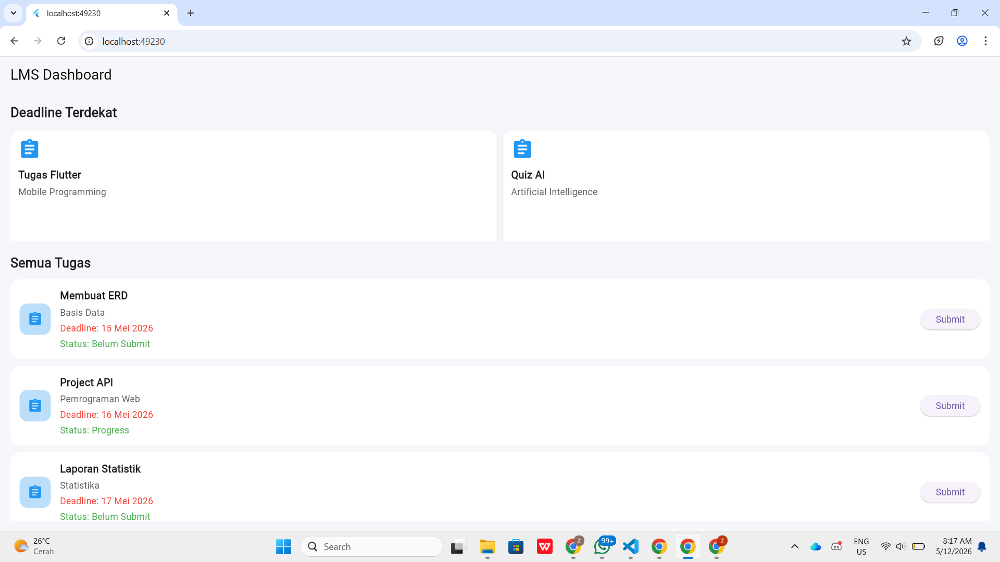

<div align="center">
  <br />
  <h1>LAPORAN PRAKTIKUM <br> APLIKASI BERBASIS PLATFORM </h1>
  <br />
  <h3>MODUL 2 <br> FLUTTER </h3>
  <br />
  
  <br />
  <br />
  <br />
  <h3>Disusun Oleh :</h3>
  <p>
    <strong>Zahra Tsuroyya Poetri</strong>
    <br>
    <strong>2311102127</strong>
    <br>
    <strong>S1 IF-11-REG05</strong>
  </p>
  <br />
  <h3>Dosen Pengampu :</h3>
  <p>
    <strong>Dedi Agung Prabowo, S.Kom., M.Kom</strong>
  </p>
  <br />
  <br />
  <h4>Asisten Praktikum :</h4>
  <strong>Apri Pandu Wicaksono </strong>
  <br>
  <strong>Hamka Zaenul Ardi</strong>
  <br />
  <h3>LABORATORIUM HIGH PERFORMANCE <br>FAKULTAS INFORMATIKA <br>UNIVERSITAS TELKOM PURWOKERTO <br>2026</h3>
</div>

<hr>

### Dasar Teori

Flutter merupakan framework open-source yang dikembangkan oleh Google untuk membangun aplikasi mobile, web, dan desktop menggunakan satu basis kode (single codebase). Flutter menggunakan bahasa pemrograman Dart dan menyediakan berbagai widget yang memudahkan pengembang dalam membuat antarmuka aplikasi yang interaktif dan responsif.

Dalam Flutter, tampilan aplikasi dibangun menggunakan widget. Widget merupakan komponen dasar yang digunakan untuk menyusun elemen antarmuka seperti teks, tombol, gambar, maupun layout. Flutter memiliki dua jenis widget utama yaitu StatelessWidget dan StatefulWidget. StatelessWidget digunakan untuk tampilan yang tidak berubah, sedangkan StatefulWidget digunakan untuk tampilan yang dapat berubah sesuai interaksi pengguna.

Flutter juga menyediakan berbagai widget layout seperti Column, Row, Container, GridView, dan ListView yang digunakan untuk mengatur posisi serta tampilan komponen aplikasi. Selain itu, Flutter mendukung fitur hot reload sehingga perubahan kode dapat langsung terlihat tanpa perlu menjalankan ulang aplikasi secara keseluruhan.

## Tugas 2 - Flutter (LMS)

### Source Code - main.dart

```dart
import 'package:flutter/material.dart';

void main() {
  runApp(MyApp());
}

class MyApp extends StatelessWidget {
  MyApp({super.key});

  @override
  Widget build(BuildContext context) {
    return MaterialApp(
      debugShowCheckedModeBanner: false,
      home: LMSPage(),
    );
  }
}

class LMSPage extends StatelessWidget {
  LMSPage({super.key});

  // GRID DEADLINE TERDEKAT
  final List<Map<String, dynamic>> urgentTasks = [
    {
      "title": "Tugas Flutter",
      "course": "Mobile Programming",
      "deadline": "13 Mei 2026",
    },
    {
      "title": "Quiz AI",
      "course": "Artificial Intelligence",
      "deadline": "14 Mei 2026",
    },
  ];

  // LIST TUGAS
  final List<Map<String, String>> tasks = [
    {
      "title": "Membuat ERD",
      "course": "Basis Data",
      "deadline": "15 Mei 2026",
      "status": "Belum Submit",
    },
    {
      "title": "Project API",
      "course": "Pemrograman Web",
      "deadline": "16 Mei 2026",
      "status": "Progress",
    },
    {
      "title": "Laporan Statistik",
      "course": "Statistika",
      "deadline": "17 Mei 2026",
      "status": "Belum Submit",
    },
    {
      "title": "Quiz UI/UX",
      "course": "UI/UX",
      "deadline": "18 Mei 2026",
      "status": "Belum Submit",
    },
    {
      "title": "Resume Video",
      "course": "Sistem Operasi",
      "deadline": "19 Mei 2026",
      "status": "Progress",
    },
    {
      "title": "Makalah Cloud",
      "course": "Cloud Computing",
      "deadline": "20 Mei 2026",
      "status": "Belum Submit",
    },
    {
      "title": "Tugas Algoritma",
      "course": "Algoritma",
      "deadline": "21 Mei 2026",
      "status": "Belum Submit",
    },
    {
      "title": "Presentasi Keamanan",
      "course": "Cyber Security",
      "deadline": "22 Mei 2026",
      "status": "Belum Submit",
    },
  ];

  @override
  Widget build(BuildContext context) {
    return Scaffold(
      backgroundColor: const Color(0xffF5F7FA),

      appBar: AppBar(
        backgroundColor: Colors.white,
        elevation: 1,
        title: const Text(
          "LMS Dashboard",
          style: TextStyle(color: Colors.black),
        ),
      ),

      body: Padding(
        padding: const EdgeInsets.all(16),

        child: Column(
          crossAxisAlignment: CrossAxisAlignment.start,

          children: [

            // TITLE
            const Text(
              "Deadline Terdekat",
              style: TextStyle(
                fontSize: 20,
                fontWeight: FontWeight.bold,
              ),
            ),

            const SizedBox(height: 12),

            // GRIDVIEW
            SizedBox(
              height: 170,

              child: GridView.builder(
                itemCount: urgentTasks.length,

                gridDelegate:
                    const SliverGridDelegateWithFixedCrossAxisCount(
                  crossAxisCount: 2,
                  crossAxisSpacing: 10,
                  mainAxisSpacing: 10,
                ),

                itemBuilder: (context, index) {

                  final task = urgentTasks[index];

                  return Container(
                    padding: const EdgeInsets.all(12),

                    decoration: BoxDecoration(
                      color: Colors.white,
                      borderRadius: BorderRadius.circular(15),

                      boxShadow: [
                        BoxShadow(
                          color: Colors.black12.withOpacity(0.05),
                          blurRadius: 5,
                        ),
                      ],
                    ),

                    child: Column(
                      crossAxisAlignment: CrossAxisAlignment.start,

                      children: [

                        const Icon(
                          Icons.assignment,
                          color: Colors.blue,
                          size: 35,
                        ),

                        const SizedBox(height: 10),

                        Text(
                          task["title"],

                          style: const TextStyle(
                            fontWeight: FontWeight.bold,
                            fontSize: 16,
                          ),
                        ),

                        const SizedBox(height: 5),

                        Text(
                          task["course"],
                          style: TextStyle(
                            color: Colors.grey[700],
                          ),
                        ),

                        const Spacer(),

                        Text(
                          "Deadline: ${task["deadline"]}",

                          style: const TextStyle(
                            color: Colors.red,
                            fontWeight: FontWeight.bold,
                          ),
                        ),
                      ],
                    ),
                  );
                },
              ),
            ),

            const SizedBox(height: 20),

            // TITLE LIST
            const Text(
              "Semua Tugas",
              style: TextStyle(
                fontSize: 20,
                fontWeight: FontWeight.bold,
              ),
            ),

            const SizedBox(height: 10),

            // LISTVIEW
            Expanded(
              child: ListView.separated(
                itemCount: tasks.length,

                separatorBuilder: (context, index) =>
                    const SizedBox(height: 10),

                itemBuilder: (context, index) {

                  final task = tasks[index];

                  return Container(
                    padding: const EdgeInsets.all(14),

                    decoration: BoxDecoration(
                      color: Colors.white,
                      borderRadius: BorderRadius.circular(15),

                      boxShadow: [
                        BoxShadow(
                          color: Colors.black12.withOpacity(0.03),
                          blurRadius: 3,
                        ),
                      ],
                    ),

                    child: Row(
                      children: [

                        Container(
                          padding: const EdgeInsets.all(12),

                          decoration: BoxDecoration(
                            color: Colors.blue.shade100,
                            borderRadius: BorderRadius.circular(12),
                          ),

                          child: const Icon(
                            Icons.assignment,
                            color: Colors.blue,
                          ),
                        ),

                        const SizedBox(width: 14),

                        Expanded(
                          child: Column(
                            crossAxisAlignment:
                                CrossAxisAlignment.start,

                            children: [

                              Text(
                                task["title"]!,

                                style: const TextStyle(
                                  fontWeight: FontWeight.bold,
                                  fontSize: 16,
                                ),
                              ),

                              const SizedBox(height: 4),

                              Text(
                                task["course"]!,
                                style: TextStyle(
                                  color: Colors.grey[700],
                                ),
                              ),

                              const SizedBox(height: 4),

                              Text(
                                "Deadline: ${task["deadline"]}",

                                style: const TextStyle(
                                  color: Colors.red,
                                ),
                              ),

                              const SizedBox(height: 4),

                              Text(
                                "Status: ${task["status"]}",
                                style: const TextStyle(
                                  color: Colors.green,
                                ),
                              ),
                            ],
                          ),
                        ),

                        ElevatedButton(
                          onPressed: () {},

                          child: const Text("Submit"),
                        ),
                      ],
                    ),
                  );
                },
              ),
            ),
          ],
        ),
      ),
    );
  }
}
```

### Hasil Output



### Deskripsi Kode

Kode tersebut merupakan program aplikasi mobile berbasis Flutter yang digunakan untuk menampilkan dashboard LMS berisi daftar tugas kuliah. Program ini menggunakan `GridView.builder` untuk menampilkan tugas dengan deadline terdekat dalam bentuk grid, serta `ListView.separated` untuk menampilkan daftar seluruh tugas secara vertikal.

Data tugas disimpan dalam bentuk `List<Map>` yang berisi informasi seperti nama tugas, mata kuliah, deadline, dan status tugas. Tampilan aplikasi dibuat menggunakan berbagai widget Flutter seperti `Container`, `Column`, `Row`, dan `Text` agar tampilan lebih rapi dan menyerupai LMS kampus.

Output dari program ini berupa halaman dashboard yang menampilkan tugas deadline terdekat pada bagian atas dan daftar seluruh tugas pada bagian bawah aplikasi.
