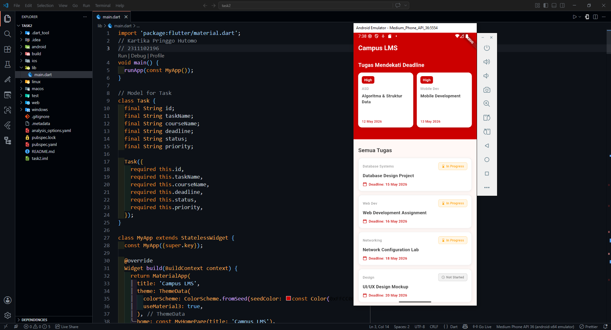

<div align="center">
  <br />
  <h1>LAPORAN PRAKTIKUM <br> APLIKASI BERBASIS PLATFORM </h1>
  <br />
  <h3>MODUL 2 <br> FLUTTER </h3>
  <br />
  
  <br />
  <br />
  <br />
  <h3>Disusun Oleh :</h3>
  <p>
    <strong>Kartika Pringgo Hutomo</strong>
    <br>
    <strong>2311102196</strong>
    <br>
    <strong>S1 IF-11-REG05</strong>
  </p>
  <br />
  <h3>Dosen Pengampu :</h3>
  <p>
    <strong>Dedi Agung Prabowo, S.Kom., M.Kom</strong>
  </p>
  <br />
  <br />
  <h4>Asisten Praktikum :</h4>
  <strong>Apri Pandu Wicaksono </strong>
  <br>
  <strong>Hamka Zaenul Ardi</strong>
  <br />
  <h3>LABORATORIUM HIGH PERFORMANCE <br>FAKULTAS INFORMATIKA <br>UNIVERSITAS TELKOM PURWOKERTO <br>2026 </h3>
</div>

<hr>

## Dasar Teori

## 1. Konsep Antarmuka pada Flutter

Flutter menggunakan sistem berbasis widget dalam proses pembangunan antarmuka aplikasi. Setiap komponen tampilan seperti teks, tombol, gambar, hingga tata letak merupakan widget yang dapat dikombinasikan sesuai kebutuhan aplikasi. Dalam pengembangan aplikasi mobile, pengelolaan tampilan data menjadi salah satu bagian penting agar informasi dapat disajikan dengan baik kepada pengguna.

Flutter menyediakan berbagai widget untuk menampilkan kumpulan data, di antaranya adalah ListView dan GridView. Kedua widget tersebut digunakan untuk menampilkan data dalam jumlah banyak dengan dukungan scrolling otomatis.

## 2. Widget ListView

ListView merupakan widget yang digunakan untuk menampilkan data secara berurutan dalam bentuk daftar (list). Data yang ditampilkan dapat berupa teks, gambar, ikon, maupun kombinasi beberapa komponen lainnya.

Widget ini sering digunakan pada aplikasi yang memiliki tampilan data linear seperti:

Daftar kontak
Riwayat chat
Menu aplikasi
Daftar berita
Data mahasiswa

Pada Flutter, ListView dapat dibuat secara statis maupun dinamis. Untuk data yang jumlahnya banyak dan berubah-ubah, biasanya digunakan ListView.builder karena lebih efisien dalam penggunaan memori.

Karakteristik utama ListView:

Menampilkan item secara vertikal atau horizontal
Mendukung scrolling otomatis
Dapat memuat data dalam jumlah besar
Mudah dikombinasikan dengan widget lain

## 3. Widget GridView

GridView adalah widget Flutter yang digunakan untuk menampilkan data dalam bentuk kisi-kisi atau grid. Berbeda dengan ListView yang hanya menampilkan satu item per baris, GridView memungkinkan beberapa item tampil dalam satu baris sehingga tampilan menjadi lebih padat dan menarik.

Widget ini banyak digunakan pada:

Galeri foto
Tampilan produk e-commerce
Dashboard menu
Katalog barang
Daftar aplikasi

Flutter menyediakan beberapa jenis GridView, salah satunya GridView.count yang digunakan untuk menentukan jumlah kolom secara langsung.

Karakteristik utama GridView:

Menampilkan item dalam bentuk baris dan kolom
Mendukung scrolling otomatis
Cocok untuk data visual
Tampilan lebih modern dan rapi

## 4. Penggunaan ListView dan GridView dalam Aplikasi

Pemilihan antara ListView dan GridView disesuaikan dengan kebutuhan tampilan aplikasi. Jika data lebih cocok ditampilkan secara berurutan dan fokus pada informasi teks, maka ListView menjadi pilihan yang tepat. Namun, jika aplikasi membutuhkan tampilan visual yang lebih banyak dalam satu layar, maka GridView lebih efektif digunakan.

Kedua widget tersebut membantu pengembang dalam:

Mengatur tampilan data secara efisien
Membuat aplikasi lebih interaktif
Mempermudah navigasi pengguna
Meningkatkan pengalaman pengguna (user experience)

## Task 2 Mobile Flutter

Kalian diminta untuk membuat tampilan mirip lms web kampus dimana terdapat 2 grid kanan kiri yang berisikan tugas mata kuliah yang paling mendekati dengan deadline, dan di bawah nya menampilkan 8 list view yang berisikan list tugas (diluar yang dari 2 grid tadi) berisikan nama tugas, mata kuliah apa, deadline, dan data tambahan lain nya.

Ketentuan:
- Menggunakan GridView untuk tampilan grid kanan dan kiri
- Menggunakan ListView (boleh dengan builder boleh dengan separated, tapi ga boleh yang biasa)

### Source Code

```dart
import 'package:flutter/material.dart';
// Kartika Pringgo Hutomo 
// 2311102196
void main() {
  runApp(const MyApp());
}

// Model for Task
class Task {
  final String id;
  final String taskName;
  final String courseName;
  final String deadline;
  final String status;
  final String priority;

  Task({
    required this.id,
    required this.taskName,
    required this.courseName,
    required this.deadline,
    required this.status,
    required this.priority,
  });
}

class MyApp extends StatelessWidget {
  const MyApp({super.key});

  @override
  Widget build(BuildContext context) {
    return MaterialApp(
      title: 'Campus LMS',
      theme: ThemeData(
        colorScheme: ColorScheme.fromSeed(seedColor: const Color(0xFFCC0000)),
        useMaterial3: true,
      ),
      home: const MyHomePage(title: 'Campus LMS'),
    );
  }
}

```
**Kode Lengkap:** [lib/main.dart](lib/main.dart)

### Penjelasan Kode
Aplikasi ini menampilkan interface LMS kampus dengan GridView 2 kolom di bagian atas yang menampilkan 2 tugas paling urgent mendekati deadline dalam kartu-kartu merah Telkom, dan di bawahnya terdapat ListView.separated dengan 8 daftar tugas lengkap yang menampilkan nama tugas, mata kuliah, status, dan deadline dengan visual yang rapi dan informatif.

### Output


