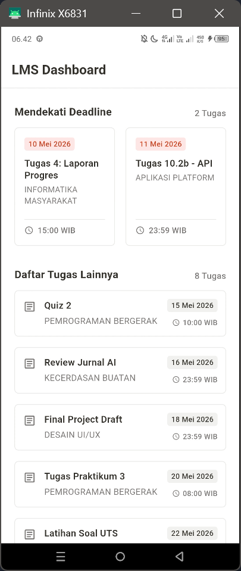

<div align="center">
    <br />
    <h1>LAPORAN PRAKTIKUM <br> APLIKASI BERBASIS PLATFORM </h1>
    <br />
    <h3>MODUL 3 <br> PENGENALAN DART </h3>
    <br />
    
    <br />
    <br />
    <br />
    <h3>Disusun Oleh :</h3>
    <p>
        <strong>Rozhak</strong>
        <br>
        <strong>2311102293</strong>
        <br>
        <strong>S1 IF-11-REG05</strong>
    </p>
    <br />
    <h3>Dosen Pengampu :</h3>
    <p>
        <strong>Dedi Agung Prabowo, S.Kom., M.Kom</strong>
    </p>
    <br />
    <br />
    <h4>Asisten Praktikum :</h4>
    <strong>Apri Pandu Wicaksono </strong>
    <br>
    <strong>Hamka Zaenul Ardi</strong>
    <br />
    <h3>LABORATORIUM HIGH PERFORMANCE <br>FAKULTAS INFORMATIKA <br>UNIVERSITAS TELKOM PURWOKERTO <br>2026 </h3>
</div>
<hr>

## Dasar Teori

Dart merupakan bahasa pemrograman utama yang digunakan dalam pengembangan aplikasi menggunakan _framework_ Flutter. Bahasa ini memiliki karakteristik sintaks yang menyerupai bahasa C atau Java, di mana penulisan setiap _statement_ wajib diakhiri dengan tanda titik koma (;). Dart menyediakan berbagai konsep fundamental pemrograman, mulai dari deklarasi variabel primitif (seperti _Integer_, _Double_, _String_, dan _Boolean_) menggunakan kata kunci `var` maupun _type annotation_, hingga penerapan kontrol alur program melalui struktur kondisional (`if`, `if-else`, `switch-case`), dan perulangan (`for loop`, `while loop`).

Dalam pengelolaan himpunan data, Dart menggunakan struktur data _List_ yang berfungsi serupa dengan _array_. _List_ pada Dart terbagi menjadi dua jenis, yaitu _Fixed Length List_ yang ukuran atau panjang indeksnya bersifat statis, serta _Growable List_ yang kapasistasnya dapat bertambah secara dinamis menyesuaikan jumlah objek yang dimasukkan.

Selain itu, Dart sangat mendukung paradigma pemrograman berbasis objek, dimana fungsi atau metode memegang peranan krusial. Penggunakan fungsi memungkinkan pengembang menerapkan prinsip _Sparation of Concern_, yakni memecah logika program menjadi blok-blok kode yang memiliki tanggung jawab spesifik, dapat menerima input (melalui parameter), memproses logika, dan mengembalikan nilai (_return value_). Hal ini bertujuan untuk mengurangi penumpukan kode (_boilerplate_) dan menghasilkan struktur program yang lebih terawat.

## Tugas Modul 3 - Pengenalan Dart

### 1. Source Code

```dart
...
void main() {
  runApp(const MyApp());
}

class MyApp extends StatelessWidget {
  const MyApp({super.key});

  @override
  Widget build(BuildContext context) {
    return MaterialApp(
      title: 'LMS Task App',
      debugShowCheckedModeBanner: false,
      theme: ThemeData(
        scaffoldBackgroundColor: const Color(0xFFFFFFFF),
        colorScheme: ColorScheme.fromSeed(seedColor: const Color(0xFF37352F)),
        fontFamily: 'Roboto',
        useMaterial3: true,
      ),
      home: const DashboardScreen(), 
    );
  }
}
```

**Kode Lengkap:** [lib/main.dart](lib/main.dart)

```dart
class DashboardScreen extends StatefulWidget {
  const DashboardScreen({super.key});

  @override
  State<DashboardScreen> createState() => _DashboardScreenState();
}

class _DashboardScreenState extends State<DashboardScreen> {
  final List<TaskModel> urgentTasks = [
    const TaskModel(title: 'Tugas 4: Laporan Progres', course: 'INFORMATIKA MASYARAKAT', deadline: '10 Mei 2026', time: '15:00 WIB'),
    ...
  ];

  final List<TaskModel> otherTasks = [
    const TaskModel(title: 'Quiz 2', course: 'PEMROGRAMAN BERGERAK', deadline: '15 Mei 2026', time: '10:00 WIB'),
    ...
  ];

  @override
  Widget build(BuildContext context) {
    return Scaffold(
      ...
    );
  }

  Widget _buildSectionTitle(String title, String subtitle) {
    ...
  }

  Widget _buildUrgentTasksGrid() {
    ...
  }

  Widget _buildOtherTasksList() {
    ...
  }
}
```

**Kode Lengkap:** [lib/screens/dashboard_screen.dart](lib/screens/dashboard_screen.dart)

```dart
class UrgentTaskCard extends StatelessWidget {
  final TaskModel task;

  const UrgentTaskCard({super.key, required this.task});

  @override
  Widget build(BuildContext context) {
    return Container(
      ...
    );
  }
}
```

**Kode Lengkap:** [lib/widgets/urgent_task_card.dart](lib/widgets/urgent_task_card.dart)

```dart
class TaskListTile extends StatelessWidget {
  final TaskModel task;

  const TaskListTile({super.key, required this.task});

  @override
  Widget build(BuildContext context) {
    return Container(
      ...
    );
  }
}
```

**Kode Lengkap:** [lib/widgets/task_list_tile.dart](lib/widgets/task_list_tile.dart)

```dart
class TaskModel {
  final String title;
  final String course;
  final String deadline;
  final String time;

  const TaskModel({
    required this.title,
    required this.course,
    required this.deadline,
    required this.time,
  });

  factory TaskModel.fromJson(Map<String, dynamic> json) {
    return TaskModel(
      ...
    );
  }

  Map<String, dynamic> toJson() {
    return {
      ...
    };
  }

TaskModel copyWith({
    String? title,
    String? course,
    String? deadline,
    String? time,
  }) {
    return TaskModel(
      title: title ?? this.title,
      course: course ?? this.course,
      deadline: deadline ?? this.deadline,
      time: time ?? this.time,
    );
  }
}
```

**Kode Lengkap:** [lib/models/task_model.dart](lib/models/task_model.dart)

### 2. Penjelasan

Aplikasi dasbor manajemen tugas ini dibangun menggunakan struktur _layout_ dasar pada Flutter. Titik awal aplikasi berada pada file `main.dart` melalui fungsi `main()` yang memanggil `runApp`. Pada file utama ini _widget_ `MaterialApp` digunakan untuk mengatur konfigurasi dasar seperti tema warna (`ThemeData`) dan menerukan halaman awal aplikasi (`home`) yang mengarah pada `DashboardScreen`.

Pada halaman `DashboardScreen`, pengelolaan data disimulasikan menggunakan struktur data list pada bahasa Dart. Terdapat dua himpunan data utama berjenis objek `TaskModel` (memuat informasi atribut seperti `title`, `course`, `deadline`, dan `time`), yaitu `urgentTask` untuk tugas terdekat dan `otherTask` untuk sisa tugas lainnya. Kedua _List_ ini kemudian dipetakan ke dalam elemen visual antarmuka.

Untuk menyusun tata letak (layout), aplikasi menggunakan _widget_ `Scaffold` sebagai kerangka utama halaman dan `SingleChildScrollView` agar keseluruhan konten dapat digeser (scroll). Susunan _layout_ secara vertikal diatur menggunakan _widget_ `Column`. Menampilkan _List_ data dilakukan melalui dua pendekatan berbeda. Pertama, `GrisView.builder` diimplementasikan untuk menampilkan koleksi `urgentTask` dalam format dua kolom (`crossAxisCount: 2`). Kedua, `ListViewsparated` digunakan untuk menampilkan elemen `otherTask` secara vertikal dan berurutan ke bawah, dimana setiap elemen tugas dikonstruksi menggunakan _widget_ seperti `Row`, `Columns`, `Container`, dan `Text` yang dikelompokkan menjadi komponen penyusun daftar.

### 3. Output



## Kesimpulan

Praktikum Modul 3 menunjukkan bahwa penguasaan dasar Dart, terutama pengelolaan `List` dan konsep _object-oriented programming_, sangat penting dalam membangun antarmuka _Flutter_ yang dinamis. Dengan menerapkan _Separation of Concern_, struktur aplikasi menjadi lebih modular karena model data dan widget dipisahkan dengan jelas. Data dari `List` kemudian ditampilkan menggunakan widget seperti `Column`, `Row`, `GridView`, dan `ListView` sehingga menghasilkan kode yang lebih rapi, efisien, dan mudah dipelihara.