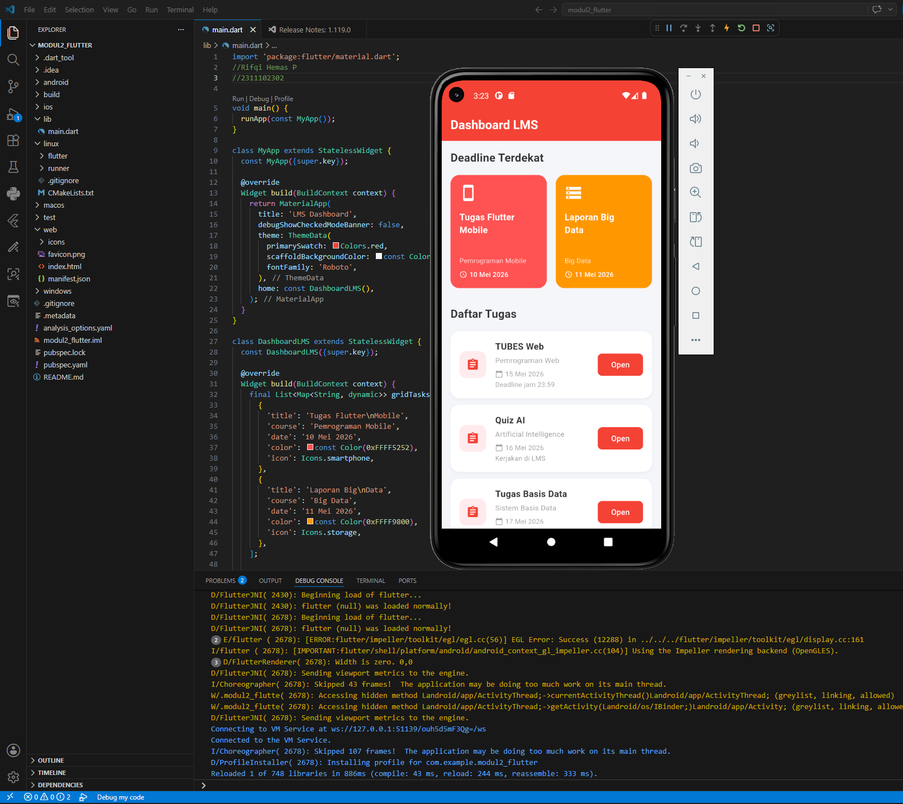

<div align="center">
  <br />
  <h1>LAPORAN PRAKTIKUM <br> APLIKASI BERBASIS PLATFORM </h1>
  <br />
  <h3>MODUL 2 <br> MOBILE FLUTTER </h3>
  <br />
  
  <br />
  <br />
  <br />
  <h3>Disusun Oleh :</h3>
  <p>
    <strong>Rifqi Hemas Pratama</strong>
    <br>
    <strong>2311102302</strong>
    <br>
    <strong>IF 11 05</strong>
  </p>
  <br />
  <h3>Dosen Pengampu :</h3>
  <p>
    <strong>Dedi Agung Prabowo, S.Kom., M.Kom</strong>
  </p>
  <br />
  <br />
  <h4>Asisten Praktikum :</h4>
  <strong>Apri Pandu Wicaksono</strong>
  <br>
  <strong>Hamka Zaenul Ardi</strong>
  <br />
  <h3>LABORATORIUM HIGH PERFORMANCE <br>FAKULTAS INFORMATIKA <br>UNIVERSITAS TELKOM PURWOKERTO <br>2026 </h3>
</div>

<hr>

---

# Dasar Teori

## 1. ListView

ListView adalah widget di Flutter yang menampilkan daftar item secara berurutan, baik secara vertikal maupun horizontal. ListView lebih cocok digunakan ketika jumlah item bersifat dinamis atau dalam jumlah besar.

Terdapat beberapa varian ListView yang dapat digunakan sesuai kebutuhan. `ListView` standar dapat digunakan untuk membuat halaman *scrollable* sederhana. Sementara itu, `ListView.separated` mirip dengan *builder* namun menambahkan pemisah antar item secara otomatis menggunakan parameter `separatorBuilder`, sehingga tampilan daftar lebih rapi dan terorganisir. Pada tugas ini, ListView digunakan ganda: sebagai pembungkus utama halaman dan sebagai penampil delapan daftar tugas mata kuliah.

---

## 2. Flutter

Flutter adalah framework open-source dari Google yang digunakan untuk membangun aplikasi mobile, web, dan desktop dari satu basis kode. Flutter menggunakan bahasa pemrograman Dart dan mengandalkan konsep widget sebagai elemen dasar pembentuk antarmuka pengguna.

Dengan Flutter, proses pengembangan aplikasi lintas platform menjadi lebih efisien karena hanya membutuhkan satu kode untuk menghasilkan tampilan yang konsisten di berbagai perangkat. Flutter juga menyediakan banyak widget bawaan yang siap pakai dan dapat dikustomisasi.

---

## 3. Widget di Flutter

Dalam Flutter, segala sesuatu yang tampil di layar merupakan sebuah widget. Widget dapat berupa elemen visual seperti teks, tombol, atau gambar, maupun elemen layout seperti baris, kolom, dan padding.

Widget di Flutter terbagi menjadi dua jenis utama. `StatelessWidget` adalah widget yang tampilannya bersifat tetap dan tidak bergantung pada perubahan data. `StatefulWidget` adalah widget yang dapat berubah tampilannya menyesuaikan perubahan state atau data yang terjadi selama aplikasi berjalan.

---

## 4. GridView

GridView adalah widget di Flutter yang digunakan untuk menampilkan kumpulan item dalam susunan berbentuk grid atau kotak-kotak. GridView sangat berguna ketika ingin menampilkan konten secara dua dimensi.

Varian `GridView.builder` digunakan untuk membuat grid secara dinamis dan efisien karena hanya merender item yang ditarik dari sebuah list data. Pada tugas ini, GridView digunakan dengan batasan tinggi (`SizedBox`) dan `NeverScrollableScrollPhysics` untuk menampilkan dua kartu tugas teratas yang paling mendekati deadline secara statis di bagian atas layar.

---

# Studi Kasus

Rifqi adalah mahasiswa program studi Informatika di Universitas Telkom Purwokerto yang sering kesulitan memantau deadline tugas dari berbagai mata kuliah sekaligus. Untuk mempermudah pengelolaan tugas, Rifqi diminta membuat tampilan antarmuka menyerupai dashboard LMS (Learning Management System) kampus menggunakan framework Flutter.

Tampilan tersebut harus bisa di-scroll secara keseluruhan. Pada bagian atas, aplikasi menampilkan dua kartu tugas dengan deadline terdekat berbentuk grid. Di bagian bawahnya, aplikasi menampilkan daftar berisi delapan tugas lainnya secara vertikal. Setiap item tugas memberikan informasi jelas mengenai nama tugas, mata kuliah terkait, tenggat waktu, dan detail tambahan/instruksi tugas tersebut.

---

# Task 2 — Mobile Flutter: GridView & ListView

### File Utama (`main.dart`)

```dart
import 'package:flutter/material.dart';

void main() {
  runApp(const MyApp());
}

class MyApp extends StatelessWidget {
  const MyApp({super.key});

  @override
  Widget build(BuildContext context) {
    return MaterialApp(
      debugShowCheckedModeBanner: false,
      title: 'LMS Telkom University',
      theme: ThemeData(
        primarySwatch: Colors.red,
      ),
      home: const DashboardPage(),
    );
  }
}

class DashboardPage extends StatelessWidget {
  const DashboardPage({super.key});

  @override
  Widget build(BuildContext context) {

    // DATA GRID (2 tugas terdekat deadline)
    final List<Map<String, dynamic>> priorityTasks = [
      {
        "title": "Tugas Flutter Mobile",
        "course": "Pemrograman Mobile",
        "deadline": "10 Mei 2026",
        "icon": Icons.phone_android,
        "color": Colors.redAccent,
      },
      {
        "title": "Laporan Big Data",
        "course": "Big Data",
        "deadline": "11 Mei 2026",
        "icon": Icons.storage,
        "color": Colors.orange,
      },
    ];

    // DATA LIST VIEW
    final List<Map<String, dynamic>> taskList = [
      {
        "title": "TUBES Web",
        "course": "Pemrograman Web",
        "deadline": "15 Mei 2026",
        "detail": "Deadline jam 23:59"
      },
      {
        "title": "Quiz AI",
        "course": "Artificial Intelligence",
        "deadline": "16 Mei 2026",
        "detail": "Kerjakan di LMS"
      },
      {
        "title": "Tugas Basis Data",
        "course": "Sistem Basis Data",
        "deadline": "17 Mei 2026",
        "detail": "Upload PDF"
      },
      {
        "title": "Tugas Machine Learning",
        "course": "Machine Learning",
        "deadline": "18 Mei 2026",
        "detail": "Individual"
      },
      {
        "title": "Laporan Jaringan",
        "course": "Networking",
        "deadline": "19 Mei 2026",
        "detail": "Format DOCX"
      },
      {
        "title": "Project UI UX",
        "course": "UI UX Design",
        "deadline": "20 Mei 2026",
        "detail": "Upload Figma"
      },
      {
        "title": "Tugas Cloud",
        "course": "Cloud Computing",
        "deadline": "21 Mei 2026",
        "detail": "Buat deployment"
      },
      {
        "title": "Resume Seminar",
        "course": "Seminar IT",
        "deadline": "22 Mei 2026",
        "detail": "Minimal 2 halaman"
      },
    ];

    return Scaffold(
      backgroundColor: Colors.grey[200],
      appBar: AppBar(
        backgroundColor: Colors.red,
        title: const Text(
          "Dashboard LMS",
          style: TextStyle(
            color: Colors.white,
            fontWeight: FontWeight.bold,
          ),
        ),
      ),

      // LISTVIEW BUILDER
      body: ListView(
        padding: const EdgeInsets.all(16),
        children: [

          // HEADER
          const Text(
            "Deadline Terdekat",
            style: TextStyle(
              fontSize: 22,
              fontWeight: FontWeight.bold,
            ),
          ),

          const SizedBox(height: 15),

          // GRID VIEW
          SizedBox(
            height: 220,
            child: GridView.builder(
              physics: const NeverScrollableScrollPhysics(),
              itemCount: priorityTasks.length,
              gridDelegate:
                  const SliverGridDelegateWithFixedCrossAxisCount(
                crossAxisCount: 2,
                crossAxisSpacing: 12,
                mainAxisSpacing: 12,
                childAspectRatio: 0.9,
              ),
              itemBuilder: (context, index) {
                final task = priorityTasks[index];

                return Container(
                  padding: const EdgeInsets.all(16),
                  decoration: BoxDecoration(
                    color: task["color"],
                    borderRadius: BorderRadius.circular(20),
                    boxShadow: [
                      BoxShadow(
                        color: Colors.black.withOpacity(0.2),
                        blurRadius: 5,
                        offset: const Offset(2, 3),
                      ),
                    ],
                  ),
                  child: Column(
                    crossAxisAlignment: CrossAxisAlignment.start,
                    mainAxisAlignment: MainAxisAlignment.spaceBetween,
                    children: [
                      Icon(
                        task["icon"],
                        size: 40,
                        color: Colors.white,
                      ),

                      Text(
                        task["title"],
                        style: const TextStyle(
                          color: Colors.white,
                          fontSize: 18,
                          fontWeight: FontWeight.bold,
                        ),
                      ),

                      Text(
                        task["course"],
                        style: const TextStyle(
                          color: Colors.white70,
                        ),
                      ),

                      Row(
                        children: [
                          const Icon(
                            Icons.access_time,
                            color: Colors.white,
                            size: 18,
                          ),
                          const SizedBox(width: 5),
                          Text(
                            task["deadline"],
                            style: const TextStyle(
                              color: Colors.white,
                            ),
                          ),
                        ],
                      )
                    ],
                  ),
                );
              },
            ),
          ),

          const SizedBox(height: 20),

          const Text(
            "Daftar Tugas",
            style: TextStyle(
              fontSize: 22,
              fontWeight: FontWeight.bold,
            ),
          ),

          const SizedBox(height: 10),

          // LIST VIEW BUILDER
          ListView.separated(
            shrinkWrap: true,
            physics: const NeverScrollableScrollPhysics(),
            itemCount: taskList.length,
            separatorBuilder: (context, index) =>
                const SizedBox(height: 10),
            itemBuilder: (context, index) {
              final task = taskList[index];

              return Container(
                padding: const EdgeInsets.all(14),
                decoration: BoxDecoration(
                  color: Colors.white,
                  borderRadius: BorderRadius.circular(18),
                  boxShadow: [
                    BoxShadow(
                      color: Colors.black.withOpacity(0.08),
                      blurRadius: 4,
                      offset: const Offset(1, 2),
                    ),
                  ],
                ),
                child: Row(
                  children: [

                    // ICON
                    Container(
                      padding: const EdgeInsets.all(12),
                      decoration: BoxDecoration(
                        color: Colors.red[100],
                        borderRadius: BorderRadius.circular(15),
                      ),
                      child: const Icon(
                        Icons.assignment,
                        color: Colors.red,
                      ),
                    ),

                    const SizedBox(width: 15),

                    // TEXT
                    Expanded(
                      child: Column(
                        crossAxisAlignment: CrossAxisAlignment.start,
                        children: [
                          Text(
                            task["title"],
                            style: const TextStyle(
                              fontSize: 17,
                              fontWeight: FontWeight.bold,
                            ),
                          ),

                          const SizedBox(height: 4),

                          Text(
                            task["course"],
                            style: TextStyle(
                              color: Colors.grey[700],
                            ),
                          ),

                          const SizedBox(height: 6),

                          Row(
                            children: [
                              const Icon(
                                Icons.calendar_today,
                                size: 16,
                                color: Colors.grey,
                              ),

                              const SizedBox(width: 5),

                              Text(
                                task["deadline"],
                                style: const TextStyle(
                                  color: Colors.grey,
                                ),
                              ),
                            ],
                          ),

                          const SizedBox(height: 5),

                          Text(
                            task["detail"],
                            style: const TextStyle(
                              color: Colors.black54,
                            ),
                          ),
                        ],
                      ),
                    ),

                    // BUTTON
                    ElevatedButton(
                      onPressed: () {},
                      style: ElevatedButton.styleFrom(
                        backgroundColor: Colors.red,
                        shape: RoundedRectangleBorder(
                          borderRadius: BorderRadius.circular(10),
                        ),
                      ),
                      child: const Text(
                        "Open",
                        style: TextStyle(color: Colors.white),
                      ),
                    )
                  ],
                ),
              );
            },
          ),
        ],
      ),
    );
  }
}
```

---
###Penjelaasan Program
### Rincian Komponen dan Logika Kode

Untuk memahami lebih dalam bagaimana antarmuka ini dibangun, berikut adalah rincian fungsionalitas dari setiap komponen utama di dalam kode:

**1. Pengelolaan Data Statis (Dummy Data)**
Data untuk daftar tugas tidak dipanggil satu per satu ke dalam widget, melainkan disimpan terlebih dahulu di dalam dua variabel bertipe `List<Map<String, dynamic>>`, yaitu `priorityTasks` dan `taskList`. Pendekatan ini (mirip dengan format JSON) membuat kode UI menjadi lebih bersih. Jika ke depannya aplikasi disambungkan ke API atau *database*, struktur UI pada *builder* tidak perlu banyak dirombak karena sudah terbiasa melakukan *looping* atau pemetaan data dari struktur *List*.

**2. Desain Kartu (Card UI) dengan BoxDecoration**
Baik pada *item* di dalam GridView maupun ListView, elemen dibungkus menggunakan widget `Container` yang diberikan properti `decoration: BoxDecoration`.
* **Border Radius:** Digunakan `BorderRadius.circular(20)` (pada grid) dan `18` (pada list) untuk menumpulkan sudut kotak sehingga desain terlihat lebih modern dan tidak kaku.
* **Box Shadow:** Properti `boxShadow` ditambahkan untuk memberikan efek bayangan (elevasi palsu) yang memisahkan *card* tugas dari *background* utama yang berwarna abu-abu terang (`Colors.grey[200]`).

**3. Pengaturan Layout Internal Item**
Di dalam *card* daftar tugas (ListView), digunakan kombinasi `Row` dan `Column`:
* **Row Utama:** Membagi *card* menjadi 3 area horizontal: Ikon (kiri), Teks Detail (tengah), dan Tombol (kanan).
* **Expanded:** Widget `Expanded` digunakan untuk membungkus `Column` bagian teks detail. Fungsinya sangat krusial, yaitu memaksa teks untuk mengambil sisa ruang kosong yang tersedia, sekaligus mendorong tombol "Open" agar selalu rapat ke tepi kanan layar, berapapun ukuran layar perangkatnya.

**4. Interaktivitas Tombol**
Pada setiap baris di bagian "Daftar Tugas", terdapat `ElevatedButton` bertuliskan "Open". Saat ini properti `onPressed: () {}` masih dibiarkan kosong karena fokus pada modul ini adalah pembentukan layout (UI). Ke depannya, fungsi ini dapat diisi dengan navigasi (seperti `Navigator.push`) untuk berpindah ke halaman detail tugas terkait.

# Output


---

<div align="center">
  <p>© 2026 Rifqi Hemas Pratama — 2311102302 | S1 IF-11-REG05</p>
  <p>Universitas Telkom Purwokerto </p>
</div>
