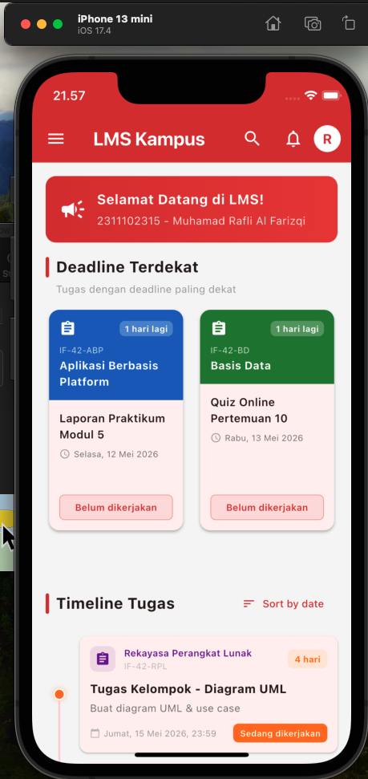

<div align="center">
  <br />
  <h1>LAPORAN PRAKTIKUM <br> APLIKASI BERBASIS PLATFORM </h1>
  <br />
  <h3>MODUL 2 <br> FLUTTER </h3>
  <br />
  
  <br />
  <br />
  <br />
  <h3>Disusun Oleh :</h3>
  <p>
    <strong>Muhamad Rafli Al Farizqi</strong>
    <br>
    <strong>2311102315</strong>
    <br>
    <strong>S1 IF-11-REG05</strong>
  </p>
  <br />
  <h3>Dosen Pengampu :</h3>
  <p>
    <strong>Dedi Agung Prabowo, S.Kom., M.Kom</strong>
  </p>
  <br />
  <br />
  <h4>Asisten Praktikum :</h4>
  <strong>Apri Pandu Wicaksono </strong>
  <br>
  <strong>Hamka Zaenul Ardi</strong>
  <br />
  <h3>LABORATORIUM HIGH PERFORMANCE <br>FAKULTAS INFORMATIKA <br>UNIVERSITAS TELKOM PURWOKERTO <br>2026 </h3>
</div>

<hr>

## Dasar Teori

Flutter adalah framework open-source yang dikembangkan oleh Google untuk membangun aplikasi multi-platform (Android, iOS, Web, Desktop) dari satu codebase. Flutter menggunakan bahasa pemrograman Dart dan menggunakan pendekatan widget-based untuk membangun UI secara deklaratif.

### Widget di Flutter

Semua elemen UI di Flutter adalah widget. Widget dapat berupa elemen sederhana seperti `Text`, `Icon`, atau `Container`, hingga elemen kompleks seperti `Scaffold`, `AppBar`, dan `Drawer`. Widget dibagi menjadi dua jenis utama:

- **StatelessWidget**: Widget yang tidak memiliki state internal dan tidak berubah setelah di-render.
- **StatefulWidget**: Widget yang memiliki state internal dan dapat berubah secara dinamis.

### GridView

`GridView` adalah widget yang menampilkan item dalam bentuk grid (baris dan kolom). Terdapat beberapa constructor yang tersedia:

- `GridView()`: Membuat grid dari daftar widget secara langsung.
- `GridView.builder()`: Membuat grid secara lazy (hanya membangun widget yang terlihat), cocok untuk data besar.
- `GridView.count()`: Membuat grid dengan jumlah kolom tetap.
- `GridView.extent()`: Membuat grid dengan lebar maksimum per item.

Pada tugas ini digunakan `GridView.builder()` dengan `SliverGridDelegateWithFixedCrossAxisCount` untuk menampilkan 2 kolom grid berisi tugas dengan deadline terdekat.

### ListView

`ListView` adalah widget scrollable yang menampilkan item secara linear (vertikal atau horizontal). Beberapa constructor yang tersedia:

- `ListView()`: Membuat list dari daftar widget secara langsung.
- `ListView.builder()`: Membuat list secara lazy, cocok untuk data dinamis atau besar.
- `ListView.separated()`: Sama seperti builder, namun dengan separator antar item.

Pada tugas ini digunakan `ListView.separated()` untuk menampilkan 8 daftar tugas dengan separator antar item dalam tampilan timeline.

### Material Design 3

Flutter mendukung Material Design 3 (Material You) yang merupakan sistem desain terbaru dari Google. Fitur-fitur yang digunakan dalam tugas ini antara lain `ColorScheme.fromSeed()` untuk menghasilkan skema warna otomatis, `Card` dengan elevation, dan `Drawer` untuk navigasi sidebar.

## Tugas 2 - Tampilan LMS Kampus

Membuat tampilan mirip LMS (Learning Management System) web kampus menggunakan Flutter. Tampilan terdiri dari 2 grid kanan-kiri yang menampilkan tugas dengan deadline terdekat, dan di bawahnya terdapat 8 list view berisi daftar tugas lainnya yang menampilkan nama tugas, mata kuliah, deadline, dan data tambahan.

**Ketentuan:**
- Menggunakan `GridView.builder()` untuk tampilan grid kanan dan kiri
- Menggunakan `ListView.separated()` untuk tampilan list tugas
- Mengandung watermark NIM dan Nama

### Source Code

```dart
// ============================================
// Tugas 2 - Modul 2 Flutter
// LMS (Learning Management System) App
// NIM  : 2311102315
// Nama : Muhamad Rafli Al Farizqi
// ============================================

import 'package:flutter/material.dart';

void main() {
  runApp(const LmsApp());
}

// Warna utama LMS CeLOE-style
const Color kPrimaryRed = Color(0xFFD32F2F);
const Color kDarkRed = Color(0xFFB71C1C);
const Color kLightRed = Color(0xFFFFCDD2);
const Color kAccentOrange = Color(0xFFFF6D00);
const Color kBgGrey = Color(0xFFF5F5F5);

class LmsApp extends StatelessWidget {
  const LmsApp({super.key});

  @override
  Widget build(BuildContext context) {
    return MaterialApp(
      title: 'LMS Telkom University',
      debugShowCheckedModeBanner: false,
      theme: ThemeData(
        primaryColor: kPrimaryRed,
        colorScheme: ColorScheme.fromSeed(
          seedColor: kPrimaryRed,
          primary: kPrimaryRed,
        ),
        scaffoldBackgroundColor: kBgGrey,
        appBarTheme: const AppBarTheme(
          backgroundColor: kPrimaryRed,
          foregroundColor: Colors.white,
          elevation: 0,
        ),
        useMaterial3: true,
      ),
      home: const LmsHomePage(),
    );
  }
}

class Tugas {
  final String namaTugas;
  final String mataKuliah;
  final String kodeMK;
  final DateTime deadline;
  final String deskripsi;
  final String status;
  final IconData icon;
  final Color warnaMK;

  const Tugas({
    required this.namaTugas,
    required this.mataKuliah,
    required this.kodeMK,
    required this.deadline,
    required this.deskripsi,
    required this.status,
    required this.icon,
    required this.warnaMK,
  });
}

// 10 tugas dummy
final List<Tugas> semuaTugas = [
  Tugas(
    namaTugas: 'Laporan Praktikum Modul 5',
    mataKuliah: 'Aplikasi Berbasis Platform',
    kodeMK: 'IF-42-ABP',
    deadline: DateTime(2026, 5, 12, 23, 59),
    deskripsi: 'Upload laporan dalam format PDF melalui LMS',
    status: 'Belum dikerjakan',
    icon: Icons.assignment,
    warnaMK: const Color(0xFF1565C0),
  ),
  Tugas(
    namaTugas: 'Quiz Online Pertemuan 10',
    mataKuliah: 'Basis Data',
    kodeMK: 'IF-42-BD',
    deadline: DateTime(2026, 5, 13, 10, 0),
    deskripsi: 'Quiz online via LMS, durasi 30 menit',
    status: 'Belum dikerjakan',
    icon: Icons.quiz,
    warnaMK: const Color(0xFF2E7D32),
  ),
  Tugas(
    namaTugas: 'Tugas Kelompok - Diagram UML',
    mataKuliah: 'Rekayasa Perangkat Lunak',
    kodeMK: 'IF-42-RPL',
    deadline: DateTime(2026, 5, 15, 23, 59),
    deskripsi: 'Buat diagram UML & use case',
    status: 'Sedang dikerjakan',
    icon: Icons.assignment,
    warnaMK: const Color(0xFF6A1B9A),
  ),
  Tugas(
    namaTugas: 'Makalah Smart Home IoT',
    mataKuliah: 'Internet of Things',
    kodeMK: 'IF-42-IOT',
    deadline: DateTime(2026, 5, 16, 23, 59),
    deskripsi: 'Makalah 10 halaman tentang smart home',
    status: 'Belum dikerjakan',
    icon: Icons.assignment,
    warnaMK: const Color(0xFF00838F),
  ),
  Tugas(
    namaTugas: 'Latihan Soal BAB 6',
    mataKuliah: 'Matematika Diskrit',
    kodeMK: 'IF-42-MD',
    deadline: DateTime(2026, 5, 17, 23, 59),
    deskripsi: 'Kerjakan 20 soal di buku halaman 150-160',
    status: 'Belum dikerjakan',
    icon: Icons.assignment,
    warnaMK: const Color(0xFFEF6C00),
  ),
  Tugas(
    namaTugas: 'Project Website Portfolio',
    mataKuliah: 'Pemrograman Web',
    kodeMK: 'IF-42-PW',
    deadline: DateTime(2026, 5, 18, 23, 59),
    deskripsi: 'Website portfolio menggunakan Laravel',
    status: 'Sedang dikerjakan',
    icon: Icons.assignment,
    warnaMK: const Color(0xFFD84315),
  ),
  Tugas(
    namaTugas: 'Resume 3 Jurnal Internasional',
    mataKuliah: 'Metodologi Penelitian',
    kodeMK: 'IF-42-MP',
    deadline: DateTime(2026, 5, 19, 23, 59),
    deskripsi: 'Resume jurnal format IEEE',
    status: 'Belum dikerjakan',
    icon: Icons.assignment,
    warnaMK: const Color(0xFF4527A0),
  ),
  Tugas(
    namaTugas: 'Simulasi Topologi Jaringan',
    mataKuliah: 'Jaringan Komputer',
    kodeMK: 'IF-42-JK',
    deadline: DateTime(2026, 5, 20, 23, 59),
    deskripsi: 'Simulasi di Cisco Packet Tracer',
    status: 'Belum dikerjakan',
    icon: Icons.assignment,
    warnaMK: const Color(0xFF00695C),
  ),
  Tugas(
    namaTugas: 'Presentasi Bisnis Plan',
    mataKuliah: 'Kewirausahaan',
    kodeMK: 'IF-42-KWU',
    deadline: DateTime(2026, 5, 21, 23, 59),
    deskripsi: 'Presentasi bisnis plan kelompok',
    status: 'Sedang dikerjakan',
    icon: Icons.assignment,
    warnaMK: const Color(0xFF827717),
  ),
  Tugas(
    namaTugas: 'Implementasi Scheduling Algorithm',
    mataKuliah: 'Sistem Operasi',
    kodeMK: 'IF-42-SO',
    deadline: DateTime(2026, 5, 22, 23, 59),
    deskripsi: 'Implementasi FCFS, SJF, Round Robin',
    status: 'Belum dikerjakan',
    icon: Icons.assignment,
    warnaMK: const Color(0xFF37474F),
  ),
];

class LmsHomePage extends StatelessWidget {
  const LmsHomePage({super.key});

  String _formatHari(DateTime dt) {
    const hari = ['Senin', 'Selasa', 'Rabu', 'Kamis', 'Jumat', 'Sabtu', 'Minggu'];
    const bulan = [
      '', 'Januari', 'Februari', 'Maret', 'April', 'Mei', 'Juni',
      'Juli', 'Agustus', 'September', 'Oktober', 'November', 'Desember',
    ];
    return '${hari[dt.weekday - 1]}, ${dt.day} ${bulan[dt.month]} ${dt.year}';
  }

  String _formatWaktu(DateTime dt) {
    return '${dt.hour.toString().padLeft(2, '0')}:'
        '${dt.minute.toString().padLeft(2, '0')}';
  }

  @override
  Widget build(BuildContext context) {
    final sorted = List<Tugas>.from(semuaTugas)
      ..sort((a, b) => a.deadline.compareTo(b.deadline));

    final gridTugas = sorted.sublist(0, 2);
    final listTugas = sorted.sublist(2, 10);

    return Scaffold(
      drawer: Drawer(
        child: ListView(
          padding: EdgeInsets.zero,
          children: [
            DrawerHeader(
              decoration: const BoxDecoration(color: kPrimaryRed),
              child: Column(
                crossAxisAlignment: CrossAxisAlignment.start,
                mainAxisAlignment: MainAxisAlignment.end,
                children: [
                  const CircleAvatar(
                    radius: 30, backgroundColor: Colors.white,
                    child: Icon(Icons.person, size: 36, color: kPrimaryRed),
                  ),
                  const SizedBox(height: 10),
                  const Text('Muhamad Rafli Al Farizqi',
                    style: TextStyle(color: Colors.white, fontSize: 16, fontWeight: FontWeight.bold)),
                  Text('NIM: 2311102315',
                    style: TextStyle(color: Colors.white.withValues(alpha: 0.8), fontSize: 13)),
                ],
              ),
            ),
            const ListTile(leading: Icon(Icons.dashboard), title: Text('Dashboard'), selected: true),
            const ListTile(leading: Icon(Icons.book), title: Text('My Courses')),
            const ListTile(leading: Icon(Icons.calendar_today), title: Text('Timeline')),
            const ListTile(leading: Icon(Icons.grade), title: Text('Grades')),
            const Divider(),
            const ListTile(leading: Icon(Icons.settings), title: Text('Settings')),
            const ListTile(leading: Icon(Icons.logout), title: Text('Logout')),
          ],
        ),
      ),
      appBar: AppBar(
        title: const Text('LMS Kampus', style: TextStyle(fontWeight: FontWeight.bold)),
        actions: [
          IconButton(icon: const Icon(Icons.search), onPressed: () {}),
          IconButton(icon: const Icon(Icons.notifications_outlined), onPressed: () {}),
          const Padding(
            padding: EdgeInsets.only(right: 12),
            child: CircleAvatar(radius: 16, backgroundColor: Colors.white,
              child: Text('R', style: TextStyle(color: kPrimaryRed, fontWeight: FontWeight.bold))),
          ),
        ],
      ),
      body: SingleChildScrollView(
        child: Column(
          crossAxisAlignment: CrossAxisAlignment.start,
          children: [
            // Banner
            Container(
              width: double.infinity,
              margin: const EdgeInsets.all(16),
              padding: const EdgeInsets.all(16),
              decoration: BoxDecoration(
                gradient: const LinearGradient(colors: [kPrimaryRed, Color(0xFFE53935)]),
                borderRadius: BorderRadius.circular(12),
              ),
              child: Row(children: [
                const Icon(Icons.campaign, color: Colors.white, size: 32),
                const SizedBox(width: 12),
                Expanded(
                  child: Column(crossAxisAlignment: CrossAxisAlignment.start, children: [
                    const Text('Selamat Datang di LMS!',
                      style: TextStyle(color: Colors.white, fontWeight: FontWeight.bold, fontSize: 16)),
                    const SizedBox(height: 4),
                    Text('2311102315 - Muhamad Rafli Al Farizqi',
                      style: TextStyle(color: Colors.white.withValues(alpha: 0.9), fontSize: 13)),
                  ]),
                ),
              ]),
            ),

            // Section: Deadline Terdekat
            Padding(
              padding: const EdgeInsets.symmetric(horizontal: 16),
              child: Row(children: [
                Container(width: 4, height: 24,
                  decoration: BoxDecoration(color: kPrimaryRed, borderRadius: BorderRadius.circular(2))),
                const SizedBox(width: 8),
                const Text('Deadline Terdekat',
                  style: TextStyle(fontSize: 18, fontWeight: FontWeight.bold)),
              ]),
            ),
            const SizedBox(height: 12),

            // GridView.builder
            Padding(
              padding: const EdgeInsets.symmetric(horizontal: 16),
              child: GridView.builder(
                shrinkWrap: true,
                physics: const NeverScrollableScrollPhysics(),
                gridDelegate: const SliverGridDelegateWithFixedCrossAxisCount(
                  crossAxisCount: 2, crossAxisSpacing: 12, mainAxisSpacing: 12, childAspectRatio: 0.62),
                itemCount: gridTugas.length,
                itemBuilder: (context, index) => _buildGridCard(context, gridTugas[index]),
              ),
            ),
            const SizedBox(height: 24),

            // Section: Timeline Tugas
            Padding(
              padding: const EdgeInsets.symmetric(horizontal: 16),
              child: Row(children: [
                Container(width: 4, height: 24,
                  decoration: BoxDecoration(color: kPrimaryRed, borderRadius: BorderRadius.circular(2))),
                const SizedBox(width: 8),
                const Text('Timeline Tugas',
                  style: TextStyle(fontSize: 18, fontWeight: FontWeight.bold)),
                const Spacer(),
                TextButton.icon(onPressed: () {},
                  icon: const Icon(Icons.sort, size: 16),
                  label: const Text('Sort by date', style: TextStyle(fontSize: 12))),
              ]),
            ),
            const SizedBox(height: 8),

            // ListView.separated
            Padding(
              padding: const EdgeInsets.symmetric(horizontal: 16),
              child: ListView.separated(
                shrinkWrap: true,
                physics: const NeverScrollableScrollPhysics(),
                itemCount: listTugas.length,
                separatorBuilder: (context, index) => const SizedBox(height: 0),
                itemBuilder: (context, index) =>
                    _buildTimelineItem(context, listTugas[index], index == 0, index == listTugas.length - 1),
              ),
            ),
            const SizedBox(height: 24),

            // Watermark footer
            Center(
              child: Padding(
                padding: const EdgeInsets.only(bottom: 16),
                child: Text('© 2026 - 2311102315 Muhamad Rafli Al Farizqi',
                  style: TextStyle(fontSize: 11, color: Colors.grey[400])),
              ),
            ),
          ],
        ),
      ),
    );
  }

  Widget _buildGridCard(BuildContext context, Tugas tugas) {
    final sisaHari = tugas.deadline.difference(DateTime.now()).inDays;
    return Card(
      elevation: 2,
      shape: RoundedRectangleBorder(borderRadius: BorderRadius.circular(12)),
      clipBehavior: Clip.antiAlias,
      child: Column(crossAxisAlignment: CrossAxisAlignment.start, children: [
        Container(
          width: double.infinity, padding: const EdgeInsets.all(12), color: tugas.warnaMK,
          child: Column(crossAxisAlignment: CrossAxisAlignment.start, children: [
            Row(children: [
              const Icon(Icons.assignment, color: Colors.white, size: 20),
              const Spacer(),
              Container(
                padding: const EdgeInsets.symmetric(horizontal: 6, vertical: 2),
                decoration: BoxDecoration(
                  color: Colors.white.withValues(alpha: 0.25), borderRadius: BorderRadius.circular(6)),
                child: Text('$sisaHari hari lagi',
                  style: const TextStyle(color: Colors.white, fontSize: 10, fontWeight: FontWeight.bold)),
              ),
            ]),
            const SizedBox(height: 8),
            Text(tugas.kodeMK,
              style: TextStyle(color: Colors.white.withValues(alpha: 0.8), fontSize: 10)),
            const SizedBox(height: 2),
            Text(tugas.mataKuliah,
              style: const TextStyle(color: Colors.white, fontSize: 13, fontWeight: FontWeight.bold),
              maxLines: 2, overflow: TextOverflow.ellipsis),
          ]),
        ),
        Expanded(
          child: Padding(
            padding: const EdgeInsets.all(12),
            child: Column(crossAxisAlignment: CrossAxisAlignment.start, children: [
              Text(tugas.namaTugas,
                style: const TextStyle(fontWeight: FontWeight.w600, fontSize: 13),
                maxLines: 2, overflow: TextOverflow.ellipsis),
              const SizedBox(height: 6),
              Row(children: [
                Icon(Icons.access_time, size: 13, color: Colors.grey[500]),
                const SizedBox(width: 4),
                Expanded(child: Text(_formatHari(tugas.deadline),
                  style: TextStyle(fontSize: 10, color: Colors.grey[600]))),
              ]),
              const Spacer(),
              Container(
                width: double.infinity, padding: const EdgeInsets.symmetric(vertical: 6),
                decoration: BoxDecoration(
                  color: _statusColor(tugas.status).withValues(alpha: 0.1),
                  borderRadius: BorderRadius.circular(6),
                  border: Border.all(color: _statusColor(tugas.status).withValues(alpha: 0.3))),
                child: Text(tugas.status, textAlign: TextAlign.center,
                  style: TextStyle(fontSize: 11, fontWeight: FontWeight.w600,
                    color: _statusColor(tugas.status))),
              ),
            ]),
          ),
        ),
      ]),
    );
  }

  Widget _buildTimelineItem(BuildContext context, Tugas tugas, bool isFirst, bool isLast) {
    final sisaHari = tugas.deadline.difference(DateTime.now()).inDays;
    return IntrinsicHeight(
      child: Row(crossAxisAlignment: CrossAxisAlignment.stretch, children: [
        SizedBox(width: 32, child: Column(children: [
          if (!isFirst) Expanded(child: Container(width: 2, color: kLightRed))
          else const Expanded(child: SizedBox()),
          Container(width: 14, height: 14, decoration: BoxDecoration(
            color: sisaHari <= 3 ? kPrimaryRed : kAccentOrange, shape: BoxShape.circle,
            border: Border.all(color: Colors.white, width: 2),
            boxShadow: [BoxShadow(
              color: (sisaHari <= 3 ? kPrimaryRed : kAccentOrange).withValues(alpha: 0.3), blurRadius: 4)],
          )),
          if (!isLast) Expanded(child: Container(width: 2, color: kLightRed))
          else const Expanded(child: SizedBox()),
        ])),
        const SizedBox(width: 8),
        Expanded(
          child: Card(
            elevation: 1, margin: const EdgeInsets.symmetric(vertical: 6),
            shape: RoundedRectangleBorder(borderRadius: BorderRadius.circular(10)),
            child: Padding(
              padding: const EdgeInsets.all(12),
              child: Column(crossAxisAlignment: CrossAxisAlignment.start, children: [
                Row(children: [
                  Container(padding: const EdgeInsets.all(6),
                    decoration: BoxDecoration(
                      color: tugas.warnaMK.withValues(alpha: 0.1), borderRadius: BorderRadius.circular(8)),
                    child: Icon(tugas.icon, size: 18, color: tugas.warnaMK)),
                  const SizedBox(width: 10),
                  Expanded(child: Column(crossAxisAlignment: CrossAxisAlignment.start, children: [
                    Text(tugas.mataKuliah,
                      style: TextStyle(fontSize: 11, color: tugas.warnaMK, fontWeight: FontWeight.w600)),
                    Text(tugas.kodeMK, style: TextStyle(fontSize: 10, color: Colors.grey[400])),
                  ])),
                  Container(
                    padding: const EdgeInsets.symmetric(horizontal: 8, vertical: 4),
                    decoration: BoxDecoration(
                      color: sisaHari <= 3 ? kPrimaryRed.withValues(alpha: 0.1) : Colors.orange.withValues(alpha: 0.1),
                      borderRadius: BorderRadius.circular(6)),
                    child: Text('$sisaHari hari', style: TextStyle(fontSize: 10, fontWeight: FontWeight.bold,
                      color: sisaHari <= 3 ? kPrimaryRed : kAccentOrange)),
                  ),
                ]),
                const SizedBox(height: 10),
                Text(tugas.namaTugas, style: const TextStyle(fontWeight: FontWeight.bold, fontSize: 14)),
                const SizedBox(height: 4),
                Text(tugas.deskripsi, style: TextStyle(fontSize: 12, color: Colors.grey[600])),
                const SizedBox(height: 10),
                Row(children: [
                  Icon(Icons.calendar_today, size: 12, color: Colors.grey[400]),
                  const SizedBox(width: 4),
                  Text('${_formatHari(tugas.deadline)}, ${_formatWaktu(tugas.deadline)}',
                    style: TextStyle(fontSize: 10, color: Colors.grey[500])),
                  const Spacer(),
                  Container(
                    padding: const EdgeInsets.symmetric(horizontal: 8, vertical: 4),
                    decoration: BoxDecoration(
                      color: _statusColor(tugas.status), borderRadius: BorderRadius.circular(6)),
                    child: Text(
                      tugas.status == 'Belum dikerjakan' ? 'Add submission' : tugas.status,
                      style: const TextStyle(color: Colors.white, fontSize: 10, fontWeight: FontWeight.w600)),
                  ),
                ]),
              ]),
            ),
          ),
        ),
      ]),
    );
  }

  Color _statusColor(String status) {
    switch (status) {
      case 'Sedang dikerjakan': return kAccentOrange;
      case 'Selesai': return Colors.green;
      default: return kPrimaryRed;
    }
  }
}
```

### Output


