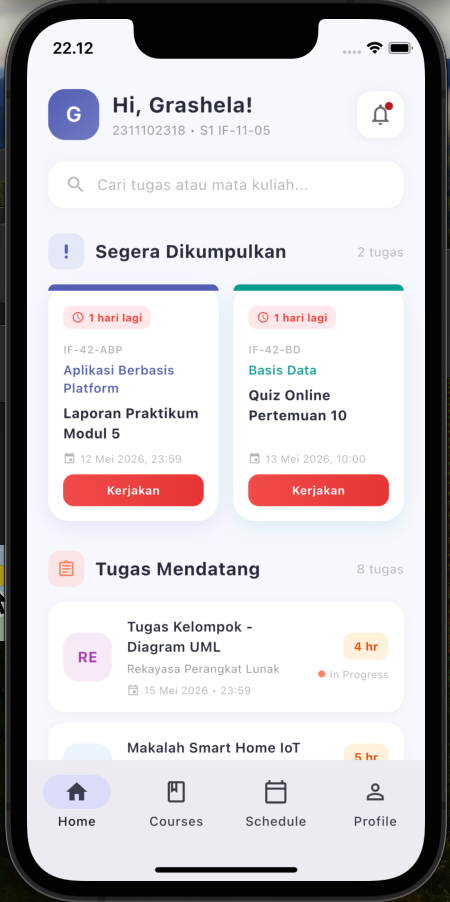

<div align="center">
  <br />
  <h1>LAPORAN PRAKTIKUM <br> APLIKASI BERBASIS PLATFORM </h1>
  <br />
  <h3>MODUL 2 <br> FLUTTER </h3>
  <br />
  
  <br />
  <br />
  <br />
  <h3>Disusun Oleh :</h3>
  <p>
    <strong>Grashela Ayudia Prameswari</strong>
    <br>
    <strong>2311102318</strong>
    <br>
    <strong>S1 IF-11-REG05</strong>
  </p>
  <br />
  <h3>Dosen Pengampu :</h3>
  <p>
    <strong>Dedi Agung Prabowo, S.Kom., M.Kom</strong>
  </p>
  <br />
  <br />
  <h4>Asisten Praktikum :</h4>
  <strong>Apri Pandu Wicaksono </strong>
  <br>
  <strong>Hamka Zaenul Ardi</strong>
  <br />
  <h3>LABORATORIUM HIGH PERFORMANCE <br>FAKULTAS INFORMATIKA <br>UNIVERSITAS TELKOM PURWOKERTO <br>2026 </h3>
</div>

<hr>

## Dasar Teori

Flutter adalah framework open-source yang dikembangkan oleh Google untuk membangun aplikasi multi-platform (Android, iOS, Web, Desktop) dari satu codebase. Flutter menggunakan bahasa pemrograman Dart dan menggunakan pendekatan widget-based untuk membangun UI secara deklaratif.

### Widget di Flutter

Semua elemen UI di Flutter adalah widget. Widget dapat berupa elemen sederhana seperti `Text`, `Icon`, atau `Container`, hingga elemen kompleks seperti `Scaffold`, `AppBar`, dan `Drawer`. Widget dibagi menjadi dua jenis utama:

- **StatelessWidget**: Widget yang tidak memiliki state internal dan tidak berubah setelah di-render.
- **StatefulWidget**: Widget yang memiliki state internal dan dapat berubah secara dinamis.

### GridView

`GridView` adalah widget yang menampilkan item dalam bentuk grid (baris dan kolom). Terdapat beberapa constructor yang tersedia:

- `GridView()`: Membuat grid dari daftar widget secara langsung.
- `GridView.builder()`: Membuat grid secara lazy (hanya membangun widget yang terlihat), cocok untuk data besar.
- `GridView.count()`: Membuat grid dengan jumlah kolom tetap.
- `GridView.extent()`: Membuat grid dengan lebar maksimum per item.

Pada tugas ini digunakan `GridView.builder()` dengan `SliverGridDelegateWithFixedCrossAxisCount` untuk menampilkan 2 kolom grid berisi tugas dengan deadline terdekat.

### ListView

`ListView` adalah widget scrollable yang menampilkan item secara linear (vertikal atau horizontal). Beberapa constructor yang tersedia:

- `ListView()`: Membuat list dari daftar widget secara langsung.
- `ListView.builder()`: Membuat list secara lazy, cocok untuk data dinamis atau besar.
- `ListView.separated()`: Sama seperti builder, namun dengan separator antar item.

Pada tugas ini digunakan `ListView.separated()` untuk menampilkan 8 daftar tugas dengan separator antar item.

### Material Design 3

Flutter mendukung Material Design 3 (Material You) yang merupakan sistem desain terbaru dari Google. Fitur-fitur yang digunakan dalam tugas ini antara lain `ColorScheme.fromSeed()` untuk menghasilkan skema warna otomatis, `NavigationBar` untuk bottom navigation, dan shadow/elevation untuk memberikan kedalaman pada card.

## Tugas 2 - Tampilan LMS Kampus

Membuat tampilan mirip LMS (Learning Management System) web kampus menggunakan Flutter. Tampilan terdiri dari 2 grid kanan-kiri yang menampilkan tugas dengan deadline terdekat, dan di bawahnya terdapat 8 list view berisi daftar tugas lainnya yang menampilkan nama tugas, mata kuliah, deadline, dan data tambahan.

**Ketentuan:**
- Menggunakan `GridView.builder()` untuk tampilan grid kanan dan kiri
- Menggunakan `ListView.separated()` untuk tampilan list tugas
- Mengandung watermark NIM dan Nama

### Source Code

```dart
// ============================================
// Tugas 2 - Modul 2 Flutter
// LMS (Learning Management System) App
// NIM  : 2311102318
// Nama : Grashela Ayudia Prameswari
// ============================================

import 'package:flutter/material.dart';

void main() {
  runApp(const LmsApp());
}

// Tema ungu/indigo
const Color kPrimary = Color(0xFF5C6BC0);
const Color kPrimaryDark = Color(0xFF3949AB);
const Color kAccent = Color(0xFFFF8A65);
const Color kBg = Color(0xFFF8F9FE);
const Color kCardBg = Colors.white;

class LmsApp extends StatelessWidget {
  const LmsApp({super.key});

  @override
  Widget build(BuildContext context) {
    return MaterialApp(
      title: 'LMS Telkom University',
      debugShowCheckedModeBanner: false,
      theme: ThemeData(
        colorScheme: ColorScheme.fromSeed(
          seedColor: kPrimary,
          primary: kPrimary,
          brightness: Brightness.light,
        ),
        scaffoldBackgroundColor: kBg,
        appBarTheme: const AppBarTheme(
          backgroundColor: Colors.transparent,
          foregroundColor: Color(0xFF2D3142),
          elevation: 0,
        ),
        useMaterial3: true,
      ),
      home: const LmsHomePage(),
    );
  }
}

class Tugas {
  final String namaTugas;
  final String mataKuliah;
  final String kodeMK;
  final DateTime deadline;
  final String deskripsi;
  final String status;
  final Color warnaMK;

  const Tugas({
    required this.namaTugas,
    required this.mataKuliah,
    required this.kodeMK,
    required this.deadline,
    required this.deskripsi,
    required this.status,
    required this.warnaMK,
  });
}

final List<Tugas> semuaTugas = [
  Tugas(
    namaTugas: 'Laporan Praktikum Modul 5',
    mataKuliah: 'Aplikasi Berbasis Platform',
    kodeMK: 'IF-42-ABP',
    deadline: DateTime(2026, 5, 12, 23, 59),
    deskripsi: 'Upload laporan dalam format PDF melalui LMS',
    status: 'Belum dikerjakan',
    warnaMK: const Color(0xFF5C6BC0),
  ),
  Tugas(
    namaTugas: 'Quiz Online Pertemuan 10',
    mataKuliah: 'Basis Data',
    kodeMK: 'IF-42-BD',
    deadline: DateTime(2026, 5, 13, 10, 0),
    deskripsi: 'Quiz online via LMS, durasi 30 menit',
    status: 'Belum dikerjakan',
    warnaMK: const Color(0xFF26A69A),
  ),
  Tugas(
    namaTugas: 'Tugas Kelompok - Diagram UML',
    mataKuliah: 'Rekayasa Perangkat Lunak',
    kodeMK: 'IF-42-RPL',
    deadline: DateTime(2026, 5, 15, 23, 59),
    deskripsi: 'Buat diagram UML & use case',
    status: 'Sedang dikerjakan',
    warnaMK: const Color(0xFFAB47BC),
  ),
  Tugas(
    namaTugas: 'Makalah Smart Home IoT',
    mataKuliah: 'Internet of Things',
    kodeMK: 'IF-42-IOT',
    deadline: DateTime(2026, 5, 16, 23, 59),
    deskripsi: 'Makalah 10 halaman tentang smart home',
    status: 'Belum dikerjakan',
    warnaMK: const Color(0xFF42A5F5),
  ),
  Tugas(
    namaTugas: 'Latihan Soal BAB 6',
    mataKuliah: 'Matematika Diskrit',
    kodeMK: 'IF-42-MD',
    deadline: DateTime(2026, 5, 17, 23, 59),
    deskripsi: 'Kerjakan 20 soal di buku halaman 150-160',
    status: 'Belum dikerjakan',
    warnaMK: const Color(0xFFFF7043),
  ),
  Tugas(
    namaTugas: 'Project Website Portfolio',
    mataKuliah: 'Pemrograman Web',
    kodeMK: 'IF-42-PW',
    deadline: DateTime(2026, 5, 18, 23, 59),
    deskripsi: 'Website portfolio menggunakan Laravel',
    status: 'Sedang dikerjakan',
    warnaMK: const Color(0xFFEC407A),
  ),
  Tugas(
    namaTugas: 'Resume 3 Jurnal Internasional',
    mataKuliah: 'Metodologi Penelitian',
    kodeMK: 'IF-42-MP',
    deadline: DateTime(2026, 5, 19, 23, 59),
    deskripsi: 'Resume jurnal format IEEE',
    status: 'Belum dikerjakan',
    warnaMK: const Color(0xFF7E57C2),
  ),
  Tugas(
    namaTugas: 'Simulasi Topologi Jaringan',
    mataKuliah: 'Jaringan Komputer',
    kodeMK: 'IF-42-JK',
    deadline: DateTime(2026, 5, 20, 23, 59),
    deskripsi: 'Simulasi di Cisco Packet Tracer',
    status: 'Belum dikerjakan',
    warnaMK: const Color(0xFF29B6F6),
  ),
  Tugas(
    namaTugas: 'Presentasi Bisnis Plan',
    mataKuliah: 'Kewirausahaan',
    kodeMK: 'IF-42-KWU',
    deadline: DateTime(2026, 5, 21, 23, 59),
    deskripsi: 'Presentasi bisnis plan kelompok',
    status: 'Sedang dikerjakan',
    warnaMK: const Color(0xFFFFA726),
  ),
  Tugas(
    namaTugas: 'Implementasi Scheduling Algorithm',
    mataKuliah: 'Sistem Operasi',
    kodeMK: 'IF-42-SO',
    deadline: DateTime(2026, 5, 22, 23, 59),
    deskripsi: 'Implementasi FCFS, SJF, Round Robin',
    status: 'Belum dikerjakan',
    warnaMK: const Color(0xFF78909C),
  ),
];

class LmsHomePage extends StatelessWidget {
  const LmsHomePage({super.key});

  String _formatTanggal(DateTime dt) {
    const bulan = [
      '', 'Jan', 'Feb', 'Mar', 'Apr', 'Mei', 'Jun',
      'Jul', 'Agu', 'Sep', 'Okt', 'Nov', 'Des',
    ];
    return '${dt.day} ${bulan[dt.month]} ${dt.year}';
  }

  String _formatWaktu(DateTime dt) {
    return '${dt.hour.toString().padLeft(2, '0')}:${dt.minute.toString().padLeft(2, '0')}';
  }

  @override
  Widget build(BuildContext context) {
    final sorted = List<Tugas>.from(semuaTugas)
      ..sort((a, b) => a.deadline.compareTo(b.deadline));

    final gridTugas = sorted.sublist(0, 2);
    final listTugas = sorted.sublist(2, 10);

    return Scaffold(
      bottomNavigationBar: NavigationBar(
        selectedIndex: 0,
        destinations: const [
          NavigationDestination(icon: Icon(Icons.home_outlined), selectedIcon: Icon(Icons.home), label: 'Home'),
          NavigationDestination(icon: Icon(Icons.book_outlined), selectedIcon: Icon(Icons.book), label: 'Courses'),
          NavigationDestination(icon: Icon(Icons.calendar_today_outlined), selectedIcon: Icon(Icons.calendar_today), label: 'Schedule'),
          NavigationDestination(icon: Icon(Icons.person_outline), selectedIcon: Icon(Icons.person), label: 'Profile'),
        ],
      ),
      body: SafeArea(
        child: SingleChildScrollView(
          child: Column(
            crossAxisAlignment: CrossAxisAlignment.start,
            children: [
              // Profile Header
              Padding(
                padding: const EdgeInsets.fromLTRB(20, 16, 20, 0),
                child: Row(children: [
                  Container(
                    width: 48, height: 48,
                    decoration: BoxDecoration(
                      gradient: const LinearGradient(
                        colors: [kPrimary, Color(0xFF7986CB)],
                        begin: Alignment.topLeft, end: Alignment.bottomRight,
                      ),
                      borderRadius: BorderRadius.circular(16),
                    ),
                    child: const Center(
                      child: Text('G', style: TextStyle(color: Colors.white, fontSize: 20, fontWeight: FontWeight.bold)),
                    ),
                  ),
                  const SizedBox(width: 12),
                  Expanded(child: Column(crossAxisAlignment: CrossAxisAlignment.start, children: [
                    const Text('Hi, Grashela!',
                      style: TextStyle(fontSize: 20, fontWeight: FontWeight.bold, color: Color(0xFF2D3142))),
                    Text('2311102318 • S1 IF-11-05', style: TextStyle(fontSize: 12, color: Colors.grey[500])),
                  ])),
                  Container(
                    padding: const EdgeInsets.all(10),
                    decoration: BoxDecoration(
                      color: Colors.white, borderRadius: BorderRadius.circular(14),
                      boxShadow: [BoxShadow(color: Colors.black.withValues(alpha: 0.05), blurRadius: 10)],
                    ),
                    child: Badge(smallSize: 8, child: Icon(Icons.notifications_outlined, color: Colors.grey[600])),
                  ),
                ]),
              ),
              const SizedBox(height: 20),

              // Search Bar
              Padding(
                padding: const EdgeInsets.symmetric(horizontal: 20),
                child: Container(
                  padding: const EdgeInsets.symmetric(horizontal: 16, vertical: 12),
                  decoration: BoxDecoration(
                    color: Colors.white, borderRadius: BorderRadius.circular(16),
                    boxShadow: [BoxShadow(color: Colors.black.withValues(alpha: 0.04), blurRadius: 10)],
                  ),
                  child: Row(children: [
                    Icon(Icons.search, color: Colors.grey[400], size: 20),
                    const SizedBox(width: 10),
                    Text('Cari tugas atau mata kuliah...', style: TextStyle(color: Colors.grey[400], fontSize: 14)),
                  ]),
                ),
              ),
              const SizedBox(height: 24),

              // Section: Segera Dikumpulkan
              Padding(
                padding: const EdgeInsets.symmetric(horizontal: 20),
                child: Row(children: [
                  Container(
                    padding: const EdgeInsets.all(8),
                    decoration: BoxDecoration(color: kPrimary.withValues(alpha: 0.1), borderRadius: BorderRadius.circular(10)),
                    child: const Icon(Icons.priority_high_rounded, color: kPrimary, size: 18),
                  ),
                  const SizedBox(width: 10),
                  const Text('Segera Dikumpulkan',
                    style: TextStyle(fontSize: 17, fontWeight: FontWeight.bold, color: Color(0xFF2D3142))),
                  const Spacer(),
                  Text('${gridTugas.length} tugas', style: TextStyle(fontSize: 12, color: Colors.grey[400])),
                ]),
              ),
              const SizedBox(height: 14),

              // GridView.builder
              Padding(
                padding: const EdgeInsets.symmetric(horizontal: 20),
                child: GridView.builder(
                  shrinkWrap: true,
                  physics: const NeverScrollableScrollPhysics(),
                  gridDelegate: const SliverGridDelegateWithFixedCrossAxisCount(
                    crossAxisCount: 2, crossAxisSpacing: 14, mainAxisSpacing: 14, childAspectRatio: 0.72),
                  itemCount: gridTugas.length,
                  itemBuilder: (context, index) => _buildGridCard(context, gridTugas[index]),
                ),
              ),
              const SizedBox(height: 28),

              // Section: Tugas Mendatang
              Padding(
                padding: const EdgeInsets.symmetric(horizontal: 20),
                child: Row(children: [
                  Container(
                    padding: const EdgeInsets.all(8),
                    decoration: BoxDecoration(color: kAccent.withValues(alpha: 0.15), borderRadius: BorderRadius.circular(10)),
                    child: const Icon(Icons.assignment_outlined, color: kAccent, size: 18),
                  ),
                  const SizedBox(width: 10),
                  const Text('Tugas Mendatang',
                    style: TextStyle(fontSize: 17, fontWeight: FontWeight.bold, color: Color(0xFF2D3142))),
                  const Spacer(),
                  Text('${listTugas.length} tugas', style: TextStyle(fontSize: 12, color: Colors.grey[400])),
                ]),
              ),
              const SizedBox(height: 14),

              // ListView.separated
              Padding(
                padding: const EdgeInsets.symmetric(horizontal: 20),
                child: ListView.separated(
                  shrinkWrap: true,
                  physics: const NeverScrollableScrollPhysics(),
                  itemCount: listTugas.length,
                  separatorBuilder: (context, index) => const SizedBox(height: 10),
                  itemBuilder: (context, index) => _buildListCard(context, listTugas[index]),
                ),
              ),
              const SizedBox(height: 20),

              // Watermark
              Center(
                child: Padding(
                  padding: const EdgeInsets.only(bottom: 16),
                  child: Text('© 2026 — 2311102318 Grashela Ayudia Prameswari',
                    style: TextStyle(fontSize: 10, color: Colors.grey[350])),
                ),
              ),
            ],
          ),
        ),
      ),
    );
  }

  Widget _buildGridCard(BuildContext context, Tugas tugas) {
    final sisaHari = tugas.deadline.difference(DateTime.now()).inDays;
    final isUrgent = sisaHari <= 2;

    return Container(
      decoration: BoxDecoration(
        color: Colors.white, borderRadius: BorderRadius.circular(20),
        boxShadow: [BoxShadow(color: tugas.warnaMK.withValues(alpha: 0.12), blurRadius: 16, offset: const Offset(0, 6))],
      ),
      child: Column(crossAxisAlignment: CrossAxisAlignment.start, children: [
        Container(height: 6, decoration: BoxDecoration(color: tugas.warnaMK,
          borderRadius: const BorderRadius.only(topLeft: Radius.circular(20), topRight: Radius.circular(20)))),
        Expanded(
          child: Padding(
            padding: const EdgeInsets.fromLTRB(14, 14, 14, 14),
            child: Column(crossAxisAlignment: CrossAxisAlignment.start, children: [
              Row(children: [
                Container(
                  padding: const EdgeInsets.symmetric(horizontal: 8, vertical: 4),
                  decoration: BoxDecoration(
                    color: isUrgent ? const Color(0xFFFFEBEE) : tugas.warnaMK.withValues(alpha: 0.1),
                    borderRadius: BorderRadius.circular(8)),
                  child: Row(mainAxisSize: MainAxisSize.min, children: [
                    Icon(Icons.schedule, size: 12, color: isUrgent ? Colors.red : tugas.warnaMK),
                    const SizedBox(width: 4),
                    Text('$sisaHari hari lagi', style: TextStyle(fontSize: 10, fontWeight: FontWeight.w700,
                      color: isUrgent ? Colors.red : tugas.warnaMK)),
                  ]),
                ),
              ]),
              const SizedBox(height: 12),
              Text(tugas.kodeMK, style: TextStyle(fontSize: 10, color: Colors.grey[400], fontWeight: FontWeight.w600, letterSpacing: 0.5)),
              const SizedBox(height: 4),
              Text(tugas.mataKuliah, style: TextStyle(fontSize: 12, color: tugas.warnaMK, fontWeight: FontWeight.w600)),
              const SizedBox(height: 6),
              Text(tugas.namaTugas, style: const TextStyle(fontSize: 13, fontWeight: FontWeight.bold, color: Color(0xFF2D3142)),
                maxLines: 2, overflow: TextOverflow.ellipsis),
              const Spacer(),
              Row(children: [
                Icon(Icons.event, size: 12, color: Colors.grey[400]),
                const SizedBox(width: 4),
                Text('${_formatTanggal(tugas.deadline)}, ${_formatWaktu(tugas.deadline)}',
                  style: TextStyle(fontSize: 10, color: Colors.grey[400])),
              ]),
              const SizedBox(height: 8),
              Container(
                width: double.infinity, padding: const EdgeInsets.symmetric(vertical: 7),
                decoration: BoxDecoration(
                  gradient: LinearGradient(
                    colors: tugas.status == 'Belum dikerjakan'
                        ? [const Color(0xFFEF5350), const Color(0xFFE53935)]
                        : [kAccent, const Color(0xFFFF7043)]),
                  borderRadius: BorderRadius.circular(10)),
                child: Text(tugas.status == 'Belum dikerjakan' ? 'Kerjakan' : 'Lanjutkan',
                  textAlign: TextAlign.center,
                  style: const TextStyle(color: Colors.white, fontSize: 11, fontWeight: FontWeight.w700)),
              ),
            ]),
          ),
        ),
      ]),
    );
  }

  Widget _buildListCard(BuildContext context, Tugas tugas) {
    final sisaHari = tugas.deadline.difference(DateTime.now()).inDays;

    return Container(
      padding: const EdgeInsets.all(14),
      decoration: BoxDecoration(
        color: Colors.white, borderRadius: BorderRadius.circular(16),
        boxShadow: [BoxShadow(color: Colors.black.withValues(alpha: 0.03), blurRadius: 8, offset: const Offset(0, 2))],
      ),
      child: Row(children: [
        Container(
          width: 46, height: 46,
          decoration: BoxDecoration(color: tugas.warnaMK.withValues(alpha: 0.1), borderRadius: BorderRadius.circular(14)),
          child: Center(child: Text(tugas.mataKuliah.substring(0, 2).toUpperCase(),
            style: TextStyle(color: tugas.warnaMK, fontWeight: FontWeight.bold, fontSize: 14))),
        ),
        const SizedBox(width: 14),
        Expanded(child: Column(crossAxisAlignment: CrossAxisAlignment.start, children: [
          Text(tugas.namaTugas, style: const TextStyle(fontWeight: FontWeight.w600, fontSize: 13, color: Color(0xFF2D3142))),
          const SizedBox(height: 3),
          Text(tugas.mataKuliah, style: TextStyle(fontSize: 11, color: Colors.grey[500])),
          const SizedBox(height: 5),
          Row(children: [
            Icon(Icons.event_outlined, size: 12, color: Colors.grey[400]),
            const SizedBox(width: 4),
            Text('${_formatTanggal(tugas.deadline)} • ${_formatWaktu(tugas.deadline)}',
              style: TextStyle(fontSize: 10, color: Colors.grey[400])),
          ]),
        ])),
        const SizedBox(width: 8),
        Column(crossAxisAlignment: CrossAxisAlignment.end, children: [
          Container(
            padding: const EdgeInsets.symmetric(horizontal: 10, vertical: 5),
            decoration: BoxDecoration(
              color: sisaHari <= 5 ? const Color(0xFFFFF3E0) : const Color(0xFFE8F5E9),
              borderRadius: BorderRadius.circular(10)),
            child: Text('$sisaHari hr', style: TextStyle(fontSize: 11, fontWeight: FontWeight.bold,
              color: sisaHari <= 5 ? const Color(0xFFE65100) : const Color(0xFF2E7D32))),
          ),
          const SizedBox(height: 6),
          Row(mainAxisSize: MainAxisSize.min, children: [
            Container(width: 7, height: 7, decoration: BoxDecoration(shape: BoxShape.circle,
              color: tugas.status == 'Sedang dikerjakan' ? kAccent : Colors.grey[300])),
            const SizedBox(width: 4),
            Text(tugas.status == 'Sedang dikerjakan' ? 'In Progress' : 'Pending',
              style: TextStyle(fontSize: 10, color: Colors.grey[400])),
          ]),
        ]),
      ]),
    );
  }
}
```

### Output


